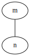

# Leetcode Solutions in Rust

This project demostrates how to create **Data Structures** and to implement **Algorithms** using programming language **Rust**
All the solutions here are crafted with love and their performance beats 99% of other solutions on the leetcode website. Tutorial videos will be added later.

### Please subscribe to our [Rust Gym Youtube Channel](https://www.youtube.com/channel/UCV9HzRLPKjI8SttaIYOygsw) for future videos.

Data Structures

- Stack & Queue ( Vec, VecDeque )
- Linked List ( Option<Box<ListNode>> )
- Hash Tables ( HashMap, HashSet )
- Tree Tables ( BTreeMap, BTreeSet )
- Binary Search Tree ( Option<Rc<RefCell<TreeNode>>> )
- Binary Heaps & Priority Queue ( BinaryHeap )
- Graphs ( Vec<Vec<usize>> )
- Union Find ( UnionFind )
- Trie ( Trie )

Algorithms

- Bit Manipulation & Numbers
- Stability in Sorting
- Heapsort
- Binary Search
- Kth Smallest Elements
- Permutations
- Subsets
- BFS Graph
- DFS Graph
- Dijkstra’s Algorithm
- Tree Traversals
    - BFS
    - DFS
        - in-order
        - pre-order
        - post-order
- Topological Sort
- Detect cycle in an undirected graph
- Detect a cycle in a directed graph
- Count connected components in a graph
- Find strongly connected components in a graph

### leetcode_rs 

# All Solutions

Easy 343/355 96.62%

|id|355 Easy Questions|Tags|343 Solutions|
|---|---|---|---|
|1450|[Number of Students Doing Homework at a Given Time](https://leetcode.com/problems/number-of-students-doing-homework-at-a-given-time)|array|   |
|190|[Reverse Bits](https://leetcode.com/problems/reverse-bits)|bit-manipulation|   |
|690|[Employee Importance](https://leetcode.com/problems/employee-importance)|hash-table depth-first-search breadth-first-search|   |
|160|[Intersection of Two Linked Lists](https://leetcode.com/problems/intersection-of-two-linked-lists)|linked-list|   |
|237|[Delete Node in a Linked List](https://leetcode.com/problems/delete-node-in-a-linked-list)|linked-list|   |
|141|[Linked List Cycle](https://leetcode.com/problems/linked-list-cycle)|linked-list two-pointers|   |
|1237|[Find Positive Integer Solution for a Given Equation](https://leetcode.com/problems/find-positive-integer-solution-for-a-given-equation)|math binary-search|   |
|157|[Read N Characters Given Read4](https://leetcode.com/problems/read-n-characters-given-read4)|string|   |
|235|[Lowest Common Ancestor of a Binary Search Tree](https://leetcode.com/problems/lowest-common-ancestor-of-a-binary-search-tree)|tree|   |
|589|[N-ary Tree Preorder Traversal](https://leetcode.com/problems/n-ary-tree-preorder-traversal)|tree|   |
|590|[N-ary Tree Postorder Traversal](https://leetcode.com/problems/n-ary-tree-postorder-traversal)|tree|   |
|559|[Maximum Depth of N-ary Tree](https://leetcode.com/problems/maximum-depth-of-n-ary-tree)|tree depth-first-search breadth-first-search|   |
|1002|[Find Common Characters](https://leetcode.com/problems/find-common-characters)|array hash-table|[solution](src/solutions/_1002_find_common_characters.rs)|
|1005|[Maximize Sum Of Array After K Negations](https://leetcode.com/problems/maximize-sum-of-array-after-k-negations)|greedy|[solution](src/solutions/_1005_maximize_sum_of_array_after_k_negations.rs)|
|1009|[Complement of Base 10 Integer](https://leetcode.com/problems/complement-of-base-10-integer)|math|[solution](src/solutions/_1009_complement_of_base_10_integer.rs)|
|100|[Same Tree](https://leetcode.com/problems/same-tree)|tree depth-first-search|[solution](src/solutions/_100_same_tree.rs)|
|1010|[Pairs of Songs With Total Durations Divisible by 60](https://leetcode.com/problems/pairs-of-songs-with-total-durations-divisible-by-60)|array|[solution](src/solutions/_1010_pairs_of_songs_with_total_durations_divisible_by_60.rs)|
|1013|[Partition Array Into Three Parts With Equal Sum](https://leetcode.com/problems/partition-array-into-three-parts-with-equal-sum)|array|[solution](src/solutions/_1013_partition_array_into_three_parts_with_equal_sum.rs)|
|1018|[Binary Prefix Divisible By 5](https://leetcode.com/problems/binary-prefix-divisible-by-5)|array|[solution](src/solutions/_1018_binary_prefix_divisible_by_5.rs)|
|101|[Symmetric Tree](https://leetcode.com/problems/symmetric-tree)|tree depth-first-search breadth-first-search|[solution](src/solutions/_101_symmetric_tree.rs)|
|1021|[Remove Outermost Parentheses](https://leetcode.com/problems/remove-outermost-parentheses)|stack|[solution](src/solutions/_1021_remove_outermost_parentheses.rs)|
|1022|[Sum of Root To Leaf Binary Numbers](https://leetcode.com/problems/sum-of-root-to-leaf-binary-numbers)|tree|[solution](src/solutions/_1022_sum_root_to_leaf_binary_number.rs)|
|1025|[Divisor Game](https://leetcode.com/problems/divisor-game)|math dynamic-programming|[solution](src/solutions/_1025_divisor_game.rs)|
|1029|[Two City Scheduling](https://leetcode.com/problems/two-city-scheduling)|greedy|[solution](src/solutions/_1029_two_city_scheduling.rs)|
|1030|[Matrix Cells in Distance Order](https://leetcode.com/problems/matrix-cells-in-distance-order)|sort|[solution](src/solutions/_1030_matrix_cells_in_distance_order.rs)|
|1033|[Moving Stones Until Consecutive](https://leetcode.com/problems/moving-stones-until-consecutive)|brainteaser|[solution](src/solutions/_1033_moving_stones_until_consecutive.rs)|
|1037|[Valid Boomerang](https://leetcode.com/problems/valid-boomerang)|math|[solution](src/solutions/_1037_valid_boomerang.rs)|
|1042|[Flower Planting With No Adjacent](https://leetcode.com/problems/flower-planting-with-no-adjacent)|graph|[solution](src/solutions/_1042_flower_planting_with_no_adjacent.rs)|
|1046|[Last Stone Weight](https://leetcode.com/problems/last-stone-weight)|heap greedy|[solution](src/solutions/_1046_last_stone_weight.rs)|
|1047|[Remove All Adjacent Duplicates In String](https://leetcode.com/problems/remove-all-adjacent-duplicates-in-string)|stack|[solution](src/solutions/_1047_remove_all_adjacent_duplicates_in_string.rs)|
|104|[Maximum Depth of Binary Tree](https://leetcode.com/problems/maximum-depth-of-binary-tree)|tree depth-first-search|[solution](src/solutions/_104_maximum_depth_of_binary_tree.rs)|
|1051|[Height Checker](https://leetcode.com/problems/height-checker)|array|[solution](src/solutions/_1051_height_checker.rs)|
|1056|[Confusing Number](https://leetcode.com/problems/confusing-number)|math|[solution](src/solutions/_1056_confusing_number.rs)|
|1064|[Fixed Point](https://leetcode.com/problems/fixed-point)|array binary-search|[solution](src/solutions/_1064_fixed_point.rs)|
|1065|[Index Pairs of a String](https://leetcode.com/problems/index-pairs-of-a-string)|string trie|[solution](src/solutions/_1065_index_pairs_of_a_string.rs)|
|1071|[Greatest Common Divisor of Strings](https://leetcode.com/problems/greatest-common-divisor-of-strings)|string|[solution](src/solutions/_1071_greatest_common_divisor_of_strings.rs)|
|1078|[Occurrences After Bigram](https://leetcode.com/problems/occurrences-after-bigram)|hash-table|[solution](src/solutions/_1078_occurrences_after_bigram.rs)|
|107|[Binary Tree Level Order Traversal II](https://leetcode.com/problems/binary-tree-level-order-traversal-ii)|tree breadth-first-search|[solution](src/solutions/_107_binary_tree_level_order_traversal_2.rs)|
|1085|[Sum of Digits in the Minimum Number](https://leetcode.com/problems/sum-of-digits-in-the-minimum-number)|array|[solution](src/solutions/_1085_sum_of_digits_in_the_minmum_number.rs)|
|1086|[High Five](https://leetcode.com/problems/high-five)|array hash-table sort|[solution](src/solutions/_1086_high_five.rs)|
|1089|[Duplicate Zeros](https://leetcode.com/problems/duplicate-zeros)|array|[solution](src/solutions/_1089_duplicate_zeros.rs)|
|108|[Convert Sorted Array to Binary Search Tree](https://leetcode.com/problems/convert-sorted-array-to-binary-search-tree)|tree depth-first-search|[solution](src/solutions/_108_convert_sorted_array_binary_search_tree.rs)|
|1099|[Two Sum Less Than K](https://leetcode.com/problems/two-sum-less-than-k)|array|[solution](src/solutions/_1099_two_sum_less_than_k.rs)|
|1103|[Distribute Candies to People](https://leetcode.com/problems/distribute-candies-to-people)|math|[solution](src/solutions/_1103_distribute_candies_to_people.rs)|
|1108|[Defanging an IP Address](https://leetcode.com/problems/defanging-an-ip-address)|string|[solution](src/solutions/_1108_defanging_an_ip_address.rs)|
|110|[Balanced Binary Tree](https://leetcode.com/problems/balanced-binary-tree)|tree depth-first-search|[solution](src/solutions/_110_balanced_binary_tree.rs)|
|1118|[Number of Days in a Month](https://leetcode.com/problems/number-of-days-in-a-month)||[solution](src/solutions/_1118_number_of_days_in_a_month.rs)|
|1119|[Remove Vowels from a String](https://leetcode.com/problems/remove-vowels-from-a-string)|string|[solution](src/solutions/_1119_remove_vowels_from_a_string.rs)|
|111|[Minimum Depth of Binary Tree](https://leetcode.com/problems/minimum-depth-of-binary-tree)|tree depth-first-search breadth-first-search|[solution](src/solutions/_111_minimum_depth_of_binary_tree.rs)|
|1122|[Relative Sort Array](https://leetcode.com/problems/relative-sort-array)|array sort|[solution](src/solutions/_1122_relative_sort_array.rs)|
|1128|[Number of Equivalent Domino Pairs](https://leetcode.com/problems/number-of-equivalent-domino-pairs)|array|[solution](src/solutions/_1128_number_of_equivalent_domino_pairs.rs)|
|112|[Path Sum](https://leetcode.com/problems/path-sum)|tree depth-first-search|[solution](src/solutions/_112_path_sum.rs)|
|1133|[Largest Unique Number](https://leetcode.com/problems/largest-unique-number)|array hash-table|[solution](src/solutions/_1133_largest_unique_number.rs)|
|1134|[Armstrong Number](https://leetcode.com/problems/armstrong-number)|math|[solution](src/solutions/_1134_armstrong_number.rs)|
|1137|[N-th Tribonacci Number](https://leetcode.com/problems/n-th-tribonacci-number)|recursion|[solution](src/solutions/_1137_n_th_tribonacci_number.rs)|
|1150|[Check If a Number Is Majority Element in a Sorted Array](https://leetcode.com/problems/check-if-a-number-is-majority-element-in-a-sorted-array)|array binary-search|[solution](src/solutions/_1150_check_if_a_number_is_majority_element_in_a_sorted_array.rs)|
|1154|[Day of the Year](https://leetcode.com/problems/day-of-the-year)|math|[solution](src/solutions/_1154_day_of_the_year.rs)|
|1160|[Find Words That Can Be Formed by Characters](https://leetcode.com/problems/find-words-that-can-be-formed-by-characters)|array hash-table|[solution](src/solutions/_1160_find_words_that_can_be_formed_by_characters.rs)|
|1165|[Single-Row Keyboard](https://leetcode.com/problems/single-row-keyboard)|string|[solution](src/solutions/_1165_single_row_keyboard.rs)|
|1170|[Compare Strings by Frequency of the Smallest Character](https://leetcode.com/problems/compare-strings-by-frequency-of-the-smallest-character)|array string|[solution](src/solutions/_1170_compare_strings_by_frequency_of_the_smallest_character.rs)|
|1175|[Prime Arrangements](https://leetcode.com/problems/prime-arrangements)|math|[solution](src/solutions/_1175_prime_arrangements.rs)|
|1176|[Diet Plan Performance](https://leetcode.com/problems/diet-plan-performance)|array sliding-window|[solution](src/solutions/_1176_diet_plan_performance.rs)|
|1180|[Count Substrings with Only One Distinct Letter](https://leetcode.com/problems/count-substrings-with-only-one-distinct-letter)|math string|[solution](src/solutions/_1180_count_substring_with_only_one_distinct_letter.rs)|
|1184|[Distance Between Bus Stops](https://leetcode.com/problems/distance-between-bus-stops)|array|[solution](src/solutions/_1184_distance_between_bus_stops.rs)|
|1185|[Day of the Week](https://leetcode.com/problems/day-of-the-week)|array|[solution](src/solutions/_1185_day_of_the_week.rs)|
|1189|[Maximum Number of Balloons](https://leetcode.com/problems/maximum-number-of-balloons)|hash-table string|[solution](src/solutions/_1189_maximum_number_of_balloons.rs)|
|118|[Pascal's Triangle](https://leetcode.com/problems/pascals-triangle)|array|[solution](src/solutions/_118_pascal_triangle.rs)|
|1196|[How Many Apples Can You Put into the Basket](https://leetcode.com/problems/how-many-apples-can-you-put-into-the-basket)|greedy|[solution](src/solutions/_1196_how_many_apples_can_you_put_into_the_basket.rs)|
|119|[Pascal's Triangle II](https://leetcode.com/problems/pascals-triangle-ii)|array|[solution](src/solutions/_119_pascal_triangle_2.rs)|
|1200|[Minimum Absolute Difference](https://leetcode.com/problems/minimum-absolute-difference)|array|[solution](src/solutions/_1200_minimum_absolute_difference.rs)|
|1207|[Unique Number of Occurrences](https://leetcode.com/problems/unique-number-of-occurrences)|hash-table|[solution](src/solutions/_1207_unique_number_of_occurrences.rs)|
|1213|[Intersection of Three Sorted Arrays](https://leetcode.com/problems/intersection-of-three-sorted-arrays)|hash-table two-pointers|[solution](src/solutions/_1213_intersection_of_three_sorted_arrays.rs)|
|1217|[Play with Chips](https://leetcode.com/problems/play-with-chips)|array math greedy|[solution](src/solutions/_1217_play_with_chips.rs)|
|121|[Best Time to Buy and Sell Stock](https://leetcode.com/problems/best-time-to-buy-and-sell-stock)|array dynamic-programming|[solution](src/solutions/_121_best_time_to_buy_and_sell_stock.rs)|
|1221|[Split a String in Balanced Strings](https://leetcode.com/problems/split-a-string-in-balanced-strings)|string greedy|[solution](src/solutions/_1221_split_a_string_in_balanced_strings.rs)|
|1228|[Missing Number In Arithmetic Progression](https://leetcode.com/problems/missing-number-in-arithmetic-progression)|math|[solution](src/solutions/_1228_missing_number_in_arithmetic_progression.rs)|
|122|[Best Time to Buy and Sell Stock II](https://leetcode.com/problems/best-time-to-buy-and-sell-stock-ii)|array greedy|[solution](src/solutions/_122_best_time_to_buy_and_sell_stock_2.rs)|
|1232|[Check If It Is a Straight Line](https://leetcode.com/problems/check-if-it-is-a-straight-line)|array math geometry|[solution](src/solutions/_1232_check_if_it_is_a_straight_line.rs)|
|1243|[Array Transformation](https://leetcode.com/problems/array-transformation)|array|[solution](src/solutions/_1243_array_transformation.rs)|
|1252|[Cells with Odd Values in a Matrix](https://leetcode.com/problems/cells-with-odd-values-in-a-matrix)|array|[solution](src/solutions/_1252_cells_with_odd_values_in_a_matrix.rs)|
|125|[Valid Palindrome](https://leetcode.com/problems/valid-palindrome)|two-pointers string|[solution](src/solutions/_125_valid_palindrome.rs)|
|1260|[Shift 2D Grid](https://leetcode.com/problems/shift-2d-grid)|array|[solution](src/solutions/_1260_shift_2d_grid.rs)|
|1266|[Minimum Time Visiting All Points](https://leetcode.com/problems/minimum-time-visiting-all-points)|array geometry|[solution](src/solutions/_1266_minimum_time_visition_all_points.rs)|
|1271|[Hexspeak](https://leetcode.com/problems/hexspeak)|math string|[solution](src/solutions/_1271_hexspeak.rs)|
|1275|[Find Winner on a Tic Tac Toe Game](https://leetcode.com/problems/find-winner-on-a-tic-tac-toe-game)|array|[solution](src/solutions/_1275_find_winner_on_a_tic_tac_toe_game.rs)|
|1281|[Subtract the Product and Sum of Digits of an Integer](https://leetcode.com/problems/subtract-the-product-and-sum-of-digits-of-an-integer)|math|[solution](src/solutions/_1281_subtract_the_product_and_sum_of_digits_of_an_integer.rs)|
|1287|[Element Appearing More Than 25% In Sorted Array](https://leetcode.com/problems/element-appearing-more-than-25-in-sorted-array)|array|[solution](src/solutions/_1287_element_appearing_more_than_25_in_sorted_array.rs)|
|1290|[Convert Binary Number in a Linked List to Integer](https://leetcode.com/problems/convert-binary-number-in-a-linked-list-to-integer)|linked-list bit-manipulation|[solution](src/solutions/_1290_convert_binary_number_in_a_linked_list_to_integer.rs)|
|1295|[Find Numbers with Even Number of Digits](https://leetcode.com/problems/find-numbers-with-even-number-of-digits)|array|[solution](src/solutions/_1295_find_numbers_with_even_number_of_digits.rs)|
|1299|[Replace Elements with Greatest Element on Right Side](https://leetcode.com/problems/replace-elements-with-greatest-element-on-right-side)|array|[solution](src/solutions/_1299_replace_elements_with_greatest_element_on_right_side.rs)|
|1304|[Find N Unique Integers Sum up to Zero](https://leetcode.com/problems/find-n-unique-integers-sum-up-to-zero)|array|[solution](src/solutions/_1304_find_n_unique_integers_sum_up_to_zero.rs)|
|1309|[Decrypt String from Alphabet to Integer Mapping](https://leetcode.com/problems/decrypt-string-from-alphabet-to-integer-mapping)|string|[solution](src/solutions/_1309_decrypt_string_from_alphabet_to_integer_mapping.rs)|
|1313|[Decompress Run-Length Encoded List](https://leetcode.com/problems/decompress-run-length-encoded-list)|array|[solution](src/solutions/_1313_decompres_run_length_encoded_list.rs)|
|1317|[Convert Integer to the Sum of Two No-Zero Integers](https://leetcode.com/problems/convert-integer-to-the-sum-of-two-no-zero-integers)|math|[solution](src/solutions/_1317_convert_integer_to_the_sum_of_two_no_zero_integers.rs)|
|1323|[Maximum 69 Number](https://leetcode.com/problems/maximum-69-number)|math|[solution](src/solutions/_1323_maximum_69_number.rs)|
|1331|[Rank Transform of an Array](https://leetcode.com/problems/rank-transform-of-an-array)|array|[solution](src/solutions/_1331_rank_transform_of_an_array.rs)|
|1332|[Remove Palindromic Subsequences](https://leetcode.com/problems/remove-palindromic-subsequences)|string|[solution](src/solutions/_1332_remove_palindromic_subsequences.rs)|
|1337|[The K Weakest Rows in a Matrix](https://leetcode.com/problems/the-k-weakest-rows-in-a-matrix)|array binary-search|[solution](src/solutions/_1337_the_k_weakest_rows_in_a_matrix.rs)|
|1342|[Number of Steps to Reduce a Number to Zero](https://leetcode.com/problems/number-of-steps-to-reduce-a-number-to-zero)|bit-manipulation|[solution](src/solutions/_1342_number_of_steps_to_reduce_a_number_to_zero.rs)|
|1346|[Check If N and Its Double Exist](https://leetcode.com/problems/check-if-n-and-its-double-exist)|array|[solution](src/solutions/_1346_check_if_n_and_its_double_exist.rs)|
|1351|[Count Negative Numbers in a Sorted Matrix](https://leetcode.com/problems/count-negative-numbers-in-a-sorted-matrix)|array binary-search|[solution](src/solutions/_1351_count_negative_numbers_in_a_sorted_matrix.rs)|
|1356|[Sort Integers by The Number of 1 Bits](https://leetcode.com/problems/sort-integers-by-the-number-of-1-bits)|sort bit-manipulation|[solution](src/solutions/_1356_sort_integers_by_the_number_of_1_bits.rs)|
|1360|[Number of Days Between Two Dates](https://leetcode.com/problems/number-of-days-between-two-dates)||[solution](src/solutions/_1360_number_of_days_between_two_dates.rs)|
|1365|[How Many Numbers Are Smaller Than the Current Number](https://leetcode.com/problems/how-many-numbers-are-smaller-than-the-current-number)|array hash-table|[solution](src/solutions/_1365_how_many_numbers_are_smaller_than_the_current_number.rs)|
|136|[Single Number](https://leetcode.com/problems/single-number)|hash-table bit-manipulation|[solution](src/solutions/_136_single_number.rs)|
|1370|[Increasing Decreasing String](https://leetcode.com/problems/increasing-decreasing-string)|string sort|[solution](src/solutions/_1370_increasing_decreasing_string.rs)|
|1374|[Generate a String With Characters That Have Odd Counts](https://leetcode.com/problems/generate-a-string-with-characters-that-have-odd-counts)|string|[solution](src/solutions/_1374_generate_a_string_with_characters_that_have_odd_counts.rs)|
|1380|[Lucky Numbers in a Matrix](https://leetcode.com/problems/lucky-numbers-in-a-matrix)|array|[solution](src/solutions/_1380_lucky_numbers_in_a_matrix.rs)|
|1385|[Find the Distance Value Between Two Arrays](https://leetcode.com/problems/find-the-distance-value-between-two-arrays)|array|[solution](src/solutions/_1385_find_the_distance_value_between_two_arrays.rs)|
|1389|[Create Target Array in the Given Order](https://leetcode.com/problems/create-target-array-in-the-given-order)|array|[solution](src/solutions/_1389_create_target_array_in_the_given_order.rs)|
|1394|[Find Lucky Integer in an Array](https://leetcode.com/problems/find-lucky-integer-in-an-array)|array|[solution](src/solutions/_1394_find_lucky_integer_in_an_array.rs)|
|1399|[Count Largest Group](https://leetcode.com/problems/count-largest-group)|array|[solution](src/solutions/_1399_count_largest_group.rs)|
|13|[Roman to Integer](https://leetcode.com/problems/roman-to-integer)|math string|[solution](src/solutions/_13_roman_to_integer.rs)|
|1403|[Minimum Subsequence in Non-Increasing Order](https://leetcode.com/problems/minimum-subsequence-in-non-increasing-order)|greedy sort|[solution](src/solutions/_1403_minimum_subsequence_in_non_increasing_order.rs)|
|1408|[String Matching in an Array](https://leetcode.com/problems/string-matching-in-an-array)|string|[solution](src/solutions/_1408_string_matching_in_an_array.rs)|
|1413|[Minimum Value to Get Positive Step by Step Sum](https://leetcode.com/problems/minimum-value-to-get-positive-step-by-step-sum)|array|[solution](src/solutions/_1413_minimum_value_to_get_positive_step_by_step_sum.rs)|
|1417|[Reformat The String](https://leetcode.com/problems/reformat-the-string)|string|[solution](src/solutions/_1417_reformat_the_string.rs)|
|1422|[Maximum Score After Splitting a String](https://leetcode.com/problems/maximum-score-after-splitting-a-string)|string|[solution](src/solutions/_1422_maximum_score_after_splitting_a_string.rs)|
|1426|[Counting Elements](https://leetcode.com/problems/counting-elements)|array|[solution](src/solutions/_1426_counting_elements.rs)|
|1427|[Perform String Shifts](https://leetcode.com/problems/perform-string-shifts)|array math|[solution](src/solutions/_1427_perform_string_shifts.rs)|
|1431|[Kids With the Greatest Number of Candies](https://leetcode.com/problems/kids-with-the-greatest-number-of-candies)|array|[solution](src/solutions/_1431_kids_with_the_greatest_number_of_candies.rs)|
|1436|[Destination City](https://leetcode.com/problems/destination-city)|string|[solution](src/solutions/_1436_destination_city.rs)|
|1441|[Build an Array With Stack Operations](https://leetcode.com/problems/build-an-array-with-stack-operations)|stack|[solution](src/solutions/_1441_build_an_array_with_stack_operations.rs)|
|1446|[Consecutive Characters](https://leetcode.com/problems/consecutive-characters)|string|[solution](src/solutions/_1446_consecutive_characters.rs)|
|14|[Longest Common Prefix](https://leetcode.com/problems/longest-common-prefix)|string|[solution](src/solutions/_14_longest_common_prefix.rs)|
|155|[Min Stack](https://leetcode.com/problems/min-stack)|stack design|[solution](src/solutions/_155_min_stack.rs)|
|167|[Two Sum II - Input array is sorted](https://leetcode.com/problems/two-sum-ii-input-array-is-sorted)|array two-pointers binary-search|[solution](src/solutions/_167_two_sum_2.rs)|
|168|[Excel Sheet Column Title](https://leetcode.com/problems/excel-sheet-column-title)|math|[solution](src/solutions/_168_excel_sheet_column_title.rs)|
|169|[Majority Element](https://leetcode.com/problems/majority-element)|array divide-and-conquer bit-manipulation|[solution](src/solutions/_169_majority_element.rs)|
|170|[Two Sum III - Data structure design](https://leetcode.com/problems/two-sum-iii-data-structure-design)|hash-table design|[solution](src/solutions/_170_two_sum_3.rs)|
|171|[Excel Sheet Column Number](https://leetcode.com/problems/excel-sheet-column-number)|math|[solution](src/solutions/_171_excel_sheet_column_number.rs)|
|172|[Factorial Trailing Zeroes](https://leetcode.com/problems/factorial-trailing-zeroes)|math|[solution](src/solutions/_172_factorial_trailing_zeroes.rs)|
|189|[Rotate Array](https://leetcode.com/problems/rotate-array)|array|[solution](src/solutions/_189_rotate_array.rs)|
|191|[Number of 1 Bits](https://leetcode.com/problems/number-of-1-bits)|bit-manipulation|[solution](src/solutions/_191_number_of_1_bits.rs)|
|198|[House Robber](https://leetcode.com/problems/house-robber)|dynamic-programming|[solution](src/solutions/_198_house_robber.rs)|
|1|[Two Sum](https://leetcode.com/problems/two-sum)|array hash-table|[solution](src/solutions/_1_two_sum.rs)|
|202|[Happy Number](https://leetcode.com/problems/happy-number)|hash-table math|[solution](src/solutions/_202_happy_number.rs)|
|203|[Remove Linked List Elements](https://leetcode.com/problems/remove-linked-list-elements)|linked-list|[solution](src/solutions/_203_remove_linked_list_elements.rs)|
|204|[Count Primes](https://leetcode.com/problems/count-primes)|hash-table math|[solution](src/solutions/_204_count_primes.rs)|
|205|[Isomorphic Strings](https://leetcode.com/problems/isomorphic-strings)|hash-table|[solution](src/solutions/_205_isomorphic_strings.rs)|
|206|[Reverse Linked List](https://leetcode.com/problems/reverse-linked-list)|linked-list|[solution](src/solutions/_206_reverse_linked_list.rs)|
|20|[Valid Parentheses](https://leetcode.com/problems/valid-parentheses)|string stack|[solution](src/solutions/_20_valid_parentheses.rs)|
|217|[Contains Duplicate](https://leetcode.com/problems/contains-duplicate)|array hash-table|[solution](src/solutions/_217_contains_duplicate.rs)|
|219|[Contains Duplicate II](https://leetcode.com/problems/contains-duplicate-ii)|array hash-table|[solution](src/solutions/_219_contains_duplicate_2.rs)|
|21|[Merge Two Sorted Lists](https://leetcode.com/problems/merge-two-sorted-lists)|linked-list|[solution](src/solutions/_21_merge_two_sorted_lists.rs)|
|225|[Implement Stack using Queues](https://leetcode.com/problems/implement-stack-using-queues)|stack design|[solution](src/solutions/_225_implement_stack_using_queues.rs)|
|226|[Invert Binary Tree](https://leetcode.com/problems/invert-binary-tree)|tree|[solution](src/solutions/_226_invert_binary_tree.rs)|
|231|[Power of Two](https://leetcode.com/problems/power-of-two)|math bit-manipulation|[solution](src/solutions/_231_power_of_two.rs)|
|232|[Implement Queue using Stacks](https://leetcode.com/problems/implement-queue-using-stacks)|stack design|[solution](src/solutions/_232_implent_queue_using_stacks.rs)|
|234|[Palindrome Linked List](https://leetcode.com/problems/palindrome-linked-list)|linked-list two-pointers|[solution](src/solutions/_234_palindrome_linked_list.rs)|
|242|[Valid Anagram](https://leetcode.com/problems/valid-anagram)|hash-table sort|[solution](src/solutions/_242_valid_anagram.rs)|
|243|[Shortest Word Distance](https://leetcode.com/problems/shortest-word-distance)|array|[solution](src/solutions/_243_shortest_word_distance.rs)|
|246|[Strobogrammatic Number](https://leetcode.com/problems/strobogrammatic-number)|hash-table math|[solution](src/solutions/_246_strobogrammantic_number.rs)|
|252|[Meeting Rooms](https://leetcode.com/problems/meeting-rooms)|sort|[solution](src/solutions/_252_meeting_rooms.rs)|
|256|[Paint House](https://leetcode.com/problems/paint-house)|dynamic-programming|[solution](src/solutions/_256_paint_house.rs)|
|257|[Binary Tree Paths](https://leetcode.com/problems/binary-tree-paths)|tree depth-first-search|[solution](src/solutions/_257_binary_tree_paths.rs)|
|258|[Add Digits](https://leetcode.com/problems/add-digits)|math|[solution](src/solutions/_258_add_digits.rs)|
|263|[Ugly Number](https://leetcode.com/problems/ugly-number)|math|[solution](src/solutions/_263_ugly_number.rs)|
|266|[Palindrome Permutation](https://leetcode.com/problems/palindrome-permutation)|hash-table|[solution](src/solutions/_266_palindrome_permutation.rs)|
|268|[Missing Number](https://leetcode.com/problems/missing-number)|array math bit-manipulation|[solution](src/solutions/_268_missing_number.rs)|
|26|[Remove Duplicates from Sorted Array](https://leetcode.com/problems/remove-duplicates-from-sorted-array)|array two-pointers|[solution](src/solutions/_26_remove_duplicates_from_sorted_array.rs)|
|270|[Closest Binary Search Tree Value](https://leetcode.com/problems/closest-binary-search-tree-value)|binary-search tree|[solution](src/solutions/_270_closest_binary_search_tree_value.rs)|
|276|[Paint Fence](https://leetcode.com/problems/paint-fence)|dynamic-programming|[solution](src/solutions/_276_paint_fence.rs)|
|278|[First Bad Version](https://leetcode.com/problems/first-bad-version)|binary-search|[solution](src/solutions/_278_first_bad_version.rs)|
|27|[Remove Element](https://leetcode.com/problems/remove-element)|array two-pointers|[solution](src/solutions/_27_remove_element.rs)|
|283|[Move Zeroes](https://leetcode.com/problems/move-zeroes)|array two-pointers|[solution](src/solutions/_283_move_zeros.rs)|
|28|[Implement strStr()](https://leetcode.com/problems/implement-strstr)|two-pointers string|[solution](src/solutions/_28_implement_str_str.rs)|
|290|[Word Pattern](https://leetcode.com/problems/word-pattern)|hash-table|[solution](src/solutions/_290_word_pattern.rs)|
|292|[Nim Game](https://leetcode.com/problems/nim-game)|brainteaser minimax|[solution](src/solutions/_292_nim_game.rs)|
|293|[Flip Game](https://leetcode.com/problems/flip-game)|string|[solution](src/solutions/_293_flip_game.rs)|
|299|[Bulls and Cows](https://leetcode.com/problems/bulls-and-cows)|hash-table|[solution](src/solutions/_299_bulls_and_cows.rs)|
|303|[Range Sum Query - Immutable](https://leetcode.com/problems/range-sum-query-immutable)|dynamic-programming|[solution](src/solutions/_303_range_sum_query.rs)|
|326|[Power of Three](https://leetcode.com/problems/power-of-three)|math|[solution](src/solutions/_326_power_of_three.rs)|
|339|[Nested List Weight Sum](https://leetcode.com/problems/nested-list-weight-sum)|depth-first-search|[solution](src/solutions/_339_nested_list_weight_sum.rs)|
|342|[Power of Four](https://leetcode.com/problems/power-of-four)|bit-manipulation|[solution](src/solutions/_342_power_of_four.rs)|
|344|[Reverse String](https://leetcode.com/problems/reverse-string)|two-pointers string|[solution](src/solutions/_344_reverse_string.rs)|
|345|[Reverse Vowels of a String](https://leetcode.com/problems/reverse-vowels-of-a-string)|two-pointers string|[solution](src/solutions/_345_reverse_vowels_of_a_string.rs)|
|346|[Moving Average from Data Stream](https://leetcode.com/problems/moving-average-from-data-stream)|design queue|[solution](src/solutions/_346_moving_average_from_data_stream.rs)|
|349|[Intersection of Two Arrays](https://leetcode.com/problems/intersection-of-two-arrays)|hash-table two-pointers binary-search sort|[solution](src/solutions/_349_intersection_of_two_arrays.rs)|
|350|[Intersection of Two Arrays II](https://leetcode.com/problems/intersection-of-two-arrays-ii)|hash-table two-pointers binary-search sort|[solution](src/solutions/_350_intersection_of_two_arrays_2.rs)|
|359|[Logger Rate Limiter](https://leetcode.com/problems/logger-rate-limiter)|hash-table design|[solution](src/solutions/_359_logger_rate_limiter.rs)|
|35|[Search Insert Position](https://leetcode.com/problems/search-insert-position)|array binary-search|[solution](src/solutions/_35_search_insert_position.rs)|
|367|[Valid Perfect Square](https://leetcode.com/problems/valid-perfect-square)|math binary-search|[solution](src/solutions/_367_valid_perfect_square.rs)|
|371|[Sum of Two Integers](https://leetcode.com/problems/sum-of-two-integers)|bit-manipulation|[solution](src/solutions/_371_sum_of_two_integers.rs)|
|374|[Guess Number Higher or Lower](https://leetcode.com/problems/guess-number-higher-or-lower)|binary-search|[solution](src/solutions/_374_guess_number_higher_or_lower.rs)|
|383|[Ransom Note](https://leetcode.com/problems/ransom-note)|string|[solution](src/solutions/_383_ransom_note.rs)|
|387|[First Unique Character in a String](https://leetcode.com/problems/first-unique-character-in-a-string)|hash-table string|[solution](src/solutions/_387_first_unique_character_in_a_string.rs)|
|389|[Find the Difference](https://leetcode.com/problems/find-the-difference)|hash-table bit-manipulation|[solution](src/solutions/_389_find_the_difference.rs)|
|38|[Count and Say](https://leetcode.com/problems/count-and-say)|string|[solution](src/solutions/_38_count_and_say.rs)|
|392|[Is Subsequence](https://leetcode.com/problems/is-subsequence)|binary-search dynamic-programming greedy|[solution](src/solutions/_392_is_subsequence.rs)|
|401|[Binary Watch](https://leetcode.com/problems/binary-watch)|backtracking bit-manipulation|[solution](src/solutions/_401_binary_watch.rs)|
|404|[Sum of Left Leaves](https://leetcode.com/problems/sum-of-left-leaves)|tree|[solution](src/solutions/_404_sum_of_left_leaves.rs)|
|405|[Convert a Number to Hexadecimal](https://leetcode.com/problems/convert-a-number-to-hexadecimal)|bit-manipulation|[solution](src/solutions/_405_convert_a_number_to_hexadecimal.rs)|
|408|[Valid Word Abbreviation](https://leetcode.com/problems/valid-word-abbreviation)|string|[solution](src/solutions/_408_valid_word_abbreviation.rs)|
|409|[Longest Palindrome](https://leetcode.com/problems/longest-palindrome)|hash-table|[solution](src/solutions/_409_longest_palindrome.rs)|
|412|[Fizz Buzz](https://leetcode.com/problems/fizz-buzz)||[solution](src/solutions/_412_fizz_buzz.rs)|
|414|[Third Maximum Number](https://leetcode.com/problems/third-maximum-number)|array|[solution](src/solutions/_414_third_maximum_number.rs)|
|415|[Add Strings](https://leetcode.com/problems/add-strings)|string|[solution](src/solutions/_415_add_strings.rs)|
|422|[Valid Word Square](https://leetcode.com/problems/valid-word-square)||[solution](src/solutions/_422_valid_word_square.rs)|
|434|[Number of Segments in a String](https://leetcode.com/problems/number-of-segments-in-a-string)|string|[solution](src/solutions/_434_number_of_segments_in_a_string.rs)|
|437|[Path Sum III](https://leetcode.com/problems/path-sum-iii)|tree|[solution](src/solutions/_437_path_sum_3.rs)|
|441|[Arranging Coins](https://leetcode.com/problems/arranging-coins)|math binary-search|[solution](src/solutions/_441_arranging_coins.rs)|
|443|[String Compression](https://leetcode.com/problems/string-compression)|string|[solution](src/solutions/_443_string_compression.rs)|
|447|[Number of Boomerangs](https://leetcode.com/problems/number-of-boomerangs)|hash-table|[solution](src/solutions/_447_number_of_boomerangs.rs)|
|448|[Find All Numbers Disappeared in an Array](https://leetcode.com/problems/find-all-numbers-disappeared-in-an-array)|array|[solution](src/solutions/_448_find_all_numbers_disappeared_in_an_array.rs)|
|453|[Minimum Moves to Equal Array Elements](https://leetcode.com/problems/minimum-moves-to-equal-array-elements)|math|[solution](src/solutions/_453_minimum_moves_to_equal_array_elements.rs)|
|455|[Assign Cookies](https://leetcode.com/problems/assign-cookies)|greedy|[solution](src/solutions/_455_assign_cookies.rs)|
|459|[Repeated Substring Pattern](https://leetcode.com/problems/repeated-substring-pattern)|string|[solution](src/solutions/_459_repeated_substring_pattern.rs)|
|461|[Hamming Distance](https://leetcode.com/problems/hamming-distance)|bit-manipulation|[solution](src/solutions/_461_hamming_distance.rs)|
|463|[Island Perimeter](https://leetcode.com/problems/island-perimeter)|hash-table|[solution](src/solutions/_463_island_perimeter.rs)|
|475|[Heaters](https://leetcode.com/problems/heaters)|binary-search|[solution](src/solutions/_475_heaters.rs)|
|476|[Number Complement](https://leetcode.com/problems/number-complement)|bit-manipulation|[solution](src/solutions/_476_number_complement.rs)|
|482|[License Key Formatting](https://leetcode.com/problems/license-key-formatting)||[solution](src/solutions/_482_license_key_formatting.rs)|
|485|[Max Consecutive Ones](https://leetcode.com/problems/max-consecutive-ones)|array|[solution](src/solutions/_485_max_consecutive_ones.rs)|
|492|[Construct the Rectangle](https://leetcode.com/problems/construct-the-rectangle)||[solution](src/solutions/_492_construct_the_rectangle.rs)|
|496|[Next Greater Element I](https://leetcode.com/problems/next-greater-element-i)|stack|[solution](src/solutions/_496_next_greater_element_1.rs)|
|500|[Keyboard Row](https://leetcode.com/problems/keyboard-row)|hash-table|[solution](src/solutions/_500_keyboard_row.rs)|
|501|[Find Mode in Binary Search Tree](https://leetcode.com/problems/find-mode-in-binary-search-tree)|tree|[solution](src/solutions/_501_find_mode_in_binary_search_tree.rs)|
|504|[Base 7](https://leetcode.com/problems/base-7)||[solution](src/solutions/_504_base_7.rs)|
|506|[Relative Ranks](https://leetcode.com/problems/relative-ranks)||[solution](src/solutions/_506_relative_ranks.rs)|
|507|[Perfect Number](https://leetcode.com/problems/perfect-number)|math|[solution](src/solutions/_507_perfect_number.rs)|
|509|[Fibonacci Number](https://leetcode.com/problems/fibonacci-number)|array|[solution](src/solutions/_509_fibonacci_number.rs)|
|520|[Detect Capital](https://leetcode.com/problems/detect-capital)|string|[solution](src/solutions/_520_detect_captial.rs)|
|521|[Longest Uncommon Subsequence I ](https://leetcode.com/problems/longest-uncommon-subsequence-i)|string|[solution](src/solutions/_521_longest_uncommon_subsequence_1.rs)|
|530|[Minimum Absolute Difference in BST](https://leetcode.com/problems/minimum-absolute-difference-in-bst)|tree|[solution](src/solutions/_530_minimum_absolute_difference_in_bst.rs)|
|532|[K-diff Pairs in an Array](https://leetcode.com/problems/k-diff-pairs-in-an-array)|array two-pointers|[solution](src/solutions/_532_k_diff_pairs_in_an_array.rs)|
|538|[Convert BST to Greater Tree](https://leetcode.com/problems/convert-bst-to-greater-tree)|tree|[solution](src/solutions/_538_convert_bst_to_greater_tree.rs)|
|53|[Maximum Subarray](https://leetcode.com/problems/maximum-subarray)|array divide-and-conquer dynamic-programming|[solution](src/solutions/_53_maximum_subarray.rs)|
|541|[Reverse String II](https://leetcode.com/problems/reverse-string-ii)|string|[solution](src/solutions/_541_reverse_string_2.rs)|
|543|[Diameter of Binary Tree](https://leetcode.com/problems/diameter-of-binary-tree)|tree|[solution](src/solutions/_543_diameter_of_binary_tree.rs)|
|551|[Student Attendance Record I](https://leetcode.com/problems/student-attendance-record-i)|string|[solution](src/solutions/_551_student_attendance_record_1.rs)|
|557|[Reverse Words in a String III](https://leetcode.com/problems/reverse-words-in-a-string-iii)|string|[solution](src/solutions/_557_reverse_words_in_a_string_3.rs)|
|561|[Array Partition I](https://leetcode.com/problems/array-partition-i)|array|[solution](src/solutions/_561_array_partition_1.rs)|
|563|[Binary Tree Tilt](https://leetcode.com/problems/binary-tree-tilt)|tree|[solution](src/solutions/_563_binary_tree_tilt.rs)|
|566|[Reshape the Matrix](https://leetcode.com/problems/reshape-the-matrix)|array|[solution](src/solutions/_566_reshape_the_matrix.rs)|
|572|[Subtree of Another Tree](https://leetcode.com/problems/subtree-of-another-tree)|tree|[solution](src/solutions/_572_subtree_of_another_tree.rs)|
|575|[Distribute Candies](https://leetcode.com/problems/distribute-candies)|hash-table|[solution](src/solutions/_575_distribute_candies.rs)|
|581|[Shortest Unsorted Continuous Subarray](https://leetcode.com/problems/shortest-unsorted-continuous-subarray)|array|[solution](src/solutions/_581_shortest_unsorted_continuous_subarray.rs)|
|58|[Length of Last Word](https://leetcode.com/problems/length-of-last-word)|string|[solution](src/solutions/_58_length_of_last_word.rs)|
|594|[Longest Harmonious Subsequence](https://leetcode.com/problems/longest-harmonious-subsequence)|hash-table|[solution](src/solutions/_594_longest_harmonious_subsequence.rs)|
|598|[Range Addition II](https://leetcode.com/problems/range-addition-ii)|math|[solution](src/solutions/_598_range_addition_2.rs)|
|599|[Minimum Index Sum of Two Lists](https://leetcode.com/problems/minimum-index-sum-of-two-lists)|hash-table|[solution](src/solutions/_599_minimum_index_sum_of_two_lists.rs)|
|604|[Design Compressed String Iterator](https://leetcode.com/problems/design-compressed-string-iterator)|design|[solution](src/solutions/_604_design_compressed_string_iterator.rs)|
|605|[Can Place Flowers](https://leetcode.com/problems/can-place-flowers)|array|[solution](src/solutions/_605_can_place_flowers.rs)|
|606|[Construct String from Binary Tree](https://leetcode.com/problems/construct-string-from-binary-tree)|string tree|[solution](src/solutions/_606_construct_string_from_binary_tree.rs)|
|617|[Merge Two Binary Trees](https://leetcode.com/problems/merge-two-binary-trees)|tree|[solution](src/solutions/_617_merge_two_binary_trees.rs)|
|624|[Maximum Distance in Arrays](https://leetcode.com/problems/maximum-distance-in-arrays)|array hash-table|[solution](src/solutions/_624_maximum_distance_in_arrays.rs)|
|628|[Maximum Product of Three Numbers](https://leetcode.com/problems/maximum-product-of-three-numbers)|array math|[solution](src/solutions/_628_maximum_product_of_three_numbers.rs)|
|633|[Sum of Square Numbers](https://leetcode.com/problems/sum-of-square-numbers)|math|[solution](src/solutions/_633_sum_of_square_numbers.rs)|
|637|[Average of Levels in Binary Tree](https://leetcode.com/problems/average-of-levels-in-binary-tree)|tree|[solution](src/solutions/_637_average_of_levels_in_binary_tree.rs)|
|643|[Maximum Average Subarray I](https://leetcode.com/problems/maximum-average-subarray-i)|array|[solution](src/solutions/_643_maximum_average_subarray_1.rs)|
|645|[Set Mismatch](https://leetcode.com/problems/set-mismatch)|hash-table math|[solution](src/solutions/_645_set_mismatch.rs)|
|653|[Two Sum IV - Input is a BST](https://leetcode.com/problems/two-sum-iv-input-is-a-bst)|tree|[solution](src/solutions/_653_two_sum_4.rs)|
|657|[Robot Return to Origin](https://leetcode.com/problems/robot-return-to-origin)|string|[solution](src/solutions/_657_robot_return_to_origin.rs)|
|661|[Image Smoother](https://leetcode.com/problems/image-smoother)|array|[solution](src/solutions/_661_image_smoother.rs)|
|665|[Non-decreasing Array](https://leetcode.com/problems/non-decreasing-array)|array|[solution](src/solutions/_665_non_decreasing_array.rs)|
|669|[Trim a Binary Search Tree](https://leetcode.com/problems/trim-a-binary-search-tree)|tree|[solution](src/solutions/_669_trim_a_binary_search_tree.rs)|
|66|[Plus One](https://leetcode.com/problems/plus-one)|array|[solution](src/solutions/_66_plus_one.rs)|
|671|[Second Minimum Node In a Binary Tree](https://leetcode.com/problems/second-minimum-node-in-a-binary-tree)|tree|[solution](src/solutions/_671_second_minimum_node_in_a_binary_tree.rs)|
|674|[Longest Continuous Increasing Subsequence](https://leetcode.com/problems/longest-continuous-increasing-subsequence)|array|[solution](src/solutions/_674_longest_continuous_increasing_subsequence.rs)|
|67|[Add Binary](https://leetcode.com/problems/add-binary)|math string|[solution](src/solutions/_67_add_binary.rs)|
|680|[Valid Palindrome II](https://leetcode.com/problems/valid-palindrome-ii)|string|[solution](src/solutions/_680_valid_palindrome_2.rs)|
|682|[Baseball Game](https://leetcode.com/problems/baseball-game)|stack|[solution](src/solutions/_682_baseball_game.rs)|
|686|[Repeated String Match](https://leetcode.com/problems/repeated-string-match)|string|[solution](src/solutions/_686_repeated_string_match.rs)|
|687|[Longest Univalue Path](https://leetcode.com/problems/longest-univalue-path)|tree recursion|[solution](src/solutions/_687_longest_univalue_path.rs)|
|693|[Binary Number with Alternating Bits](https://leetcode.com/problems/binary-number-with-alternating-bits)|bit-manipulation|[solution](src/solutions/_693_binary_number_with_alternating_bits.rs)|
|696|[Count Binary Substrings](https://leetcode.com/problems/count-binary-substrings)|string|[solution](src/solutions/_696_count_binary_substrings.rs)|
|697|[Degree of an Array](https://leetcode.com/problems/degree-of-an-array)|array|[solution](src/solutions/_697_degree_of_an_array.rs)|
|69|[Sqrt(x)](https://leetcode.com/problems/sqrtx)|math binary-search|[solution](src/solutions/_69_sqrt.rs)|
|700|[Search in a Binary Search Tree](https://leetcode.com/problems/search-in-a-binary-search-tree)|tree|[solution](src/solutions/_700_search_in_a_binary_search_tree.rs)|
|703|[Kth Largest Element in a Stream](https://leetcode.com/problems/kth-largest-element-in-a-stream)|heap|[solution](src/solutions/_703_kth_largest_element_in_a_stream.rs)|
|704|[Binary Search](https://leetcode.com/problems/binary-search)|binary-search|[solution](src/solutions/_704_binary_search.rs)|
|705|[Design HashSet](https://leetcode.com/problems/design-hashset)|hash-table design|[solution](src/solutions/_705_design_hash_set.rs)|
|706|[Design HashMap](https://leetcode.com/problems/design-hashmap)|hash-table design|[solution](src/solutions/_706_design_hash_map.rs)|
|709|[To Lower Case](https://leetcode.com/problems/to-lower-case)|string|[solution](src/solutions/_709_to_lower_case.rs)|
|70|[Climbing Stairs](https://leetcode.com/problems/climbing-stairs)|dynamic-programming|[solution](src/solutions/_70_climbing_stairs.rs)|
|716|[Max Stack](https://leetcode.com/problems/max-stack)|design|[solution](src/solutions/_716_max_stack.rs)|
|717|[1-bit and 2-bit Characters](https://leetcode.com/problems/1-bit-and-2-bit-characters)|array|[solution](src/solutions/_717_1bit_and_2bit_characters.rs)|
|720|[Longest Word in Dictionary](https://leetcode.com/problems/longest-word-in-dictionary)|hash-table trie|[solution](src/solutions/_720_longest_word_in_dictionary.rs)|
|724|[Find Pivot Index](https://leetcode.com/problems/find-pivot-index)|array|[solution](src/solutions/_724_find_pivot_index.rs)|
|728|[Self Dividing Numbers](https://leetcode.com/problems/self-dividing-numbers)|math|[solution](src/solutions/_728_self_dividing_numbers.rs)|
|733|[Flood Fill](https://leetcode.com/problems/flood-fill)|depth-first-search|[solution](src/solutions/_733_flood_fill.rs)|
|734|[Sentence Similarity](https://leetcode.com/problems/sentence-similarity)|hash-table|[solution](src/solutions/_734_sentence_similarity.rs)|
|744|[Find Smallest Letter Greater Than Target](https://leetcode.com/problems/find-smallest-letter-greater-than-target)|binary-search|[solution](src/solutions/_744_find_smallest_letter_greater_than_target.rs)|
|746|[Min Cost Climbing Stairs](https://leetcode.com/problems/min-cost-climbing-stairs)|array dynamic-programming|[solution](src/solutions/_746_min_cost_climbing_stairs.rs)|
|747|[Largest Number At Least Twice of Others](https://leetcode.com/problems/largest-number-at-least-twice-of-others)|array|[solution](src/solutions/_747_largest_number_at_least_twice_of_others.rs)|
|748|[Shortest Completing Word](https://leetcode.com/problems/shortest-completing-word)|hash-table|[solution](src/solutions/_748_shortest_completing_word.rs)|
|751|[IP to CIDR](https://leetcode.com/problems/ip-to-cidr)|bit-manipulation|[solution](src/solutions/_751_ip_to_cidr.rs)|
|758|[Bold Words in String](https://leetcode.com/problems/bold-words-in-string)|string|[solution](src/solutions/_758_bold_words_in_string.rs)|
|760|[Find Anagram Mappings](https://leetcode.com/problems/find-anagram-mappings)|hash-table|[solution](src/solutions/_760_find_anagram_mappings.rs)|
|762|[Prime Number of Set Bits in Binary Representation](https://leetcode.com/problems/prime-number-of-set-bits-in-binary-representation)|bit-manipulation|[solution](src/solutions/_762_prime_number_of_set_bits_in_binary_representation.rs)|
|766|[Toeplitz Matrix](https://leetcode.com/problems/toeplitz-matrix)|array|[solution](src/solutions/_766_toeplitiz_matrix.rs)|
|771|[Jewels and Stones](https://leetcode.com/problems/jewels-and-stones)|hash-table|[solution](src/solutions/_771_jewels_and_stones.rs)|
|783|[Minimum Distance Between BST Nodes](https://leetcode.com/problems/minimum-distance-between-bst-nodes)|tree recursion|[solution](src/solutions/_783_minimum_distance_between_bst_nodes.rs)|
|784|[Letter Case Permutation](https://leetcode.com/problems/letter-case-permutation)|backtracking bit-manipulation|[solution](src/solutions/_784_letter_case_permutation.rs)|
|788|[Rotated Digits](https://leetcode.com/problems/rotated-digits)|string|[solution](src/solutions/_788_rotated_digits.rs)|
|796|[Rotate String](https://leetcode.com/problems/rotate-string)||[solution](src/solutions/_796_rotate_string.rs)|
|7|[Reverse Integer](https://leetcode.com/problems/reverse-integer)|math|[solution](src/solutions/_7_reverse_integer.rs)|
|800|[Similar RGB Color](https://leetcode.com/problems/similar-rgb-color)|math string|[solution](src/solutions/_800_similar_rgb_color.rs)|
|804|[Unique Morse Code Words](https://leetcode.com/problems/unique-morse-code-words)|string|[solution](src/solutions/_804_unique_morse_code_words.rs)|
|806|[Number of Lines To Write String](https://leetcode.com/problems/number-of-lines-to-write-string)||[solution](src/solutions/_806_number_of_lines_to_write_string.rs)|
|811|[Subdomain Visit Count](https://leetcode.com/problems/subdomain-visit-count)|hash-table|[solution](src/solutions/_811_subdomain_visit_count.rs)|
|812|[Largest Triangle Area](https://leetcode.com/problems/largest-triangle-area)|math|[solution](src/solutions/_812_largest_triangle_area.rs)|
|819|[Most Common Word](https://leetcode.com/problems/most-common-word)|string|[solution](src/solutions/_819_most_common_word.rs)|
|821|[Shortest Distance to a Character](https://leetcode.com/problems/shortest-distance-to-a-character)||[solution](src/solutions/_821_shortest_distance_to_a_character.rs)|
|824|[Goat Latin](https://leetcode.com/problems/goat-latin)|string|[solution](src/solutions/_824_goat_latin.rs)|
|830|[Positions of Large Groups](https://leetcode.com/problems/positions-of-large-groups)|array|[solution](src/solutions/_830_positions_of_large_groups.rs)|
|832|[Flipping an Image](https://leetcode.com/problems/flipping-an-image)|array|[solution](src/solutions/_832_flipping_an_image.rs)|
|836|[Rectangle Overlap](https://leetcode.com/problems/rectangle-overlap)|math|[solution](src/solutions/_836_rectangle_overlap.rs)|
|83|[Remove Duplicates from Sorted List](https://leetcode.com/problems/remove-duplicates-from-sorted-list)|linked-list|[solution](src/solutions/_83_remove_duplicates_from_sorted_list.rs)|
|840|[Magic Squares In Grid](https://leetcode.com/problems/magic-squares-in-grid)|array|[solution](src/solutions/_840_magic_squares_in_grid.rs)|
|844|[Backspace String Compare](https://leetcode.com/problems/backspace-string-compare)|two-pointers stack|[solution](src/solutions/_844_backspace_string_compare.rs)|
|849|[Maximize Distance to Closest Person](https://leetcode.com/problems/maximize-distance-to-closest-person)|array|[solution](src/solutions/_849_maximize_distance_to_closest_person.rs)|
|852|[Peak Index in a Mountain Array](https://leetcode.com/problems/peak-index-in-a-mountain-array)|binary-search|[solution](src/solutions/_852_peak_index_in_a_mountain_array.rs)|
|859|[Buddy Strings](https://leetcode.com/problems/buddy-strings)|string|[solution](src/solutions/_859_buddy_strings.rs)|
|860|[Lemonade Change](https://leetcode.com/problems/lemonade-change)|greedy|[solution](src/solutions/_860_lemonade_change.rs)|
|867|[Transpose Matrix](https://leetcode.com/problems/transpose-matrix)|array|[solution](src/solutions/_867_transpose_matrix.rs)|
|868|[Binary Gap](https://leetcode.com/problems/binary-gap)|math|[solution](src/solutions/_868_binary_gap.rs)|
|872|[Leaf-Similar Trees](https://leetcode.com/problems/leaf-similar-trees)|tree depth-first-search|[solution](src/solutions/_872_leaf_similar_trees.rs)|
|874|[Walking Robot Simulation](https://leetcode.com/problems/walking-robot-simulation)|greedy|[solution](src/solutions/_874_walking_robot_simulation.rs)|
|876|[Middle of the Linked List](https://leetcode.com/problems/middle-of-the-linked-list)|linked-list|[solution](src/solutions/_876_middle_of_the_linked_list.rs)|
|883|[Projection Area of 3D Shapes](https://leetcode.com/problems/projection-area-of-3d-shapes)|math|[solution](src/solutions/_883_projection_area_of_3d_shapes.rs)|
|884|[Uncommon Words from Two Sentences](https://leetcode.com/problems/uncommon-words-from-two-sentences)|hash-table|[solution](src/solutions/_884_uncommon_words_from_two_sentences.rs)|
|888|[Fair Candy Swap](https://leetcode.com/problems/fair-candy-swap)|array|[solution](src/solutions/_888_fair_candy_swap.rs)|
|88|[Merge Sorted Array](https://leetcode.com/problems/merge-sorted-array)|array two-pointers|[solution](src/solutions/_88_merge_sorted_array.rs)|
|892|[Surface Area of 3D Shapes](https://leetcode.com/problems/surface-area-of-3d-shapes)|math geometry|[solution](src/solutions/_892_surface_area_of_3d_shapes.rs)|
|893|[Groups of Special-Equivalent Strings](https://leetcode.com/problems/groups-of-special-equivalent-strings)|string|[solution](src/solutions/_893_groups_of_special_equivalent_string.rs)|
|896|[Monotonic Array](https://leetcode.com/problems/monotonic-array)|array|[solution](src/solutions/_896_monotonic_array.rs)|
|897|[Increasing Order Search Tree](https://leetcode.com/problems/increasing-order-search-tree)|tree depth-first-search|[solution](src/solutions/_897_increasing_order_search_tree.rs)|
|905|[Sort Array By Parity](https://leetcode.com/problems/sort-array-by-parity)|array|[solution](src/solutions/_905_sort_array_by_parity.rs)|
|908|[Smallest Range I](https://leetcode.com/problems/smallest-range-i)|math|[solution](src/solutions/_908_smallest_range_1.rs)|
|914|[X of a Kind in a Deck of Cards](https://leetcode.com/problems/x-of-a-kind-in-a-deck-of-cards)|array math|[solution](src/solutions/_914_x_of_a_kind_in_a_deck_of_cards.rs)|
|917|[Reverse Only Letters](https://leetcode.com/problems/reverse-only-letters)|string|[solution](src/solutions/_917_reverse_only_letters.rs)|
|922|[Sort Array By Parity II](https://leetcode.com/problems/sort-array-by-parity-ii)|array sort|[solution](src/solutions/_922_sort_array_by_parity_2.rs)|
|925|[Long Pressed Name](https://leetcode.com/problems/long-pressed-name)|two-pointers string|[solution](src/solutions/_925_long_pressed_name.rs)|
|929|[Unique Email Addresses](https://leetcode.com/problems/unique-email-addresses)|string|[solution](src/solutions/_929_unique_email_addresses.rs)|
|933|[Number of Recent Calls](https://leetcode.com/problems/number-of-recent-calls)|queue|[solution](src/solutions/_933_number_of_recent_calls.rs)|
|937|[Reorder Data in Log Files](https://leetcode.com/problems/reorder-data-in-log-files)|string|[solution](src/solutions/_937_reorder_log_files.rs)|
|938|[Range Sum of BST](https://leetcode.com/problems/range-sum-of-bst)|tree recursion|[solution](src/solutions/_938_range_sum_of_bst.rs)|
|941|[Valid Mountain Array](https://leetcode.com/problems/valid-mountain-array)|array|[solution](src/solutions/_941_valid_mountain_array.rs)|
|942|[DI String Match](https://leetcode.com/problems/di-string-match)|math|[solution](src/solutions/_942_di_string_match.rs)|
|944|[Delete Columns to Make Sorted](https://leetcode.com/problems/delete-columns-to-make-sorted)|greedy|[solution](src/solutions/_944_delete_columns_to_make_sorted.rs)|
|949|[Largest Time for Given Digits](https://leetcode.com/problems/largest-time-for-given-digits)|math|[solution](src/solutions/_949_largest_time_for_given_digits.rs)|
|953|[Verifying an Alien Dictionary](https://leetcode.com/problems/verifying-an-alien-dictionary)|hash-table|[solution](src/solutions/_953_verifying_an_alien_dictionary.rs)|
|961|[N-Repeated Element in Size 2N Array](https://leetcode.com/problems/n-repeated-element-in-size-2n-array)|hash-table|[solution](src/solutions/_961_n_repeated_element_in_size_2n_array.rs)|
|965|[Univalued Binary Tree](https://leetcode.com/problems/univalued-binary-tree)|tree|[solution](src/solutions/_965_univalued_binary_tree.rs)|
|970|[Powerful Integers](https://leetcode.com/problems/powerful-integers)|hash-table math|[solution](src/solutions/_970_powerful_integers.rs)|
|976|[Largest Perimeter Triangle](https://leetcode.com/problems/largest-perimeter-triangle)|math sort|[solution](src/solutions/_976_largest_perimeter_triangle.rs)|
|977|[Squares of a Sorted Array](https://leetcode.com/problems/squares-of-a-sorted-array)|array two-pointers|[solution](src/solutions/_977_squares_of_a_sorted_array.rs)|
|985|[Sum of Even Numbers After Queries](https://leetcode.com/problems/sum-of-even-numbers-after-queries)|array|[solution](src/solutions/_985_sum_of_even_numbers_after_queries.rs)|
|989|[Add to Array-Form of Integer](https://leetcode.com/problems/add-to-array-form-of-integer)|array|[solution](src/solutions/_989_add_to_array_form_of_integer.rs)|
|993|[Cousins in Binary Tree](https://leetcode.com/problems/cousins-in-binary-tree)|tree breadth-first-search|[solution](src/solutions/_993_cousins_in_binary_tree.rs)|
|997|[Find the Town Judge](https://leetcode.com/problems/find-the-town-judge)|graph|[solution](src/solutions/_997_find_the_town_judge.rs)|
|999|[Available Captures for Rook](https://leetcode.com/problems/available-captures-for-rook)|array|[solution](src/solutions/_999_available_captures_for_rook.rs)|
|9|[Palindrome Number](https://leetcode.com/problems/palindrome-number)|math|[solution](src/solutions/_9_palindrome_number.rs)|

Medium 476/688 69.19%

|id|688 Medium Questions|Tags|476 Solutions|
|---|---|---|---|
|427|[Construct Quad Tree](https://leetcode.com/problems/construct-quad-tree)||   |
|558|[Logical OR of Two Binary Grids Represented as Quad-Trees](https://leetcode.com/problems/logical-or-of-two-binary-grids-represented-as-quad-trees)||   |
|1265|[Print Immutable Linked List in Reverse](https://leetcode.com/problems/print-immutable-linked-list-in-reverse)||   |
|277|[Find the Celebrity](https://leetcode.com/problems/find-the-celebrity)|array|   |
|1423|[Maximum Points You Can Obtain from Cards](https://leetcode.com/problems/maximum-points-you-can-obtain-from-cards)|array dynamic-programming sliding-window|   |
|1424|[Diagonal Traverse II](https://leetcode.com/problems/diagonal-traverse-ii)|array sort|   |
|294|[Flip Game II](https://leetcode.com/problems/flip-game-ii)|backtracking minimax|   |
|307|[Range Sum Query - Mutable](https://leetcode.com/problems/range-sum-query-mutable)|binary-indexed-tree segment-tree|   |
|702|[Search in a Sorted Array of Unknown Size](https://leetcode.com/problems/search-in-a-sorted-array-of-unknown-size)|binary-search|   |
|240|[Search a 2D Matrix II](https://leetcode.com/problems/search-a-2d-matrix-ii)|binary-search divide-and-conquer|   |
|421|[Maximum XOR of Two Numbers in an Array](https://leetcode.com/problems/maximum-xor-of-two-numbers-in-an-array)|bit-manipulation trie|   |
|1236|[Web Crawler](https://leetcode.com/problems/web-crawler)|depth-first-search breadth-first-search|   |
|1391|[Check if There is a Valid Path in a Grid](https://leetcode.com/problems/check-if-there-is-a-valid-path-in-a-grid)|depth-first-search breadth-first-search|   |
|133|[Clone Graph](https://leetcode.com/problems/clone-graph)|depth-first-search breadth-first-search graph|   |
|130|[Surrounded Regions](https://leetcode.com/problems/surrounded-regions)|depth-first-search breadth-first-search union-find|   |
|1319|[Number of Operations to Make Network Connected](https://leetcode.com/problems/number-of-operations-to-make-network-connected)|depth-first-search breadth-first-search union-find|   |
|261|[Graph Valid Tree](https://leetcode.com/problems/graph-valid-tree)|depth-first-search breadth-first-search union-find graph|   |
|323|[Number of Connected Components in an Undirected Graph](https://leetcode.com/problems/number-of-connected-components-in-an-undirected-graph)|depth-first-search breadth-first-search union-find graph|   |
|802|[Find Eventual Safe States](https://leetcode.com/problems/find-eventual-safe-states)|depth-first-search graph|   |
|1059|[All Paths from Source Lead to Destination](https://leetcode.com/problems/all-paths-from-source-lead-to-destination)|depth-first-search graph|   |
|737|[Sentence Similarity II](https://leetcode.com/problems/sentence-similarity-ii)|depth-first-search union-find|   |
|947|[Most Stones Removed with Same Row or Column](https://leetcode.com/problems/most-stones-removed-with-same-row-or-column)|depth-first-search union-find|   |
|1102|[Path With Maximum Minimum Value](https://leetcode.com/problems/path-with-maximum-minimum-value)|depth-first-search union-find graph|   |
|284|[Peeking Iterator](https://leetcode.com/problems/peeking-iterator)|design|   |
|1348|[Tweet Counts Per Frequency](https://leetcode.com/problems/tweet-counts-per-frequency)|design|   |
|241|[Different Ways to Add Parentheses](https://leetcode.com/problems/different-ways-to-add-parentheses)|divide-and-conquer|   |
|361|[Bomb Enemy](https://leetcode.com/problems/bomb-enemy)|dynamic-programming|   |
|377|[Combination Sum IV](https://leetcode.com/problems/combination-sum-iv)|dynamic-programming|   |
|418|[Sentence Screen Fitting](https://leetcode.com/problems/sentence-screen-fitting)|dynamic-programming|   |
|467|[Unique Substrings in Wraparound String](https://leetcode.com/problems/unique-substrings-in-wraparound-string)|dynamic-programming|   |
|474|[Ones and Zeroes](https://leetcode.com/problems/ones-and-zeroes)|dynamic-programming|   |
|646|[Maximum Length of Pair Chain](https://leetcode.com/problems/maximum-length-of-pair-chain)|dynamic-programming|   |
|650|[2 Keys Keyboard](https://leetcode.com/problems/2-keys-keyboard)|dynamic-programming|   |
|673|[Number of Longest Increasing Subsequence](https://leetcode.com/problems/number-of-longest-increasing-subsequence)|dynamic-programming|   |
|764|[Largest Plus Sign](https://leetcode.com/problems/largest-plus-sign)|dynamic-programming|   |
|790|[Domino and Tromino Tiling](https://leetcode.com/problems/domino-and-tromino-tiling)|dynamic-programming|   |
|801|[Minimum Swaps To Make Sequences Increasing](https://leetcode.com/problems/minimum-swaps-to-make-sequences-increasing)|dynamic-programming|   |
|808|[Soup Servings](https://leetcode.com/problems/soup-servings)|dynamic-programming|   |
|813|[Largest Sum of Averages](https://leetcode.com/problems/largest-sum-of-averages)|dynamic-programming|   |
|837|[New 21 Game](https://leetcode.com/problems/new-21-game)|dynamic-programming|   |
|967|[Numbers With Same Consecutive Differences](https://leetcode.com/problems/numbers-with-same-consecutive-differences)|dynamic-programming|   |
|1024|[Video Stitching](https://leetcode.com/problems/video-stitching)|dynamic-programming|   |
|1039|[Minimum Score Triangulation of Polygon](https://leetcode.com/problems/minimum-score-triangulation-of-polygon)|dynamic-programming|   |
|1049|[Last Stone Weight II](https://leetcode.com/problems/last-stone-weight-ii)|dynamic-programming|   |
|1139|[Largest 1-Bordered Square](https://leetcode.com/problems/largest-1-bordered-square)|dynamic-programming|   |
|1140|[Stone Game II](https://leetcode.com/problems/stone-game-ii)|dynamic-programming|   |
|1155|[Number of Dice Rolls With Target Sum](https://leetcode.com/problems/number-of-dice-rolls-with-target-sum)|dynamic-programming|   |
|1186|[Maximum Subarray Sum with One Deletion](https://leetcode.com/problems/maximum-subarray-sum-with-one-deletion)|dynamic-programming|   |
|1191|[K-Concatenation Maximum Sum](https://leetcode.com/problems/k-concatenation-maximum-sum)|dynamic-programming|   |
|1262|[Greatest Sum Divisible by Three](https://leetcode.com/problems/greatest-sum-divisible-by-three)|dynamic-programming|   |
|351|[Android Unlock Patterns](https://leetcode.com/problems/android-unlock-patterns)|dynamic-programming backtracking|   |
|1066|[Campus Bikes II](https://leetcode.com/problems/campus-bikes-ii)|dynamic-programming backtracking|   |
|898|[Bitwise ORs of Subarrays](https://leetcode.com/problems/bitwise-ors-of-subarrays)|dynamic-programming bit-manipulation|   |
|494|[Target Sum](https://leetcode.com/problems/target-sum)|dynamic-programming depth-first-search|   |
|576|[Out of Boundary Paths](https://leetcode.com/problems/out-of-boundary-paths)|dynamic-programming depth-first-search|   |
|638|[Shopping Offers](https://leetcode.com/problems/shopping-offers)|dynamic-programming depth-first-search|   |
|376|[Wiggle Subsequence](https://leetcode.com/problems/wiggle-subsequence)|dynamic-programming greedy|   |
|1405|[Longest Happy String](https://leetcode.com/problems/longest-happy-string)|dynamic-programming greedy|   |
|375|[Guess Number Higher or Lower II](https://leetcode.com/problems/guess-number-higher-or-lower-ii)|dynamic-programming minimax|   |
|464|[Can I Win](https://leetcode.com/problems/can-i-win)|dynamic-programming minimax|   |
|486|[Predict the Winner](https://leetcode.com/problems/predict-the-winner)|dynamic-programming minimax|   |
|1372|[Longest ZigZag Path in a Binary Tree](https://leetcode.com/problems/longest-zigzag-path-in-a-binary-tree)|dynamic-programming tree|   |
|1339|[Maximum Product of Splitted Binary Tree](https://leetcode.com/problems/maximum-product-of-splitted-binary-tree)|dynamic-programming tree depth-first-search|   |
|1401|[Circle and Rectangle Overlapping](https://leetcode.com/problems/circle-and-rectangle-overlapping)|geometry|   |
|1334|[Find the City With the Smallest Number of Neighbors at a Threshold Distance](https://leetcode.com/problems/find-the-city-with-the-smallest-number-of-neighbors-at-a-threshold-distance)|graph|   |
|1361|[Validate Binary Tree Nodes](https://leetcode.com/problems/validate-binary-tree-nodes)|graph|   |
|435|[Non-overlapping Intervals](https://leetcode.com/problems/non-overlapping-intervals)|greedy|   |
|452|[Minimum Number of Arrows to Burst Balloons](https://leetcode.com/problems/minimum-number-of-arrows-to-burst-balloons)|greedy|   |
|649|[Dota2 Senate](https://leetcode.com/problems/dota2-senate)|greedy|   |
|738|[Monotone Increasing Digits](https://leetcode.com/problems/monotone-increasing-digits)|greedy|   |
|948|[Bag of Tokens](https://leetcode.com/problems/bag-of-tokens)|greedy|   |
|955|[Delete Columns to Make Sorted II](https://leetcode.com/problems/delete-columns-to-make-sorted-ii)|greedy|   |
|984|[String Without AAA or BBB](https://leetcode.com/problems/string-without-aaa-or-bbb)|greedy|   |
|1353|[Maximum Number of Events That Can Be Attended](https://leetcode.com/problems/maximum-number-of-events-that-can-be-attended)|greedy sort segment-tree|   |
|454|[4Sum II](https://leetcode.com/problems/4sum-ii)|hash-table binary-search|   |
|187|[Repeated DNA Sequences](https://leetcode.com/problems/repeated-dna-sequences)|hash-table bit-manipulation|   |
|288|[Unique Word Abbreviation](https://leetcode.com/problems/unique-word-abbreviation)|hash-table design|   |
|138|[Copy List with Random Pointer](https://leetcode.com/problems/copy-list-with-random-pointer)|hash-table linked-list|   |
|356|[Line Reflection](https://leetcode.com/problems/line-reflection)|hash-table math|   |
|781|[Rabbits in Forest](https://leetcode.com/problems/rabbits-in-forest)|hash-table math|   |
|249|[Group Shifted Strings](https://leetcode.com/problems/group-shifted-strings)|hash-table string|   |
|966|[Vowel Spellchecker](https://leetcode.com/problems/vowel-spellchecker)|hash-table string|   |
|1138|[Alphabet Board Path](https://leetcode.com/problems/alphabet-board-path)|hash-table string|   |
|1311|[Get Watched Videos by Your Friends](https://leetcode.com/problems/get-watched-videos-by-your-friends)|hash-table string breadth-first-search|   |
|676|[Implement Magic Dictionary](https://leetcode.com/problems/implement-magic-dictionary)|hash-table trie|   |
|930|[Binary Subarrays With Sum](https://leetcode.com/problems/binary-subarrays-with-sum)|hash-table two-pointers|   |
|373|[Find K Pairs with Smallest Sums](https://leetcode.com/problems/find-k-pairs-with-smallest-sums)|heap|   |
|743|[Network Delay Time](https://leetcode.com/problems/network-delay-time)|heap depth-first-search breadth-first-search graph|   |
|659|[Split Array into Consecutive Subsequences](https://leetcode.com/problems/split-array-into-consecutive-subsequences)|heap greedy|   |
|82|[Remove Duplicates from Sorted List II](https://leetcode.com/problems/remove-duplicates-from-sorted-list-ii)|linked-list|   |
|708|[Insert into a Sorted Circular Linked List](https://leetcode.com/problems/insert-into-a-sorted-circular-linked-list)|linked-list|   |
|725|[Split Linked List in Parts](https://leetcode.com/problems/split-linked-list-in-parts)|linked-list|   |
|1171|[Remove Zero Sum Consecutive Nodes from Linked List](https://leetcode.com/problems/remove-zero-sum-consecutive-nodes-from-linked-list)|linked-list|   |
|430|[Flatten a Multilevel Doubly Linked List](https://leetcode.com/problems/flatten-a-multilevel-doubly-linked-list)|linked-list depth-first-search|   |
|379|[Design Phone Directory](https://leetcode.com/problems/design-phone-directory)|linked-list design|   |
|426|[Convert Binary Search Tree to Sorted Doubly Linked List](https://leetcode.com/problems/convert-binary-search-tree-to-sorted-doubly-linked-list)|linked-list divide-and-conquer tree|   |
|1367|[Linked List in Binary Tree](https://leetcode.com/problems/linked-list-in-binary-tree)|linked-list dynamic-programming tree|   |
|147|[Insertion Sort List](https://leetcode.com/problems/insertion-sort-list)|linked-list sort|   |
|86|[Partition List](https://leetcode.com/problems/partition-list)|linked-list two-pointers|   |
|142|[Linked List Cycle II](https://leetcode.com/problems/linked-list-cycle-ii)|linked-list two-pointers|   |
|396|[Rotate Function](https://leetcode.com/problems/rotate-function)|math|   |
|400|[Nth Digit](https://leetcode.com/problems/nth-digit)|math|   |
|423|[Reconstruct Original Digits from English](https://leetcode.com/problems/reconstruct-original-digits-from-english)|math|   |
|462|[Minimum Moves to Equal Array Elements II](https://leetcode.com/problems/minimum-moves-to-equal-array-elements-ii)|math|   |
|469|[Convex Polygon](https://leetcode.com/problems/convex-polygon)|math|   |
|573|[Squirrel Simulation](https://leetcode.com/problems/squirrel-simulation)|math|   |
|592|[Fraction Addition and Subtraction](https://leetcode.com/problems/fraction-addition-and-subtraction)|math|   |
|634|[Find the Derangement of An Array](https://leetcode.com/problems/find-the-derangement-of-an-array)|math|   |
|640|[Solve the Equation](https://leetcode.com/problems/solve-the-equation)|math|   |
|672|[Bulb Switcher II](https://leetcode.com/problems/bulb-switcher-ii)|math|   |
|858|[Mirror Reflection](https://leetcode.com/problems/mirror-reflection)|math|   |
|869|[Reordered Power of 2](https://leetcode.com/problems/reordered-power-of-2)|math|   |
|1006|[Clumsy Factorial](https://leetcode.com/problems/clumsy-factorial)|math|   |
|1015|[Smallest Integer Divisible by K](https://leetcode.com/problems/smallest-integer-divisible-by-k)|math|   |
|1073|[Adding Two Negabinary Numbers](https://leetcode.com/problems/adding-two-negabinary-numbers)|math|   |
|1390|[Four Divisors](https://leetcode.com/problems/four-divisors)|math|   |
|60|[Permutation Sequence](https://leetcode.com/problems/permutation-sequence)|math backtracking|   |
|1201|[Ugly Number III](https://leetcode.com/problems/ugly-number-iii)|math binary-search|   |
|397|[Integer Replacement](https://leetcode.com/problems/integer-replacement)|math bit-manipulation|   |
|1131|[Maximum of Absolute Value Expression](https://leetcode.com/problems/maximum-of-absolute-value-expression)|math bit-manipulation|   |
|343|[Integer Break](https://leetcode.com/problems/integer-break)|math dynamic-programming|   |
|368|[Largest Divisible Subset](https://leetcode.com/problems/largest-divisible-subset)|math dynamic-programming|   |
|1218|[Longest Arithmetic Subsequence of Given Difference](https://leetcode.com/problems/longest-arithmetic-subsequence-of-given-difference)|math dynamic-programming|   |
|1230|[Toss Strange Coins](https://leetcode.com/problems/toss-strange-coins)|math dynamic-programming|   |
|357|[Count Numbers with Unique Digits](https://leetcode.com/problems/count-numbers-with-unique-digits)|math dynamic-programming backtracking|   |
|279|[Perfect Squares](https://leetcode.com/problems/perfect-squares)|math dynamic-programming breadth-first-search|   |
|651|[4 Keys Keyboard](https://leetcode.com/problems/4-keys-keyboard)|math dynamic-programming greedy|   |
|1058|[Minimize Rounding Error to Meet Target](https://leetcode.com/problems/minimize-rounding-error-to-meet-target)|math dynamic-programming greedy|   |
|264|[Ugly Number II](https://leetcode.com/problems/ugly-number-ii)|math dynamic-programming heap|   |
|910|[Smallest Range II](https://leetcode.com/problems/smallest-range-ii)|math greedy|   |
|1253|[Reconstruct a 2-Row Binary Matrix](https://leetcode.com/problems/reconstruct-a-2-row-binary-matrix)|math greedy|   |
|1276|[Number of Burgers with No Waste of Ingredients](https://leetcode.com/problems/number-of-burgers-with-no-waste-of-ingredients)|math greedy|   |
|313|[Super Ugly Number](https://leetcode.com/problems/super-ugly-number)|math heap|   |
|360|[Sort Transformed Array](https://leetcode.com/problems/sort-transformed-array)|math two-pointers|   |
|1093|[Statistics from a Large Sample](https://leetcode.com/problems/statistics-from-a-large-sample)|math two-pointers|   |
|470|[Implement Rand10() Using Rand7()](https://leetcode.com/problems/implement-rand10-using-rand7)|random rejection-sampling|   |
|324|[Wiggle Sort II](https://leetcode.com/problems/wiggle-sort-ii)|sort|   |
|853|[Car Fleet](https://leetcode.com/problems/car-fleet)|sort|   |
|150|[Evaluate Reverse Polish Notation](https://leetcode.com/problems/evaluate-reverse-polish-notation)|stack|   |
|331|[Verify Preorder Serialization of a Binary Tree](https://leetcode.com/problems/verify-preorder-serialization-of-a-binary-tree)|stack|   |
|880|[Decoded String at Index](https://leetcode.com/problems/decoded-string-at-index)|stack|   |
|901|[Online Stock Span](https://leetcode.com/problems/online-stock-span)|stack|   |
|1124|[Longest Well-Performing Interval](https://leetcode.com/problems/longest-well-performing-interval)|stack|   |
|341|[Flatten Nested List Iterator](https://leetcode.com/problems/flatten-nested-list-iterator)|stack design|   |
|144|[Binary Tree Preorder Traversal](https://leetcode.com/problems/binary-tree-preorder-traversal)|stack tree|   |
|255|[Verify Preorder Sequence in Binary Search Tree](https://leetcode.com/problems/verify-preorder-sequence-in-binary-search-tree)|stack tree|   |
|271|[Encode and Decode Strings](https://leetcode.com/problems/encode-and-decode-strings)|string|   |
|468|[Validate IP Address](https://leetcode.com/problems/validate-ip-address)|string|   |
|522|[Longest Uncommon Subsequence II](https://leetcode.com/problems/longest-uncommon-subsequence-ii)|string|   |
|555|[Split Concatenated Strings](https://leetcode.com/problems/split-concatenated-strings)|string|   |
|583|[Delete Operation for Two Strings](https://leetcode.com/problems/delete-operation-for-two-strings)|string|   |
|681|[Next Closest Time](https://leetcode.com/problems/next-closest-time)|string|   |
|722|[Remove Comments](https://leetcode.com/problems/remove-comments)|string|   |
|809|[Expressive Words](https://leetcode.com/problems/expressive-words)|string|   |
|816|[Ambiguous Coordinates](https://leetcode.com/problems/ambiguous-coordinates)|string|   |
|831|[Masking Personal Information](https://leetcode.com/problems/masking-personal-information)|string|   |
|833|[Find And Replace in String](https://leetcode.com/problems/find-and-replace-in-string)|string|   |
|848|[Shifting Letters](https://leetcode.com/problems/shifting-letters)|string|   |
|916|[Word Subsets](https://leetcode.com/problems/word-subsets)|string|   |
|1081|[Smallest Subsequence of Distinct Characters](https://leetcode.com/problems/smallest-subsequence-of-distinct-characters)|string|   |
|1156|[Swap For Longest Repeated Character Substring](https://leetcode.com/problems/swap-for-longest-repeated-character-substring)|string|   |
|1328|[Break a Palindrome](https://leetcode.com/problems/break-a-palindrome)|string|   |
|1358|[Number of Substrings Containing All Three Characters](https://leetcode.com/problems/number-of-substrings-containing-all-three-characters)|string|   |
|1419|[Minimum Number of Frogs Croaking](https://leetcode.com/problems/minimum-number-of-frogs-croaking)|string|   |
|1432|[Max Difference You Can Get From Changing an Integer](https://leetcode.com/problems/max-difference-you-can-get-from-changing-an-integer)|string|   |
|842|[Split Array into Fibonacci Sequence](https://leetcode.com/problems/split-array-into-fibonacci-sequence)|string backtracking greedy|   |
|1297|[Maximum Number of Occurrences of a Substring](https://leetcode.com/problems/maximum-number-of-occurrences-of-a-substring)|string bit-manipulation|   |
|1404|[Number of Steps to Reduce a Number in Binary Representation to One](https://leetcode.com/problems/number-of-steps-to-reduce-a-number-in-binary-representation-to-one)|string bit-manipulation|   |
|767|[Reorganize String](https://leetcode.com/problems/reorganize-string)|string heap greedy sort|   |
|1451|[Rearrange Words in a Sentence](https://leetcode.com/problems/rearrange-words-in-a-sentence)|string sort|   |
|1452|[People Whose List of Favorite Companies Is Not a Subset of Another List](https://leetcode.com/problems/people-whose-list-of-favorite-companies-is-not-a-subset-of-another-list)|string sort|   |
|385|[Mini Parser](https://leetcode.com/problems/mini-parser)|string stack|   |
|1003|[Check If Word Is Valid After Substitutions](https://leetcode.com/problems/check-if-word-is-valid-after-substitutions)|string stack|   |
|1410|[HTML Entity Parser](https://leetcode.com/problems/html-entity-parser)|string stack|   |
|536|[Construct Binary Tree from String](https://leetcode.com/problems/construct-binary-tree-from-string)|string tree|   |
|156|[Binary Tree Upside Down](https://leetcode.com/problems/binary-tree-upside-down)|tree|   |
|236|[Lowest Common Ancestor of a Binary Tree](https://leetcode.com/problems/lowest-common-ancestor-of-a-binary-tree)|tree|   |
|285|[Inorder Successor in BST](https://leetcode.com/problems/inorder-successor-in-bst)|tree|   |
|298|[Binary Tree Longest Consecutive Sequence](https://leetcode.com/problems/binary-tree-longest-consecutive-sequence)|tree|   |
|333|[Largest BST Subtree](https://leetcode.com/problems/largest-bst-subtree)|tree|   |
|449|[Serialize and Deserialize BST](https://leetcode.com/problems/serialize-and-deserialize-bst)|tree|   |
|450|[Delete Node in a BST](https://leetcode.com/problems/delete-node-in-a-bst)|tree|   |
|510|[Inorder Successor in BST II](https://leetcode.com/problems/inorder-successor-in-bst-ii)|tree|   |
|549|[Binary Tree Longest Consecutive Sequence II](https://leetcode.com/problems/binary-tree-longest-consecutive-sequence-ii)|tree|   |
|623|[Add One Row to Tree](https://leetcode.com/problems/add-one-row-to-tree)|tree|   |
|652|[Find Duplicate Subtrees](https://leetcode.com/problems/find-duplicate-subtrees)|tree|   |
|662|[Maximum Width of Binary Tree](https://leetcode.com/problems/maximum-width-of-binary-tree)|tree|   |
|663|[Equal Tree Partition](https://leetcode.com/problems/equal-tree-partition)|tree|   |
|666|[Path Sum IV](https://leetcode.com/problems/path-sum-iv)|tree|   |
|958|[Check Completeness of a Binary Tree](https://leetcode.com/problems/check-completeness-of-a-binary-tree)|tree|   |
|1379|[Find a Corresponding Node of a Binary Tree in a Clone of That Tree](https://leetcode.com/problems/find-a-corresponding-node-of-a-binary-tree-in-a-clone-of-that-tree)|tree|   |
|429|[N-ary Tree Level Order Traversal](https://leetcode.com/problems/n-ary-tree-level-order-traversal)|tree breadth-first-search|   |
|113|[Path Sum II](https://leetcode.com/problems/path-sum-ii)|tree depth-first-search|   |
|116|[Populating Next Right Pointers in Each Node](https://leetcode.com/problems/populating-next-right-pointers-in-each-node)|tree depth-first-search|   |
|117|[Populating Next Right Pointers in Each Node II](https://leetcode.com/problems/populating-next-right-pointers-in-each-node-ii)|tree depth-first-search|   |
|129|[Sum Root to Leaf Numbers](https://leetcode.com/problems/sum-root-to-leaf-numbers)|tree depth-first-search|   |
|337|[House Robber III](https://leetcode.com/problems/house-robber-iii)|tree depth-first-search|   |
|971|[Flip Binary Tree To Match Preorder Traversal](https://leetcode.com/problems/flip-binary-tree-to-match-preorder-traversal)|tree depth-first-search|   |
|988|[Smallest String Starting From Leaf](https://leetcode.com/problems/smallest-string-starting-from-leaf)|tree depth-first-search|   |
|1145|[Binary Tree Coloring Game](https://leetcode.com/problems/binary-tree-coloring-game)|tree depth-first-search|   |
|863|[All Nodes Distance K in Binary Tree](https://leetcode.com/problems/all-nodes-distance-k-in-binary-tree)|tree depth-first-search breadth-first-search|   |
|677|[Map Sum Pairs](https://leetcode.com/problems/map-sum-pairs)|trie|   |
|826|[Most Profit Assigning Work](https://leetcode.com/problems/most-profit-assigning-work)|two-pointers|   |
|845|[Longest Mountain in Array](https://leetcode.com/problems/longest-mountain-in-array)|two-pointers|   |
|904|[Fruit Into Baskets](https://leetcode.com/problems/fruit-into-baskets)|two-pointers|   |
|923|[3Sum With Multiplicity](https://leetcode.com/problems/3sum-with-multiplicity)|two-pointers|   |
|838|[Push Dominoes](https://leetcode.com/problems/push-dominoes)|two-pointers dynamic-programming|   |
|881|[Boats to Save People](https://leetcode.com/problems/boats-to-save-people)|two-pointers greedy|   |
|567|[Permutation in String](https://leetcode.com/problems/permutation-in-string)|two-pointers sliding-window|   |
|524|[Longest Word in Dictionary through Deleting](https://leetcode.com/problems/longest-word-in-dictionary-through-deleting)|two-pointers sort|   |
|1234|[Replace the Substring for Balanced String](https://leetcode.com/problems/replace-the-substring-for-balanced-string)|two-pointers string|   |
|990|[Satisfiability of Equality Equations](https://leetcode.com/problems/satisfiability-of-equality-equations)|union-find graph|   |
|1004|[Max Consecutive Ones III](https://leetcode.com/problems/max-consecutive-ones-iii)|two-pointers sliding-window|[solution](src/solutions/_1004_max_consecutive_ones_3.rs)|
|1007|[Minimum Domino Rotations For Equal Row](https://leetcode.com/problems/minimum-domino-rotations-for-equal-row)|array greedy|[solution](src/solutions/_1007_minimum_domino_rotations_for_equal_row.rs)|
|1008|[Construct Binary Search Tree from Preorder Traversal](https://leetcode.com/problems/construct-binary-search-tree-from-preorder-traversal)|tree|[solution](src/solutions/_1008_construct_binary_search_tree_from_preorder_traversal.rs)|
|1011|[Capacity To Ship Packages Within D Days](https://leetcode.com/problems/capacity-to-ship-packages-within-d-days)|array binary-search|[solution](src/solutions/_1011_capacity_to_ship_packages_within_d_days.rs)|
|1014|[Best Sightseeing Pair](https://leetcode.com/problems/best-sightseeing-pair)|array|[solution](src/solutions/_1014_best_sightseeing_pair.rs)|
|1016|[Binary String With Substrings Representing 1 To N](https://leetcode.com/problems/binary-string-with-substrings-representing-1-to-n)|string|[solution](src/solutions/_1016_binary_string_with_substrings_representing_1_to_n.rs)|
|1017|[Convert to Base -2](https://leetcode.com/problems/convert-to-base-2)|math|[solution](src/solutions/_1017_convert_to_base_minus_2.rs)|
|1019|[Next Greater Node In Linked List](https://leetcode.com/problems/next-greater-node-in-linked-list)|linked-list stack|[solution](src/solutions/_1019_next_greater_node_in_linked_list.rs)|
|1020|[Number of Enclaves](https://leetcode.com/problems/number-of-enclaves)|depth-first-search|[solution](src/solutions/_1020_number_of_enclaves.rs)|
|1023|[Camelcase Matching](https://leetcode.com/problems/camelcase-matching)|string trie|[solution](src/solutions/_1023_camelcase_matching.rs)|
|1026|[Maximum Difference Between Node and Ancestor](https://leetcode.com/problems/maximum-difference-between-node-and-ancestor)|tree depth-first-search|[solution](src/solutions/_1026_maximum_difference_between_node_and_ancestor.rs)|
|1027|[Longest Arithmetic Sequence](https://leetcode.com/problems/longest-arithmetic-sequence)|dynamic-programming|[solution](src/solutions/_1027_longest_arithmetic_sequence.rs)|
|102|[Binary Tree Level Order Traversal](https://leetcode.com/problems/binary-tree-level-order-traversal)|tree breadth-first-search|[solution](src/solutions/_102_binary_tree_level_order_traversal.rs)|
|1031|[Maximum Sum of Two Non-Overlapping Subarrays](https://leetcode.com/problems/maximum-sum-of-two-non-overlapping-subarrays)|array|[solution](src/solutions/_1031_maximum_sum_of_two_non_overlapping_subarrays.rs)|
|1034|[Coloring A Border](https://leetcode.com/problems/coloring-a-border)|depth-first-search|[solution](src/solutions/_1034_coloring_a_border.rs)|
|1035|[Uncrossed Lines](https://leetcode.com/problems/uncrossed-lines)|array|[solution](src/solutions/_1035_uncrossed_lines.rs)|
|1038|[Binary Search Tree to Greater Sum Tree](https://leetcode.com/problems/binary-search-tree-to-greater-sum-tree)|binary-search-tree|[solution](src/solutions/_1038_binary_search_tree_to_greater_sum_tree.rs)|
|103|[Binary Tree Zigzag Level Order Traversal](https://leetcode.com/problems/binary-tree-zigzag-level-order-traversal)|stack tree breadth-first-search|[solution](src/solutions/_103_binary_tree_zigzag_level_order_traversal.rs)|
|1040|[Moving Stones Until Consecutive II](https://leetcode.com/problems/moving-stones-until-consecutive-ii)|array sliding-window|[solution](src/solutions/_1040_moving_stones_until_consecutive_2.rs)|
|1041|[Robot Bounded In Circle](https://leetcode.com/problems/robot-bounded-in-circle)|math|[solution](src/solutions/_1041_robot_bounded_in_circle.rs)|
|1043|[Partition Array for Maximum Sum](https://leetcode.com/problems/partition-array-for-maximum-sum)|graph|[solution](src/solutions/_1043_partition_array_for_maximum_sum.rs)|
|1048|[Longest String Chain](https://leetcode.com/problems/longest-string-chain)|hash-table dynamic-programming|[solution](src/solutions/_1048_longest_string_chain.rs)|
|1052|[Grumpy Bookstore Owner](https://leetcode.com/problems/grumpy-bookstore-owner)|array sliding-window|[solution](src/solutions/_1052_grumpy_bookstore_owner.rs)|
|1053|[Previous Permutation With One Swap](https://leetcode.com/problems/previous-permutation-with-one-swap)|array greedy|[solution](src/solutions/_1053_previous_permutation_with_one_swap.rs)|
|1054|[Distant Barcodes](https://leetcode.com/problems/distant-barcodes)|heap sort|[solution](src/solutions/_1054_distant_barcodes.rs)|
|1055|[Shortest Way to Form String](https://leetcode.com/problems/shortest-way-to-form-string)|dynamic-programming greedy|[solution](src/solutions/_1055_shortest_way_to_form_string.rs)|
|1057|[Campus Bikes](https://leetcode.com/problems/campus-bikes)|greedy sort|[solution](src/solutions/_1057_campus_bikes.rs)|
|105|[Construct Binary Tree from Preorder and Inorder Traversal](https://leetcode.com/problems/construct-binary-tree-from-preorder-and-inorder-traversal)|array tree depth-first-search|[solution](src/solutions/_105_construct_binary_tree_from_preorder_and_inorder_traversal.rs)|
|1060|[Missing Element in Sorted Array](https://leetcode.com/problems/missing-element-in-sorted-array)|binary-search|[solution](src/solutions/_1060_missing_element_in_sorted_array.rs)|
|1061|[Lexicographically Smallest Equivalent String](https://leetcode.com/problems/lexicographically-smallest-equivalent-string)|depth-first-search union-find|[solution](src/solutions/_1061_lexicographically_smallest_equivalent_string.rs)|
|1062|[Longest Repeating Substring](https://leetcode.com/problems/longest-repeating-substring)|string|[solution](src/solutions/_1062_longest_repeating_substring.rs)|
|106|[Construct Binary Tree from Inorder and Postorder Traversal](https://leetcode.com/problems/construct-binary-tree-from-inorder-and-postorder-traversal)|array tree depth-first-search|[solution](src/solutions/_106_construct_binary_tree_from_inorder_and_postorder_traversal.rs)|
|1072|[Flip Columns For Maximum Number of Equal Rows](https://leetcode.com/problems/flip-columns-for-maximum-number-of-equal-rows)|hash-table|[solution](src/solutions/_1072_flip_columns_for_maximum_number_of_equal_rows.rs)|
|1079|[Letter Tile Possibilities](https://leetcode.com/problems/letter-tile-possibilities)|backtracking|[solution](src/solutions/_1079_letter_tile_possibilities.rs)|
|1080|[Insufficient Nodes in Root to Leaf Paths](https://leetcode.com/problems/insufficient-nodes-in-root-to-leaf-paths)|depth-first-search|[solution](src/solutions/_1080_insufficient_nodes_in_root_to_leaf_paths.rs)|
|1087|[Brace Expansion](https://leetcode.com/problems/brace-expansion)|backtracking|[solution](src/solutions/_1087_brace_expansion.rs)|
|1090|[Largest Values From Labels](https://leetcode.com/problems/largest-values-from-labels)|hash-table greedy|[solution](src/solutions/_1090_largest_values_from_labels.rs)|
|1091|[Shortest Path in Binary Matrix](https://leetcode.com/problems/shortest-path-in-binary-matrix)|breadth-first-search|[solution](src/solutions/_1091_shortest_path_in_binary_matrix.rs)|
|1094|[Car Pooling](https://leetcode.com/problems/car-pooling)|greedy|[solution](src/solutions/_1094_car_pooling.rs)|
|109|[Convert Sorted List to Binary Search Tree](https://leetcode.com/problems/convert-sorted-list-to-binary-search-tree)|linked-list depth-first-search|[solution](src/solutions/_109_convert_sorted_list_to_binary_search_tree.rs)|
|1100|[Find K-Length Substrings With No Repeated Characters](https://leetcode.com/problems/find-k-length-substrings-with-no-repeated-characters)|string sliding-window|[solution](src/solutions/_1100_find_k_length_substrings_with_no_repeated_characters.rs)|
|1101|[The Earliest Moment When Everyone Become Friends](https://leetcode.com/problems/the-earliest-moment-when-everyone-become-friends)|union-find|[solution](src/solutions/_1101_the_earliest_moment_when_everyone_become_friends.rs)|
|1104|[Path In Zigzag Labelled Binary Tree](https://leetcode.com/problems/path-in-zigzag-labelled-binary-tree)|math tree|[solution](src/solutions/_1104_path_in_zigzag_labelled_binary_tree.rs)|
|1105|[Filling Bookcase Shelves](https://leetcode.com/problems/filling-bookcase-shelves)|dynamic-programming|[solution](src/solutions/_1105_filling_bookcase_shelves.rs)|
|1109|[Corporate Flight Bookings](https://leetcode.com/problems/corporate-flight-bookings)|array math|[solution](src/solutions/_1109_corp_flight_bookings.rs)|
|1110|[Delete Nodes And Return Forest](https://leetcode.com/problems/delete-nodes-and-return-forest)|tree depth-first-search|[solution](src/solutions/_1110_delete_nodes_and_return_forest.rs)|
|1111|[Maximum Nesting Depth of Two Valid Parentheses Strings](https://leetcode.com/problems/maximum-nesting-depth-of-two-valid-parentheses-strings)|binary-search greedy|[solution](src/solutions/_1111_maximum_nesting_depth_of_two_valid_parentheses_strings.rs)|
|1120|[Maximum Average Subtree](https://leetcode.com/problems/maximum-average-subtree)|tree|[solution](src/solutions/_1120_maximum_average_subtree.rs)|
|1123|[Lowest Common Ancestor of Deepest Leaves](https://leetcode.com/problems/lowest-common-ancestor-of-deepest-leaves)|tree depth-first-search|[solution](src/solutions/_1123_lowest_common_ancestor_or_deepest_leaves.rs)|
|1129|[Shortest Path with Alternating Colors](https://leetcode.com/problems/shortest-path-with-alternating-colors)|breadth-first-search graph|[solution](src/solutions/_1129_shortest_path_with_alternating_colors.rs)|
|1130|[Minimum Cost Tree From Leaf Values](https://leetcode.com/problems/minimum-cost-tree-from-leaf-values)|dynamic-programming stack tree|[solution](src/solutions/_1130_minimum_cost_tree_from_leaf_values.rs)|
|1135|[Connecting Cities With Minimum Cost](https://leetcode.com/problems/connecting-cities-with-minimum-cost)|union-find graph|[solution](src/solutions/_1135_connecting_cities_with_minimum_cost.rs)|
|1143|[Longest Common Subsequence](https://leetcode.com/problems/longest-common-subsequence)|dynamic-programming|[solution](src/solutions/_1143_longest_common_subsequence.rs)|
|1144|[Decrease Elements To Make Array Zigzag](https://leetcode.com/problems/decrease-elements-to-make-array-zigzag)|array|[solution](src/solutions/_1144_decrease_elements_to_make_array_zigzag.rs)|
|1146|[Snapshot Array](https://leetcode.com/problems/snapshot-array)|array|[solution](src/solutions/_1146_snapshot_array.rs)|
|114|[Flatten Binary Tree to Linked List](https://leetcode.com/problems/flatten-binary-tree-to-linked-list)|tree depth-first-search|[solution](src/solutions/_114_flatten_binary_tree_to_linked_list.rs)|
|1151|[Minimum Swaps to Group All 1's Together](https://leetcode.com/problems/minimum-swaps-to-group-all-1s-together)|array sliding-window|[solution](src/solutions/_1151_minimum_swaps_to_group_all_1s_together.rs)|
|1152|[Analyze User Website Visit Pattern](https://leetcode.com/problems/analyze-user-website-visit-pattern)|array hash-table sort|[solution](src/solutions/_1152_analyze_user_website_visit_pattern.rs)|
|1161|[Maximum Level Sum of a Binary Tree](https://leetcode.com/problems/maximum-level-sum-of-a-binary-tree)|graph|[solution](src/solutions/_1161_maximum_level_sum_of_a_binary_tree.rs)|
|1162|[As Far from Land as Possible](https://leetcode.com/problems/as-far-from-land-as-possible)|breadth-first-search graph|[solution](src/solutions/_1162_as_far_from_land_as_possible.rs)|
|1166|[Design File System](https://leetcode.com/problems/design-file-system)|hash-table design|[solution](src/solutions/_1166_design_file_system.rs)|
|1167|[Minimum Cost to Connect Sticks](https://leetcode.com/problems/minimum-cost-to-connect-sticks)|greedy|[solution](src/solutions/_1167_minimum_cost_to_connect_sticks.rs)|
|1169|[Invalid Transactions](https://leetcode.com/problems/invalid-transactions)|array string|[solution](src/solutions/_1169_invalid_transactions.rs)|
|1177|[Can Make Palindrome from Substring](https://leetcode.com/problems/can-make-palindrome-from-substring)|array string|[solution](src/solutions/_1177_can_make_palindrome_from_substring.rs)|
|1181|[Before and After Puzzle](https://leetcode.com/problems/before-and-after-puzzle)|string|[solution](src/solutions/_1181_before_and_after_puzzle.rs)|
|1182|[Shortest Distance to Target Color](https://leetcode.com/problems/shortest-distance-to-target-color)|binary-search|[solution](src/solutions/_1182_shortest_distance_to_target_color.rs)|
|1190|[Reverse Substrings Between Each Pair of Parentheses](https://leetcode.com/problems/reverse-substrings-between-each-pair-of-parentheses)|stack|[solution](src/solutions/_1190_reverse_substrings_between_each_pair_of_parentheses.rs)|
|1197|[Minimum Knight Moves](https://leetcode.com/problems/minimum-knight-moves)|breadth-first-search|[solution](src/solutions/_1197_minimum_knight_moves_math.rs)|
|1198|[Find Smallest Common Element in All Rows](https://leetcode.com/problems/find-smallest-common-element-in-all-rows)|hash-table binary-search|[solution](src/solutions/_1198_find_smallest_common_element_in_all_rows.rs)|
|11|[Container With Most Water](https://leetcode.com/problems/container-with-most-water)|array two-pointers|[solution](src/solutions/_11_container_with_most_water.rs)|
|1202|[Smallest String With Swaps](https://leetcode.com/problems/smallest-string-with-swaps)|array union-find|[solution](src/solutions/_1202_smallest_string_with_swaps.rs)|
|1208|[Get Equal Substrings Within Budget](https://leetcode.com/problems/get-equal-substrings-within-budget)|array sliding-window|[solution](src/solutions/_1208_get_equal_substrings_within_budget.rs)|
|1209|[Remove All Adjacent Duplicates in String II](https://leetcode.com/problems/remove-all-adjacent-duplicates-in-string-ii)|stack|[solution](src/solutions/_1209_remove_all_adjacent_duplicates_in_string_2.rs)|
|120|[Triangle](https://leetcode.com/problems/triangle)|array dynamic-programming|[solution](src/solutions/_120_triangle.rs)|
|1214|[Two Sum BSTs](https://leetcode.com/problems/two-sum-bsts)|binary-search-tree|[solution](src/solutions/_1214_two_sum_bsts.rs)|
|1215|[Stepping Numbers](https://leetcode.com/problems/stepping-numbers)|backtracking|[solution](src/solutions/_1215_stepping_numbers.rs)|
|1219|[Path with Maximum Gold](https://leetcode.com/problems/path-with-maximum-gold)|backtracking|[solution](src/solutions/_1219_path_with_maximum_gold.rs)|
|1222|[Queens That Can Attack the King](https://leetcode.com/problems/queens-that-can-attack-the-king)|array|[solution](src/solutions/_1222_queens_that_can_attack_the_king.rs)|
|1223|[Dice Roll Simulation](https://leetcode.com/problems/dice-roll-simulation)|dynamic-programming|[solution](src/solutions/_1223_dice_roll_simulation.rs)|
|1227|[Airplane Seat Assignment Probability](https://leetcode.com/problems/airplane-seat-assignment-probability)|math dynamic-programming brainteaser|[solution](src/solutions/_1227_airplane_seat_assignment_probability.rs)|
|1229|[Meeting Scheduler](https://leetcode.com/problems/meeting-scheduler)|line-sweep|[solution](src/solutions/_1229_meeting_scheduler.rs)|
|1233|[Remove Sub-Folders from the Filesystem](https://leetcode.com/problems/remove-sub-folders-from-the-filesystem)|array string|[solution](src/solutions/_1233_remove_sub_folders_from_the_filesystem.rs)|
|1238|[Circular Permutation in Binary Representation](https://leetcode.com/problems/circular-permutation-in-binary-representation)|math|[solution](src/solutions/_1238_circular_permutation_in_binary_representation.rs)|
|1239|[Maximum Length of a Concatenated String with Unique Characters](https://leetcode.com/problems/maximum-length-of-a-concatenated-string-with-unique-characters)|backtracking bit-manipulation|[solution](src/solutions/_1239_maximum_length_of_concatenated_string_with_unique_characters.rs)|
|1244|[Design A Leaderboard](https://leetcode.com/problems/design-a-leaderboard)|hash-table sort design|[solution](src/solutions/_1244_design_a_leaderboard.rs)|
|1245|[Tree Diameter](https://leetcode.com/problems/tree-diameter)|tree depth-first-search breadth-first-search|[solution](src/solutions/_1245_tree_diameter.rs)|
|1247|[Minimum Swaps to Make Strings Equal](https://leetcode.com/problems/minimum-swaps-to-make-strings-equal)|string greedy|[solution](src/solutions/_1247_minimum_swaps_to_make_strings_equal.rs)|
|1248|[Count Number of Nice Subarrays](https://leetcode.com/problems/count-number-of-nice-subarrays)|two-pointers|[solution](src/solutions/_1248_count_number_of_nice_subarrays.rs)|
|1249|[Minimum Remove to Make Valid Parentheses](https://leetcode.com/problems/minimum-remove-to-make-valid-parentheses)|string stack|[solution](src/solutions/_1249_minimum_remove_to_make_valid_parentheses.rs)|
|1254|[Number of Closed Islands](https://leetcode.com/problems/number-of-closed-islands)|depth-first-search|[solution](src/solutions/_1254_number_of_closed_islands.rs)|
|1256|[Encode Number](https://leetcode.com/problems/encode-number)|math bit-manipulation|[solution](src/solutions/_1256_encode_number.rs)|
|1257|[Smallest Common Region](https://leetcode.com/problems/smallest-common-region)|tree|[solution](src/solutions/_1257_smallest_common_region.rs)|
|1258|[Synonymous Sentences](https://leetcode.com/problems/synonymous-sentences)|backtracking|[solution](src/solutions/_1258_synonymous_sentences.rs)|
|1261|[Find Elements in a Contaminated Binary Tree](https://leetcode.com/problems/find-elements-in-a-contaminated-binary-tree)|hash-table tree|[solution](src/solutions/_1261_find_elements_in_contaminated_binary_tree.rs)|
|1267|[Count Servers that Communicate](https://leetcode.com/problems/count-servers-that-communicate)|array graph|[solution](src/solutions/_1267_count_servers_that_communicate.rs)|
|1268|[Search Suggestions System](https://leetcode.com/problems/search-suggestions-system)|string|[solution](src/solutions/_1268_search_suggestions_system.rs)|
|1272|[Remove Interval](https://leetcode.com/problems/remove-interval)|math line-sweep|[solution](src/solutions/_1272_remove_interval.rs)|
|1273|[Delete Tree Nodes](https://leetcode.com/problems/delete-tree-nodes)|dynamic-programming depth-first-search|[solution](src/solutions/_1273_delete_tree_nodes.rs)|
|1277|[Count Square Submatrices with All Ones](https://leetcode.com/problems/count-square-submatrices-with-all-ones)|array dynamic-programming|[solution](src/solutions/_1277_count_square_submatrices_with_all_ones.rs)|
|127|[Word Ladder](https://leetcode.com/problems/word-ladder)|breadth-first-search|[solution](src/solutions/_127_word_ladder.rs)|
|1282|[Group the People Given the Group Size They Belong To](https://leetcode.com/problems/group-the-people-given-the-group-size-they-belong-to)|greedy|[solution](src/solutions/_1282_group_the_people_given_the_group_size_they_belong_to.rs)|
|1283|[Find the Smallest Divisor Given a Threshold](https://leetcode.com/problems/find-the-smallest-divisor-given-a-threshold)|binary-search|[solution](src/solutions/_1283_find_the_smallest_divisor_given_a_threshold.rs)|
|1286|[Iterator for Combination](https://leetcode.com/problems/iterator-for-combination)|backtracking design|[solution](src/solutions/_1286_iterator_for_combination.rs)|
|1288|[Remove Covered Intervals](https://leetcode.com/problems/remove-covered-intervals)|line-sweep|[solution](src/solutions/_1288_remove_covered_intervals.rs)|
|1291|[Sequential Digits](https://leetcode.com/problems/sequential-digits)|backtracking|[solution](src/solutions/_1291_sequential_digits.rs)|
|1292|[Maximum Side Length of a Square with Sum Less than or Equal to Threshold](https://leetcode.com/problems/maximum-side-length-of-a-square-with-sum-less-than-or-equal-to-threshold)|array binary-search|[solution](src/solutions/_1292_maximum_side_length_of_a_square_with_sum_less_than_or_equal_to_threshold.rs)|
|1296|[Divide Array in Sets of K Consecutive Numbers](https://leetcode.com/problems/divide-array-in-sets-of-k-consecutive-numbers)|array greedy|[solution](src/solutions/_1296_divide_array_in_sets_of_k_consecutive_numbers.rs)|
|12|[Integer to Roman](https://leetcode.com/problems/integer-to-roman)|math string|[solution](src/solutions/_12_integer_to_roman.rs)|
|1300|[Sum of Mutated Array Closest to Target](https://leetcode.com/problems/sum-of-mutated-array-closest-to-target)|array binary-search|[solution](src/solutions/_1300_sum_of_mutated_array_closest_to_target.rs)|
|1302|[Deepest Leaves Sum](https://leetcode.com/problems/deepest-leaves-sum)|tree depth-first-search|[solution](src/solutions/_1302_deepest_leaves_sum.rs)|
|1305|[All Elements in Two Binary Search Trees](https://leetcode.com/problems/all-elements-in-two-binary-search-trees)|sort tree|[solution](src/solutions/_1305_all_elements_in_two_binary_search_tree.rs)|
|1306|[Jump Game III](https://leetcode.com/problems/jump-game-iii)|breadth-first-search graph|[solution](src/solutions/_1306_jump_game_3.rs)|
|1310|[XOR Queries of a Subarray](https://leetcode.com/problems/xor-queries-of-a-subarray)|bit-manipulation|[solution](src/solutions/_1310_xor_queries_of_a_subarray.rs)|
|1314|[Matrix Block Sum](https://leetcode.com/problems/matrix-block-sum)|dynamic-programming|[solution](src/solutions/_1314_matrix_block_sum.rs)|
|1315|[Sum of Nodes with Even-Valued Grandparent](https://leetcode.com/problems/sum-of-nodes-with-even-valued-grandparent)|tree depth-first-search|[solution](src/solutions/_1315_sum_of_nodes_with_even_valued_grandparent.rs)|
|1318|[Minimum Flips to Make a OR b Equal to c](https://leetcode.com/problems/minimum-flips-to-make-a-or-b-equal-to-c)|bit-manipulation|[solution](src/solutions/_1318_minimum_flips_to_make_a_or_b_equal_to_c.rs)|
|131|[Palindrome Partitioning](https://leetcode.com/problems/palindrome-partitioning)|backtracking|[solution](src/solutions/_131_palindrome_partitioning.rs)|
|1324|[Print Words Vertically](https://leetcode.com/problems/print-words-vertically)|string|[solution](src/solutions/_1324_print_words_vertically.rs)|
|1325|[Delete Leaves With a Given Value](https://leetcode.com/problems/delete-leaves-with-a-given-value)|tree|[solution](src/solutions/_1325_delete_leaves_with_a_given_value.rs)|
|1329|[Sort the Matrix Diagonally](https://leetcode.com/problems/sort-the-matrix-diagonally)|array sort|[solution](src/solutions/_1329_sort_the_matrix_diagonally.rs)|
|1333|[Filter Restaurants by Vegan-Friendly, Price and Distance](https://leetcode.com/problems/filter-restaurants-by-vegan-friendly-price-and-distance)|array sort|[solution](src/solutions/_1333_filter_restaurants_by_vengan_friendly_price_and_distance.rs)|
|1338|[Reduce Array Size to The Half](https://leetcode.com/problems/reduce-array-size-to-the-half)|array greedy|[solution](src/solutions/_1338_reduce_array_size_to_the_half.rs)|
|1343|[Number of Sub-arrays of Size K and Average Greater than or Equal to Threshold](https://leetcode.com/problems/number-of-sub-arrays-of-size-k-and-average-greater-than-or-equal-to-threshold)|array|[solution](src/solutions/_1343_number_of_sub_arrays_of_size_k_and_average_greater_than_or_equal_to_threshold.rs)|
|1344|[Angle Between Hands of a Clock](https://leetcode.com/problems/angle-between-hands-of-a-clock)|math|[solution](src/solutions/_1344_angle_between_hands_of_a_clock.rs)|
|1347|[Minimum Number of Steps to Make Two Strings Anagram](https://leetcode.com/problems/minimum-number-of-steps-to-make-two-strings-anagram)|string|[solution](src/solutions/_1347_minimum_number_of_steps_to_make_two_strings_anagram.rs)|
|134|[Gas Station](https://leetcode.com/problems/gas-station)|greedy|[solution](src/solutions/_134_gas_station.rs)|
|1352|[Product of the Last K Numbers](https://leetcode.com/problems/product-of-the-last-k-numbers)|array design|[solution](src/solutions/_1352_product_of_the_last_k_numbers.rs)|
|1357|[Apply Discount Every n Orders](https://leetcode.com/problems/apply-discount-every-n-orders)|design|[solution](src/solutions/_1357_apply_discount_every_n_orders.rs)|
|1362|[Closest Divisors](https://leetcode.com/problems/closest-divisors)|math|[solution](src/solutions/_1362_closest_divisors.rs)|
|1366|[Rank Teams by Votes](https://leetcode.com/problems/rank-teams-by-votes)|array sort|[solution](src/solutions/_1366_rank_teams_by_votes.rs)|
|1371|[Find the Longest Substring Containing Vowels in Even Counts](https://leetcode.com/problems/find-the-longest-substring-containing-vowels-in-even-counts)|string|[solution](src/solutions/_1371_find_the_longest_substring_containing_vowels_in_even_counts.rs)|
|1375|[Bulb Switcher III](https://leetcode.com/problems/bulb-switcher-iii)|array|[solution](src/solutions/_1375_bulb_switcher_3.rs)|
|1376|[Time Needed to Inform All Employees](https://leetcode.com/problems/time-needed-to-inform-all-employees)|depth-first-search|[solution](src/solutions/_1376_time_needed_to_inform_all_employees.rs)|
|137|[Single Number II](https://leetcode.com/problems/single-number-ii)|bit-manipulation|[solution](src/solutions/_137_single_number_2.rs)|
|1381|[Design a Stack With Increment Operation](https://leetcode.com/problems/design-a-stack-with-increment-operation)|stack design|[solution](src/solutions/_1381_design_a_stack_with_increment_operation.rs)|
|1382|[Balance a Binary Search Tree](https://leetcode.com/problems/balance-a-binary-search-tree)|binary-search-tree|[solution](src/solutions/_1382_balance_a_binary_search_tree.rs)|
|1386|[Cinema Seat Allocation](https://leetcode.com/problems/cinema-seat-allocation)|array greedy|[solution](src/solutions/_1386_cinema_seat_allocation.rs)|
|1387|[Sort Integers by The Power Value](https://leetcode.com/problems/sort-integers-by-the-power-value)|sort graph|[solution](src/solutions/_1387_sort_integers_by_the_power_value.rs)|
|1395|[Count Number of Teams](https://leetcode.com/problems/count-number-of-teams)|array|[solution](src/solutions/_1395_count_number_of_teams.rs)|
|1396|[Design Underground System](https://leetcode.com/problems/design-underground-system)|design|[solution](src/solutions/_1396_design_underground_system.rs)|
|139|[Word Break](https://leetcode.com/problems/word-break)|dynamic-programming|[solution](src/solutions/_139_word_break.rs)|
|1400|[Construct K Palindrome Strings](https://leetcode.com/problems/construct-k-palindrome-strings)|greedy|[solution](src/solutions/_1400_construct_k_palindrome_strings.rs)|
|1409|[Queries on a Permutation With Key](https://leetcode.com/problems/queries-on-a-permutation-with-key)|array|[solution](src/solutions/_1409_queries_on_a_permutation_with_key.rs)|
|1414|[Find the Minimum Number of Fibonacci Numbers Whose Sum Is K](https://leetcode.com/problems/find-the-minimum-number-of-fibonacci-numbers-whose-sum-is-k)|array greedy|[solution](src/solutions/_1414_find_the_minimum_number_of_fibonacci_numbers_whoes_sum_is_k.rs)|
|1415|[The k-th Lexicographical String of All Happy Strings of Length n](https://leetcode.com/problems/the-k-th-lexicographical-string-of-all-happy-strings-of-length-n)|backtracking|[solution](src/solutions/_1415_the_k_th_lexicographical_string_of_all_happy_strings_of_length_n.rs)|
|1418|[Display Table of Food Orders in a Restaurant](https://leetcode.com/problems/display-table-of-food-orders-in-a-restaurant)|hash-table|[solution](src/solutions/_1418_display_table_of_food_orders_in_a_restaurant.rs)|
|1428|[Leftmost Column with at Least a One](https://leetcode.com/problems/leftmost-column-with-at-least-a-one)|array|[solution](src/solutions/_1428_leftmost_column_with_at_least_a_one.rs)|
|1429|[First Unique Number](https://leetcode.com/problems/first-unique-number)|hash-table design|[solution](src/solutions/_1429_first_unique_number.rs)|
|1430|[Check If a String Is a Valid Sequence from Root to Leaves Path in a Binary Tree](https://leetcode.com/problems/check-if-a-string-is-a-valid-sequence-from-root-to-leaves-path-in-a-binary-tree)|tree|[solution](src/solutions/_1430_chick_if_a_string_is_a_valid_sequence_from_root_to_leaves_path_in_a_binary_tree.rs)|
|1433|[Check If a String Can Break Another String](https://leetcode.com/problems/check-if-a-string-can-break-another-string)|string greedy|[solution](src/solutions/_1433_check_if_a_string_can_break_another_string.rs)|
|1437|[Check If All 1's Are at Least Length K Places Away](https://leetcode.com/problems/check-if-all-1s-are-at-least-length-k-places-away)|array|[solution](src/solutions/_1437_check_if_all_1s_are_at_least_length_k_places_away.rs)|
|1438|[Longest Continuous Subarray With Absolute Diff Less Than or Equal to Limit](https://leetcode.com/problems/longest-continuous-subarray-with-absolute-diff-less-than-or-equal-to-limit)|array sliding-window|[solution](src/solutions/_1438_longest_continuous_subarray_with_absolute_diff_less_than_or_equal_to_limit.rs)|
|143|[Reorder List](https://leetcode.com/problems/reorder-list)|linked-list|[solution](src/solutions/_143_reorder_list.rs)|
|1442|[Count Triplets That Can Form Two Arrays of Equal XOR](https://leetcode.com/problems/count-triplets-that-can-form-two-arrays-of-equal-xor)|array math bit-manipulation|[solution](src/solutions/_1442_count_triplets_that_can_form_two_arrays_of_equal_xor.rs)|
|1443|[Minimum Time to Collect All Apples in a Tree](https://leetcode.com/problems/minimum-time-to-collect-all-apples-in-a-tree)|tree depth-first-search|[solution](src/solutions/_1443_minimum_time_to_collect_all_apples_in_a_tree.rs)|
|1447|[Simplified Fractions](https://leetcode.com/problems/simplified-fractions)|math|[solution](src/solutions/_1447_simplified_fractions.rs)|
|1448|[Count Good Nodes in Binary Tree](https://leetcode.com/problems/count-good-nodes-in-binary-tree)|tree depth-first-search|[solution](src/solutions/_1448_count_good_nodes_in_binary_tree.rs)|
|146|[LRU Cache](https://leetcode.com/problems/lru-cache)|design|[solution](src/solutions/_146_lru_cache.rs)|
|148|[Sort List](https://leetcode.com/problems/sort-list)|linked-list sort|[solution](src/solutions/_148_sort_list.rs)|
|151|[Reverse Words in a String](https://leetcode.com/problems/reverse-words-in-a-string)|string|[solution](src/solutions/_151_reverse_words_in_a_string.rs)|
|152|[Maximum Product Subarray](https://leetcode.com/problems/maximum-product-subarray)|array dynamic-programming|[solution](src/solutions/_152_maximum_product_subarray.rs)|
|153|[Find Minimum in Rotated Sorted Array](https://leetcode.com/problems/find-minimum-in-rotated-sorted-array)|array binary-search|[solution](src/solutions/_153_find_minimum_in_rotated_sorted_array.rs)|
|159|[Longest Substring with At Most Two Distinct Characters](https://leetcode.com/problems/longest-substring-with-at-most-two-distinct-characters)|hash-table two-pointers string sliding-window|[solution](src/solutions/_159_longest_substring_with_at_most_two_distinc_characters.rs)|
|15|[3Sum](https://leetcode.com/problems/3sum)|array two-pointers|[solution](src/solutions/_15_three_sum.rs)|
|161|[One Edit Distance](https://leetcode.com/problems/one-edit-distance)|string|[solution](src/solutions/_161_one_edit_distance.rs)|
|162|[Find Peak Element](https://leetcode.com/problems/find-peak-element)|array binary-search|[solution](src/solutions/_162_find_peak_element.rs)|
|163|[Missing Ranges](https://leetcode.com/problems/missing-ranges)|array|[solution](src/solutions/_163_missing_ranges.rs)|
|165|[Compare Version Numbers](https://leetcode.com/problems/compare-version-numbers)|string|[solution](src/solutions/_165_compare_version_numbers.rs)|
|166|[Fraction to Recurring Decimal](https://leetcode.com/problems/fraction-to-recurring-decimal)|hash-table math|[solution](src/solutions/_166_fraction_to_recurring_decimal.rs)|
|16|[3Sum Closest](https://leetcode.com/problems/3sum-closest)|array two-pointers|[solution](src/solutions/_16_3sum_closest.rs)|
|173|[Binary Search Tree Iterator](https://leetcode.com/problems/binary-search-tree-iterator)|stack tree design|[solution](src/solutions/_173_binary_search_tree_iterator.rs)|
|179|[Largest Number](https://leetcode.com/problems/largest-number)|sort|[solution](src/solutions/_179_largest_number.rs)|
|17|[Letter Combinations of a Phone Number](https://leetcode.com/problems/letter-combinations-of-a-phone-number)|string backtracking|[solution](src/solutions/_17_letter_combinations_of_a_phone_number.rs)|
|186|[Reverse Words in a String II](https://leetcode.com/problems/reverse-words-in-a-string-ii)|string|[solution](src/solutions/_186_reverse_words_in_a_string_2.rs)|
|18|[4Sum](https://leetcode.com/problems/4sum)|array hash-table two-pointers|[solution](src/solutions/_18_4sum.rs)|
|199|[Binary Tree Right Side View](https://leetcode.com/problems/binary-tree-right-side-view)|tree depth-first-search breadth-first-search|[solution](src/solutions/_199_binary_tree_right_side_view.rs)|
|19|[Remove Nth Node From End of List](https://leetcode.com/problems/remove-nth-node-from-end-of-list)|linked-list two-pointers|[solution](src/solutions/_19_remove_nth_node_from_end_of_list.rs)|
|200|[Number of Islands](https://leetcode.com/problems/number-of-islands)|depth-first-search breadth-first-search union-find|[solution](src/solutions/_200_number_of_islands.rs)|
|201|[Bitwise AND of Numbers Range](https://leetcode.com/problems/bitwise-and-of-numbers-range)|bit-manipulation|[solution](src/solutions/_201_bitwise_and_of_numbers_range.rs)|
|207|[Course Schedule](https://leetcode.com/problems/course-schedule)|depth-first-search breadth-first-search graph topological-sort|[solution](src/solutions/_207_course_schedule.rs)|
|208|[Implement Trie (Prefix Tree)](https://leetcode.com/problems/implement-trie-prefix-tree)|design trie|[solution](src/solutions/_208_implement_trie.rs)|
|209|[Minimum Size Subarray Sum](https://leetcode.com/problems/minimum-size-subarray-sum)|array two-pointers binary-search|[solution](src/solutions/_209_minimum_size_subarray_sum.rs)|
|210|[Course Schedule II](https://leetcode.com/problems/course-schedule-ii)|depth-first-search breadth-first-search graph topological-sort|[solution](src/solutions/_210_course_schedule_2.rs)|
|211|[Add and Search Word - Data structure design](https://leetcode.com/problems/add-and-search-word-data-structure-design)|backtracking design trie|[solution](src/solutions/_211_add_and_search_word_data_structure_design.rs)|
|213|[House Robber II](https://leetcode.com/problems/house-robber-ii)|dynamic-programming|[solution](src/solutions/_213_house_robber_2.rs)|
|215|[Kth Largest Element in an Array](https://leetcode.com/problems/kth-largest-element-in-an-array)|divide-and-conquer heap|[solution](src/solutions/_215_kth_largest_element_in_an_array.rs)|
|216|[Combination Sum III](https://leetcode.com/problems/combination-sum-iii)|array backtracking|[solution](src/solutions/_216_combination_sum_3.rs)|
|220|[Contains Duplicate III](https://leetcode.com/problems/contains-duplicate-iii)|sort ordered-map|[solution](src/solutions/_220_contains_duplicate_3.rs)|
|221|[Maximal Square](https://leetcode.com/problems/maximal-square)|dynamic-programming|[solution](src/solutions/_221_maximal_square.rs)|
|222|[Count Complete Tree Nodes](https://leetcode.com/problems/count-complete-tree-nodes)|binary-search tree|[solution](src/solutions/_222_count_complete_tree_nodes.rs)|
|223|[Rectangle Area](https://leetcode.com/problems/rectangle-area)|math|[solution](src/solutions/_223_rectangle_area.rs)|
|227|[Basic Calculator II](https://leetcode.com/problems/basic-calculator-ii)|string|[solution](src/solutions/_227_basic_calculator_2.rs)|
|228|[Summary Ranges](https://leetcode.com/problems/summary-ranges)|array|[solution](src/solutions/_228_summary_ranges.rs)|
|229|[Majority Element II](https://leetcode.com/problems/majority-element-ii)|array|[solution](src/solutions/_229_majority_element_2.rs)|
|22|[Generate Parentheses](https://leetcode.com/problems/generate-parentheses)|string backtracking|[solution](src/solutions/_22_generate_parentheses.rs)|
|230|[Kth Smallest Element in a BST](https://leetcode.com/problems/kth-smallest-element-in-a-bst)|binary-search tree|[solution](src/solutions/_230_kth_smallest_element_in_a_bst.rs)|
|238|[Product of Array Except Self](https://leetcode.com/problems/product-of-array-except-self)|array|[solution](src/solutions/_238_product_of_array_except_self.rs)|
|244|[Shortest Word Distance II](https://leetcode.com/problems/shortest-word-distance-ii)|hash-table design|[solution](src/solutions/_244_shortest_word_distance_2.rs)|
|245|[Shortest Word Distance III](https://leetcode.com/problems/shortest-word-distance-iii)|array|[solution](src/solutions/_245_shortest_word_distance_3.rs)|
|247|[Strobogrammatic Number II](https://leetcode.com/problems/strobogrammatic-number-ii)|math recursion|[solution](src/solutions/_247_strobogrammatic_number_2.rs)|
|24|[Swap Nodes in Pairs](https://leetcode.com/problems/swap-nodes-in-pairs)|linked-list|[solution](src/solutions/_24_swap_nodes_in_pairs.rs)|
|250|[Count Univalue Subtrees](https://leetcode.com/problems/count-univalue-subtrees)|tree|[solution](src/solutions/_250_count_univalue_subtrees.rs)|
|251|[Flatten 2D Vector](https://leetcode.com/problems/flatten-2d-vector)|design|[solution](src/solutions/_251_flatten_2d_vector.rs)|
|253|[Meeting Rooms II](https://leetcode.com/problems/meeting-rooms-ii)|heap greedy sort|[solution](src/solutions/_253_meeting_rooms_2.rs)|
|254|[Factor Combinations](https://leetcode.com/problems/factor-combinations)|backtracking|[solution](src/solutions/_254_factor_combinations.rs)|
|259|[3Sum Smaller](https://leetcode.com/problems/3sum-smaller)|array two-pointers|[solution](src/solutions/_259_3sum_smaller.rs)|
|260|[Single Number III](https://leetcode.com/problems/single-number-iii)|bit-manipulation|[solution](src/solutions/_260_single_number_3.rs)|
|267|[Palindrome Permutation II](https://leetcode.com/problems/palindrome-permutation-ii)|backtracking|[solution](src/solutions/_267_palindrome_permutation_2.rs)|
|274|[H-Index](https://leetcode.com/problems/h-index)|hash-table sort|[solution](src/solutions/_274_h_index.rs)|
|275|[H-Index II](https://leetcode.com/problems/h-index-ii)|binary-search|[solution](src/solutions/_275_h_index_2.rs)|
|280|[Wiggle Sort](https://leetcode.com/problems/wiggle-sort)|array sort|[solution](src/solutions/_280_wiggle_sort.rs)|
|281|[Zigzag Iterator](https://leetcode.com/problems/zigzag-iterator)|design|[solution](src/solutions/_281_zigzag_iterator.rs)|
|286|[Walls and Gates](https://leetcode.com/problems/walls-and-gates)|breadth-first-search|[solution](src/solutions/_286_walls_and_gates.rs)|
|287|[Find the Duplicate Number](https://leetcode.com/problems/find-the-duplicate-number)|array two-pointers binary-search|[solution](src/solutions/_287_find_the_duplicate_number.rs)|
|289|[Game of Life](https://leetcode.com/problems/game-of-life)|array|[solution](src/solutions/_289_game_of_life.rs)|
|29|[Divide Two Integers](https://leetcode.com/problems/divide-two-integers)|math binary-search|[solution](src/solutions/_29_divide_two_integers.rs)|
|2|[Add Two Numbers](https://leetcode.com/problems/add-two-numbers)|linked-list math|[solution](src/solutions/_2_add_two_numbers.rs)|
|300|[Longest Increasing Subsequence](https://leetcode.com/problems/longest-increasing-subsequence)|binary-search dynamic-programming|[solution](src/solutions/_300_longest_increasing_subsequence.rs)|
|304|[Range Sum Query 2D - Immutable](https://leetcode.com/problems/range-sum-query-2d-immutable)|dynamic-programming|[solution](src/solutions/_304_range_sum_query_2d_immutable.rs)|
|306|[Additive Number](https://leetcode.com/problems/additive-number)|backtracking|[solution](src/solutions/_306_additive_number.rs)|
|309|[Best Time to Buy and Sell Stock with Cooldown](https://leetcode.com/problems/best-time-to-buy-and-sell-stock-with-cooldown)|dynamic-programming|[solution](src/solutions/_309_best_time_to_buy_and_sell_stock_with_cooldown.rs)|
|310|[Minimum Height Trees](https://leetcode.com/problems/minimum-height-trees)|breadth-first-search graph|[solution](src/solutions/_310_minimum_height_trees.rs)|
|311|[Sparse Matrix Multiplication](https://leetcode.com/problems/sparse-matrix-multiplication)|hash-table|[solution](src/solutions/_311_sparse_matrix_multiplication.rs)|
|314|[Binary Tree Vertical Order Traversal](https://leetcode.com/problems/binary-tree-vertical-order-traversal)|depth-first-search breadth-first-search|[solution](src/solutions/_314_binary_tree_vertical_order_traversal.rs)|
|318|[Maximum Product of Word Lengths](https://leetcode.com/problems/maximum-product-of-word-lengths)|bit-manipulation|[solution](src/solutions/_318_maximum_product_of_word_lengths.rs)|
|319|[Bulb Switcher](https://leetcode.com/problems/bulb-switcher)|math brainteaser|[solution](src/solutions/_319_bulb_switcher.rs)|
|31|[Next Permutation](https://leetcode.com/problems/next-permutation)|array|[solution](src/solutions/_31_next_permutation.rs)|
|320|[Generalized Abbreviation](https://leetcode.com/problems/generalized-abbreviation)|backtracking bit-manipulation|[solution](src/solutions/_320_generalized_abbreviation.rs)|
|322|[Coin Change](https://leetcode.com/problems/coin-change)|dynamic-programming|[solution](src/solutions/_322_coin_change.rs)|
|325|[Maximum Size Subarray Sum Equals k](https://leetcode.com/problems/maximum-size-subarray-sum-equals-k)|hash-table|[solution](src/solutions/_325_maximum_size_subarray_sum_equals_k.rs)|
|328|[Odd Even Linked List](https://leetcode.com/problems/odd-even-linked-list)|linked-list|[solution](src/solutions/_328_odd_even_linked_list.rs)|
|332|[Reconstruct Itinerary](https://leetcode.com/problems/reconstruct-itinerary)|depth-first-search graph|[solution](src/solutions/_332_reconstruct_itinerary.rs)|
|334|[Increasing Triplet Subsequence](https://leetcode.com/problems/increasing-triplet-subsequence)||[solution](src/solutions/_334_increasing_triplet_subsequence.rs)|
|338|[Counting Bits](https://leetcode.com/problems/counting-bits)|dynamic-programming bit-manipulation|[solution](src/solutions/_338_counting_bits.rs)|
|33|[Search in Rotated Sorted Array](https://leetcode.com/problems/search-in-rotated-sorted-array)|array binary-search|[solution](src/solutions/_33_search_in_rotated_sorted_array.rs)|
|347|[Top K Frequent Elements](https://leetcode.com/problems/top-k-frequent-elements)|hash-table heap|[solution](src/solutions/_347_top_k_frequent_elements.rs)|
|348|[Design Tic-Tac-Toe](https://leetcode.com/problems/design-tic-tac-toe)|design|[solution](src/solutions/_348_design_tic_tac_toe.rs)|
|34|[Find First and Last Position of Element in Sorted Array](https://leetcode.com/problems/find-first-and-last-position-of-element-in-sorted-array)|array binary-search|[solution](src/solutions/_34_find_first_and_last_position_of_elements_in_sorted_array.rs)|
|353|[Design Snake Game](https://leetcode.com/problems/design-snake-game)|design queue|[solution](src/solutions/_353_design_snake_game.rs)|
|355|[Design Twitter](https://leetcode.com/problems/design-twitter)|hash-table heap design|[solution](src/solutions/_355_design_twitter.rs)|
|362|[Design Hit Counter](https://leetcode.com/problems/design-hit-counter)|design|[solution](src/solutions/_362_design_hit_counter.rs)|
|364|[Nested List Weight Sum II](https://leetcode.com/problems/nested-list-weight-sum-ii)|depth-first-search|[solution](src/solutions/_364_nested_list_weight_sum_2.rs)|
|365|[Water and Jug Problem](https://leetcode.com/problems/water-and-jug-problem)|math|[solution](src/solutions/_365_water_and_jug_problem.rs)|
|366|[Find Leaves of Binary Tree](https://leetcode.com/problems/find-leaves-of-binary-tree)|tree depth-first-search|[solution](src/solutions/_366_find_leaves_of_binary_tree.rs)|
|369|[Plus One Linked List](https://leetcode.com/problems/plus-one-linked-list)|linked-list|[solution](src/solutions/_369_plus_one_linked_list.rs)|
|36|[Valid Sudoku](https://leetcode.com/problems/valid-sudoku)|hash-table|[solution](src/solutions/_36_valid_sudoku.rs)|
|370|[Range Addition](https://leetcode.com/problems/range-addition)|array|[solution](src/solutions/_370_range_addition.rs)|
|372|[Super Pow](https://leetcode.com/problems/super-pow)|math|[solution](src/solutions/_372_super_pow.rs)|
|378|[Kth Smallest Element in a Sorted Matrix](https://leetcode.com/problems/kth-smallest-element-in-a-sorted-matrix)|binary-search heap|[solution](src/solutions/_378_kth_smallest_element_in_a_sorted_matrix.rs)|
|380|[Insert Delete GetRandom O(1)](https://leetcode.com/problems/insert-delete-getrandom-o1)|array hash-table design|[solution](src/solutions/_380_insert_delete_get_random_o1.rs)|
|382|[Linked List Random Node](https://leetcode.com/problems/linked-list-random-node)|reservoir-sampling|[solution](src/solutions/_382_linked_list_random_node.rs)|
|384|[Shuffle an Array](https://leetcode.com/problems/shuffle-an-array)||[solution](src/solutions/_384_shuffle_an_array.rs)|
|386|[Lexicographical Numbers](https://leetcode.com/problems/lexicographical-numbers)||[solution](src/solutions/_386_lexicographical_numbers.rs)|
|388|[Longest Absolute File Path](https://leetcode.com/problems/longest-absolute-file-path)||[solution](src/solutions/_388_longest_absolute_file_path.rs)|
|390|[Elimination Game](https://leetcode.com/problems/elimination-game)||[solution](src/solutions/_390_elimination_game.rs)|
|393|[UTF-8 Validation](https://leetcode.com/problems/utf-8-validation)|bit-manipulation|[solution](src/solutions/_393_utf8_validation.rs)|
|394|[Decode String](https://leetcode.com/problems/decode-string)|stack depth-first-search|[solution](src/solutions/_394_decode_string.rs)|
|395|[Longest Substring with At Least K Repeating Characters](https://leetcode.com/problems/longest-substring-with-at-least-k-repeating-characters)||[solution](src/solutions/_395_longest_substring_with_at_least_k_repeating_characters.rs)|
|398|[Random Pick Index](https://leetcode.com/problems/random-pick-index)|reservoir-sampling|[solution](src/solutions/_398_random_pick_index.rs)|
|399|[Evaluate Division](https://leetcode.com/problems/evaluate-division)|union-find graph|[solution](src/solutions/_399_evaluate_division.rs)|
|39|[Combination Sum](https://leetcode.com/problems/combination-sum)|array backtracking|[solution](src/solutions/_39_combination_sum.rs)|
|3|[Longest Substring Without Repeating Characters](https://leetcode.com/problems/longest-substring-without-repeating-characters)|hash-table two-pointers string sliding-window|[solution](src/solutions/_3_longest_substring_without_repeating_characters.rs)|
|402|[Remove K Digits](https://leetcode.com/problems/remove-k-digits)|stack greedy|[solution](src/solutions/_402_remove_k_digits.rs)|
|406|[Queue Reconstruction by Height](https://leetcode.com/problems/queue-reconstruction-by-height)|greedy|[solution](src/solutions/_406_queue_reconstruction_by_height.rs)|
|40|[Combination Sum II](https://leetcode.com/problems/combination-sum-ii)|array backtracking|[solution](src/solutions/_40_combination_sum_2.rs)|
|413|[Arithmetic Slices](https://leetcode.com/problems/arithmetic-slices)|math dynamic-programming|[solution](src/solutions/_413_arithmetic_slices.rs)|
|416|[Partition Equal Subset Sum](https://leetcode.com/problems/partition-equal-subset-sum)|dynamic-programming|[solution](src/solutions/_416_partition_equal_subset_sum.rs)|
|417|[Pacific Atlantic Water Flow](https://leetcode.com/problems/pacific-atlantic-water-flow)|depth-first-search breadth-first-search|[solution](src/solutions/_417_pacific_atlantic_water_flow.rs)|
|419|[Battleships in a Board](https://leetcode.com/problems/battleships-in-a-board)||[solution](src/solutions/_419_battleships_in_a_board.rs)|
|424|[Longest Repeating Character Replacement](https://leetcode.com/problems/longest-repeating-character-replacement)|two-pointers sliding-window|[solution](src/solutions/_424_longest_repeating_character_replacement.rs)|
|433|[Minimum Genetic Mutation](https://leetcode.com/problems/minimum-genetic-mutation)||[solution](src/solutions/_433_minimum_genetic_mutation.rs)|
|436|[Find Right Interval](https://leetcode.com/problems/find-right-interval)|binary-search|[solution](src/solutions/_436_find_right_interval.rs)|
|438|[Find All Anagrams in a String](https://leetcode.com/problems/find-all-anagrams-in-a-string)|hash-table|[solution](src/solutions/_438_find_all_anagrams_in_a_string.rs)|
|439|[Ternary Expression Parser](https://leetcode.com/problems/ternary-expression-parser)|stack depth-first-search|[solution](src/solutions/_439_ternary_expression_parser.rs)|
|43|[Multiply Strings](https://leetcode.com/problems/multiply-strings)|math string|[solution](src/solutions/_43_multiply_strings.rs)|
|442|[Find All Duplicates in an Array](https://leetcode.com/problems/find-all-duplicates-in-an-array)|array|[solution](src/solutions/_442_find_all_duplicates_in_an_array.rs)|
|444|[Sequence Reconstruction](https://leetcode.com/problems/sequence-reconstruction)|graph topological-sort|[solution](src/solutions/_444_sequence_reconstruction.rs)|
|445|[Add Two Numbers II](https://leetcode.com/problems/add-two-numbers-ii)|linked-list|[solution](src/solutions/_445_add_two_numbers_2.rs)|
|451|[Sort Characters By Frequency](https://leetcode.com/problems/sort-characters-by-frequency)|hash-table heap|[solution](src/solutions/_451_sort_characters_by_frequency.rs)|
|456|[132 Pattern](https://leetcode.com/problems/132-pattern)|stack|[solution](src/solutions/_456_132_pattern.rs)|
|457|[Circular Array Loop](https://leetcode.com/problems/circular-array-loop)|array two-pointers|[solution](src/solutions/_457_circular_array_loop.rs)|
|46|[Permutations](https://leetcode.com/problems/permutations)|backtracking|[solution](src/solutions/_46_permutations.rs)|
|473|[Matchsticks to Square](https://leetcode.com/problems/matchsticks-to-square)|depth-first-search|[solution](src/solutions/_473_matchsticks_to_square.rs)|
|477|[Total Hamming Distance](https://leetcode.com/problems/total-hamming-distance)|bit-manipulation|[solution](src/solutions/_477_total_hamming_distance.rs)|
|478|[Generate Random Point in a Circle](https://leetcode.com/problems/generate-random-point-in-a-circle)|math random rejection-sampling|[solution](src/solutions/_478_generate_random_point_in_circle.rs)|
|47|[Permutations II](https://leetcode.com/problems/permutations-ii)|backtracking|[solution](src/solutions/_47_permutations_2.rs)|
|481|[Magical String](https://leetcode.com/problems/magical-string)||[solution](src/solutions/_481_magical_string.rs)|
|484|[Find Permutation](https://leetcode.com/problems/find-permutation)|greedy|[solution](src/solutions/_484_find_permutation.rs)|
|487|[Max Consecutive Ones II](https://leetcode.com/problems/max-consecutive-ones-ii)|two-pointers|[solution](src/solutions/_487_max_consecutive_ones_2.rs)|
|48|[Rotate Image](https://leetcode.com/problems/rotate-image)|array|[solution](src/solutions/_48_rotate_image.rs)|
|490|[The Maze](https://leetcode.com/problems/the-maze)|depth-first-search breadth-first-search|[solution](src/solutions/_490_the_maze.rs)|
|491|[Increasing Subsequences](https://leetcode.com/problems/increasing-subsequences)|depth-first-search|[solution](src/solutions/_491_increasing_subsequences.rs)|
|495|[Teemo Attacking](https://leetcode.com/problems/teemo-attacking)|array|[solution](src/solutions/_495_teemo_attacking.rs)|
|497|[Random Point in Non-overlapping Rectangles](https://leetcode.com/problems/random-point-in-non-overlapping-rectangles)|binary-search random|[solution](src/solutions/_497_random_point_in_nonoverlapping_rectangles.rs)|
|498|[Diagonal Traverse](https://leetcode.com/problems/diagonal-traverse)||[solution](src/solutions/_498_diagonal_traverse.rs)|
|49|[Group Anagrams](https://leetcode.com/problems/group-anagrams)|hash-table string|[solution](src/solutions/_49_group_anagrams.rs)|
|503|[Next Greater Element II](https://leetcode.com/problems/next-greater-element-ii)|stack|[solution](src/solutions/_503_next_greater_element_2.rs)|
|505|[The Maze II](https://leetcode.com/problems/the-maze-ii)|depth-first-search breadth-first-search|[solution](src/solutions/_505_the_maze_2.rs)|
|508|[Most Frequent Subtree Sum](https://leetcode.com/problems/most-frequent-subtree-sum)|hash-table tree|[solution](src/solutions/_508_most_frequent_subtree_sum.rs)|
|50|[Pow(x, n)](https://leetcode.com/problems/powx-n)|math binary-search|[solution](src/solutions/_50_pow_x_n.rs)|
|513|[Find Bottom Left Tree Value](https://leetcode.com/problems/find-bottom-left-tree-value)|tree depth-first-search breadth-first-search|[solution](src/solutions/_513_find_bottom_left_tree_value.rs)|
|515|[Find Largest Value in Each Tree Row](https://leetcode.com/problems/find-largest-value-in-each-tree-row)|tree depth-first-search breadth-first-search|[solution](src/solutions/_515_find_largest_value_in_each_row.rs)|
|516|[Longest Palindromic Subsequence](https://leetcode.com/problems/longest-palindromic-subsequence)|dynamic-programming|[solution](src/solutions/_516_longest_palindromic_subsequence.rs)|
|518|[Coin Change 2](https://leetcode.com/problems/coin-change-2)||[solution](src/solutions/_518_coin_change_2.rs)|
|519|[Random Flip Matrix](https://leetcode.com/problems/random-flip-matrix)|random|[solution](src/solutions/_519_random_flip_matrix.rs)|
|523|[Continuous Subarray Sum](https://leetcode.com/problems/continuous-subarray-sum)|math dynamic-programming|[solution](src/solutions/_523_continuous_subarray_sum.rs)|
|525|[Contiguous Array](https://leetcode.com/problems/contiguous-array)|hash-table|[solution](src/solutions/_525_contiguous_array.rs)|
|526|[Beautiful Arrangement](https://leetcode.com/problems/beautiful-arrangement)|backtracking|[solution](src/solutions/_526_beautiful_arrangment.rs)|
|528|[Random Pick with Weight](https://leetcode.com/problems/random-pick-with-weight)|binary-search random|[solution](src/solutions/_528_random_pick_with_weight.rs)|
|529|[Minesweeper](https://leetcode.com/problems/minesweeper)|depth-first-search breadth-first-search|[solution](src/solutions/_529_minesweeper.rs)|
|531|[Lonely Pixel I](https://leetcode.com/problems/lonely-pixel-i)|array depth-first-search|[solution](src/solutions/_531_lonely_pixel_1.rs)|
|533|[Lonely Pixel II](https://leetcode.com/problems/lonely-pixel-ii)|array depth-first-search|[solution](src/solutions/_533_lonely_pixel_2.rs)|
|535|[Encode and Decode TinyURL](https://leetcode.com/problems/encode-and-decode-tinyurl)|hash-table math|[solution](src/solutions/_535_encode_and_decode_tiny_url.rs)|
|537|[Complex Number Multiplication](https://leetcode.com/problems/complex-number-multiplication)|math string|[solution](src/solutions/_537_complex_number_multiplication.rs)|
|539|[Minimum Time Difference](https://leetcode.com/problems/minimum-time-difference)|string|[solution](src/solutions/_539_minimum_time_difference.rs)|
|540|[Single Element in a Sorted Array](https://leetcode.com/problems/single-element-in-a-sorted-array)||[solution](src/solutions/_540_single_element_in_a_sorted_array.rs)|
|542|[01 Matrix](https://leetcode.com/problems/01-matrix)|depth-first-search breadth-first-search|[solution](src/solutions/_542_01_matrix.rs)|
|544|[Output Contest Matches](https://leetcode.com/problems/output-contest-matches)|string recursion|[solution](src/solutions/_544_output_contest_matches.rs)|
|545|[Boundary of Binary Tree](https://leetcode.com/problems/boundary-of-binary-tree)|tree|[solution](src/solutions/_545_boundary_of_binary_tree.rs)|
|547|[Friend Circles](https://leetcode.com/problems/friend-circles)|depth-first-search union-find|[solution](src/solutions/_547_friend_circles.rs)|
|548|[Split Array with Equal Sum](https://leetcode.com/problems/split-array-with-equal-sum)|array|[solution](src/solutions/_548_split_array_with_equal_sum.rs)|
|54|[Spiral Matrix](https://leetcode.com/problems/spiral-matrix)|array|[solution](src/solutions/_54_spiral_matrix.rs)|
|553|[Optimal Division](https://leetcode.com/problems/optimal-division)|math string|[solution](src/solutions/_553_optimal_division.rs)|
|554|[Brick Wall](https://leetcode.com/problems/brick-wall)|hash-table|[solution](src/solutions/_554_brick_wall.rs)|
|556|[Next Greater Element III](https://leetcode.com/problems/next-greater-element-iii)|string|[solution](src/solutions/_556_next_greater_element_3.rs)|
|55|[Jump Game](https://leetcode.com/problems/jump-game)|array greedy|[solution](src/solutions/_55_jump_game.rs)|
|560|[Subarray Sum Equals K](https://leetcode.com/problems/subarray-sum-equals-k)|array hash-table|[solution](src/solutions/_560_subarray_sum_equals_k.rs)|
|562|[Longest Line of Consecutive One in Matrix](https://leetcode.com/problems/longest-line-of-consecutive-one-in-matrix)|array|[solution](src/solutions/_562_longest_line_of_consecutive_one_in_matrix.rs)|
|565|[Array Nesting](https://leetcode.com/problems/array-nesting)|array|[solution](src/solutions/_565_array_nesting.rs)|
|56|[Merge Intervals](https://leetcode.com/problems/merge-intervals)|array sort|[solution](src/solutions/_56_merge_intervals.rs)|
|582|[Kill Process](https://leetcode.com/problems/kill-process)|tree queue|[solution](src/solutions/_582_kill_process.rs)|
|593|[Valid Square](https://leetcode.com/problems/valid-square)|math|[solution](src/solutions/_593_valid_square.rs)|
|59|[Spiral Matrix II](https://leetcode.com/problems/spiral-matrix-ii)|array|[solution](src/solutions/_59_spiral_matrix_2.rs)|
|5|[Longest Palindromic Substring](https://leetcode.com/problems/longest-palindromic-substring)|string dynamic-programming|[solution](src/solutions/_5_longest_palindromic_substring.rs)|
|609|[Find Duplicate File in System](https://leetcode.com/problems/find-duplicate-file-in-system)|hash-table string|[solution](src/solutions/_609_find_duplicate_file_in_system.rs)|
|611|[Valid Triangle Number](https://leetcode.com/problems/valid-triangle-number)|array|[solution](src/solutions/_611_valid_triangle_number.rs)|
|616|[Add Bold Tag in String](https://leetcode.com/problems/add-bold-tag-in-string)|string|[solution](src/solutions/_616_add_bold_tag_in_string.rs)|
|61|[Rotate List](https://leetcode.com/problems/rotate-list)|linked-list two-pointers|[solution](src/solutions/_61_rotate_list.rs)|
|621|[Task Scheduler](https://leetcode.com/problems/task-scheduler)|array greedy queue|[solution](src/solutions/_621_task_scheduler.rs)|
|622|[Design Circular Queue](https://leetcode.com/problems/design-circular-queue)|design queue|[solution](src/solutions/_622_design_circular_queue.rs)|
|625|[Minimum Factorization](https://leetcode.com/problems/minimum-factorization)|math recursion|[solution](src/solutions/_625_minimum_factorization.rs)|
|62|[Unique Paths](https://leetcode.com/problems/unique-paths)|array dynamic-programming|[solution](src/solutions/_62_unique_paths.rs)|
|635|[Design Log Storage System](https://leetcode.com/problems/design-log-storage-system)|string design|[solution](src/solutions/_635_design_log_storage_system.rs)|
|636|[Exclusive Time of Functions](https://leetcode.com/problems/exclusive-time-of-functions)|stack|[solution](src/solutions/_636_exclusive_time_of_functions.rs)|
|63|[Unique Paths II](https://leetcode.com/problems/unique-paths-ii)|array dynamic-programming|[solution](src/solutions/_63_unique_paths_2.rs)|
|641|[Design Circular Deque](https://leetcode.com/problems/design-circular-deque)|design queue|[solution](src/solutions/_641_design_circular_deque.rs)|
|647|[Palindromic Substrings](https://leetcode.com/problems/palindromic-substrings)|string dynamic-programming|[solution](src/solutions/_647_palindromic_substrings.rs)|
|648|[Replace Words](https://leetcode.com/problems/replace-words)|hash-table trie|[solution](src/solutions/_648_replace_words.rs)|
|64|[Minimum Path Sum](https://leetcode.com/problems/minimum-path-sum)|array dynamic-programming|[solution](src/solutions/_64_minimum_path_sum.rs)|
|654|[Maximum Binary Tree](https://leetcode.com/problems/maximum-binary-tree)|tree|[solution](src/solutions/_654_maximum_binary_tree.rs)|
|655|[Print Binary Tree](https://leetcode.com/problems/print-binary-tree)|tree|[solution](src/solutions/_655_print_binary_tree.rs)|
|658|[Find K Closest Elements](https://leetcode.com/problems/find-k-closest-elements)|binary-search|[solution](src/solutions/_658_find_k_cloest_elements.rs)|
|667|[Beautiful Arrangement II](https://leetcode.com/problems/beautiful-arrangement-ii)|array|[solution](src/solutions/_667_beautiful_arrangement_2.rs)|
|670|[Maximum Swap](https://leetcode.com/problems/maximum-swap)|array math|[solution](src/solutions/_670_maximum_swap.rs)|
|678|[Valid Parenthesis String](https://leetcode.com/problems/valid-parenthesis-string)|string|[solution](src/solutions/_678_valid_parenthesis_string.rs)|
|684|[Redundant Connection](https://leetcode.com/problems/redundant-connection)|tree union-find graph|[solution](src/solutions/_684_redundant_connection.rs)|
|688|[Knight Probability in Chessboard](https://leetcode.com/problems/knight-probability-in-chessboard)|dynamic-programming|[solution](src/solutions/_688_knight_probability_in_chessboard.rs)|
|692|[Top K Frequent Words](https://leetcode.com/problems/top-k-frequent-words)|hash-table heap trie|[solution](src/solutions/_692_top_k_frequent_words.rs)|
|694|[Number of Distinct Islands](https://leetcode.com/problems/number-of-distinct-islands)|hash-table depth-first-search|[solution](src/solutions/_694_number_of_distinct_islands.rs)|
|695|[Max Area of Island](https://leetcode.com/problems/max-area-of-island)|array depth-first-search|[solution](src/solutions/_695_max_area_of_island.rs)|
|698|[Partition to K Equal Sum Subsets](https://leetcode.com/problems/partition-to-k-equal-sum-subsets)|dynamic-programming recursion|[solution](src/solutions/_698_partition_to_k_equal_sum_subsets.rs)|
|6|[ZigZag Conversion](https://leetcode.com/problems/zigzag-conversion)|string|[solution](src/solutions/_6_zigzag_conversion.rs)|
|701|[Insert into a Binary Search Tree](https://leetcode.com/problems/insert-into-a-binary-search-tree)|tree|[solution](src/solutions/_701_insert_into_a_binary_search_tree.rs)|
|707|[Design Linked List](https://leetcode.com/problems/design-linked-list)|linked-list design|[solution](src/solutions/_707_design_linked_list.rs)|
|712|[Minimum ASCII Delete Sum for Two Strings](https://leetcode.com/problems/minimum-ascii-delete-sum-for-two-strings)|dynamic-programming|[solution](src/solutions/_712_minimum_ascii_delete_sum_for_two_string.rs)|
|713|[Subarray Product Less Than K](https://leetcode.com/problems/subarray-product-less-than-k)|array two-pointers|[solution](src/solutions/_713_subarray_product_less_than_k.rs)|
|714|[Best Time to Buy and Sell Stock with Transaction Fee](https://leetcode.com/problems/best-time-to-buy-and-sell-stock-with-transaction-fee)|array dynamic-programming greedy|[solution](src/solutions/_714_best_time_to_buy_and_sell_stock_with_transaction_fee.rs)|
|718|[Maximum Length of Repeated Subarray](https://leetcode.com/problems/maximum-length-of-repeated-subarray)|array hash-table binary-search dynamic-programming|[solution](src/solutions/_718_maximum_length_of_repeated_subarray.rs)|
|71|[Simplify Path](https://leetcode.com/problems/simplify-path)|string stack|[solution](src/solutions/_71_simplify_path.rs)|
|721|[Accounts Merge](https://leetcode.com/problems/accounts-merge)|depth-first-search union-find|[solution](src/solutions/_721_accounts_merge.rs)|
|723|[Candy Crush](https://leetcode.com/problems/candy-crush)|array two-pointers|[solution](src/solutions/_723_candy_crush.rs)|
|729|[My Calendar I](https://leetcode.com/problems/my-calendar-i)|array|[solution](src/solutions/_729_my_calendar_1.rs)|
|731|[My Calendar II](https://leetcode.com/problems/my-calendar-ii)|ordered-map|[solution](src/solutions/_731_my_calendar_2.rs)|
|735|[Asteroid Collision](https://leetcode.com/problems/asteroid-collision)|stack|[solution](src/solutions/_735_asteroid_collision.rs)|
|739|[Daily Temperatures](https://leetcode.com/problems/daily-temperatures)|hash-table stack|[solution](src/solutions/_739_daily_temperatures.rs)|
|73|[Set Matrix Zeroes](https://leetcode.com/problems/set-matrix-zeroes)|array|[solution](src/solutions/_73_set_matrix_zeroes.rs)|
|740|[Delete and Earn](https://leetcode.com/problems/delete-and-earn)|dynamic-programming|[solution](src/solutions/_740_delete_and_earn.rs)|
|742|[Closest Leaf in a Binary Tree](https://leetcode.com/problems/closest-leaf-in-a-binary-tree)|tree|[solution](src/solutions/_742_closest_leaf_in_binary_tree.rs)|
|74|[Search a 2D Matrix](https://leetcode.com/problems/search-a-2d-matrix)|array binary-search|[solution](src/solutions/_74_search_a_2d_matrix.rs)|
|750|[Number Of Corner Rectangles](https://leetcode.com/problems/number-of-corner-rectangles)|dynamic-programming|[solution](src/solutions/_750_number_of_corner_rectangles.rs)|
|752|[Open the Lock](https://leetcode.com/problems/open-the-lock)|breadth-first-search|[solution](src/solutions/_752_open_the_lock.rs)|
|754|[Reach a Number](https://leetcode.com/problems/reach-a-number)|math|[solution](src/solutions/_754_reach_a_number.rs)|
|755|[Pour Water](https://leetcode.com/problems/pour-water)|array|[solution](src/solutions/_755_pour_water.rs)|
|756|[Pyramid Transition Matrix](https://leetcode.com/problems/pyramid-transition-matrix)|bit-manipulation depth-first-search|[solution](src/solutions/_756_pyramid_transition_matrix.rs)|
|75|[Sort Colors](https://leetcode.com/problems/sort-colors)|array two-pointers sort|[solution](src/solutions/_75_sort_colors.rs)|
|763|[Partition Labels](https://leetcode.com/problems/partition-labels)|two-pointers greedy|[solution](src/solutions/_763_partition_labels.rs)|
|769|[Max Chunks To Make Sorted](https://leetcode.com/problems/max-chunks-to-make-sorted)|array|[solution](src/solutions/_769_max_chunks_to_make_sorted.rs)|
|775|[Global and Local Inversions](https://leetcode.com/problems/global-and-local-inversions)|array math|[solution](src/solutions/_775_global_and_local_inversions.rs)|
|776|[Split BST](https://leetcode.com/problems/split-bst)|tree recursion|[solution](src/solutions/_776_split_bst.rs)|
|777|[Swap Adjacent in LR String](https://leetcode.com/problems/swap-adjacent-in-lr-string)|brainteaser|[solution](src/solutions/_777_swap_adjacent_in_lr_string.rs)|
|779|[K-th Symbol in Grammar](https://leetcode.com/problems/k-th-symbol-in-grammar)|recursion|[solution](src/solutions/_779_kth_symbol_in_grammar.rs)|
|77|[Combinations](https://leetcode.com/problems/combinations)|backtracking|[solution](src/solutions/_77_combinations.rs)|
|785|[Is Graph Bipartite?](https://leetcode.com/problems/is-graph-bipartite)|depth-first-search breadth-first-search graph|[solution](src/solutions/_785_is_graph_bipartite.rs)|
|787|[Cheapest Flights Within K Stops](https://leetcode.com/problems/cheapest-flights-within-k-stops)|dynamic-programming heap breadth-first-search|[solution](src/solutions/_787_cheapest_flights_within_k_stops.rs)|
|789|[Escape The Ghosts](https://leetcode.com/problems/escape-the-ghosts)|math|[solution](src/solutions/_789_escape_the_ghosts.rs)|
|78|[Subsets](https://leetcode.com/problems/subsets)|array backtracking bit-manipulation|[solution](src/solutions/_78_subsets.rs)|
|791|[Custom Sort String](https://leetcode.com/problems/custom-sort-string)|string|[solution](src/solutions/_791_custom_sort_string.rs)|
|792|[Number of Matching Subsequences](https://leetcode.com/problems/number-of-matching-subsequences)|array|[solution](src/solutions/_792_number_of_matching_subsequences.rs)|
|794|[Valid Tic-Tac-Toe State](https://leetcode.com/problems/valid-tic-tac-toe-state)|math recursion|[solution](src/solutions/_794_valid_tic_tac_toe_state.rs)|
|795|[Number of Subarrays with Bounded Maximum](https://leetcode.com/problems/number-of-subarrays-with-bounded-maximum)|array|[solution](src/solutions/_795_number_of_subarrays_with_bounded_maximum.rs)|
|797|[All Paths From Source to Target](https://leetcode.com/problems/all-paths-from-source-to-target)||[solution](src/solutions/_797_all_paths_from_source_to_target.rs)|
|799|[Champagne Tower](https://leetcode.com/problems/champagne-tower)||[solution](src/solutions/_799_champagne_tower.rs)|
|79|[Word Search](https://leetcode.com/problems/word-search)|array backtracking|[solution](src/solutions/_79_word_search.rs)|
|807|[Max Increase to Keep City Skyline](https://leetcode.com/problems/max-increase-to-keep-city-skyline)||[solution](src/solutions/_807_max_increase_to_keep_city_skyline.rs)|
|80|[Remove Duplicates from Sorted Array II](https://leetcode.com/problems/remove-duplicates-from-sorted-array-ii)|array two-pointers|[solution](src/solutions/_80_remove_duplicates_from_sorted_array_2.rs)|
|814|[Binary Tree Pruning](https://leetcode.com/problems/binary-tree-pruning)|tree|[solution](src/solutions/_814_binary_tree_pruning.rs)|
|817|[Linked List Components](https://leetcode.com/problems/linked-list-components)|linked-list|[solution](src/solutions/_817_linked_list_components.rs)|
|81|[Search in Rotated Sorted Array II](https://leetcode.com/problems/search-in-rotated-sorted-array-ii)|array binary-search|[solution](src/solutions/_81_search_in_rotated_sorted_array_2.rs)|
|820|[Short Encoding of Words](https://leetcode.com/problems/short-encoding-of-words)||[solution](src/solutions/_820_short_encoding_of_words.rs)|
|822|[Card Flipping Game](https://leetcode.com/problems/card-flipping-game)||[solution](src/solutions/_822_card_flipping_game.rs)|
|823|[Binary Trees With Factors](https://leetcode.com/problems/binary-trees-with-factors)||[solution](src/solutions/_823_binary_trees_with_factors.rs)|
|825|[Friends Of Appropriate Ages](https://leetcode.com/problems/friends-of-appropriate-ages)|array|[solution](src/solutions/_825_friends_of_appropriate_ages.rs)|
|835|[Image Overlap](https://leetcode.com/problems/image-overlap)|array|[solution](src/solutions/_835_image_overlap.rs)|
|841|[Keys and Rooms](https://leetcode.com/problems/keys-and-rooms)|depth-first-search graph|[solution](src/solutions/_841_keys_and_rooms.rs)|
|846|[Hand of Straights](https://leetcode.com/problems/hand-of-straights)|ordered-map|[solution](src/solutions/_846_hand_of_straights.rs)|
|851|[Loud and Rich](https://leetcode.com/problems/loud-and-rich)|depth-first-search|[solution](src/solutions/_851_loud_and_rich.rs)|
|855|[Exam Room](https://leetcode.com/problems/exam-room)|ordered-map|[solution](src/solutions/_855_exam_room.rs)|
|856|[Score of Parentheses](https://leetcode.com/problems/score-of-parentheses)|string stack|[solution](src/solutions/_856_score_of_parentheses.rs)|
|861|[Score After Flipping Matrix](https://leetcode.com/problems/score-after-flipping-matrix)|greedy|[solution](src/solutions/_861_score_after_flipping_matrix.rs)|
|865|[Smallest Subtree with all the Deepest Nodes](https://leetcode.com/problems/smallest-subtree-with-all-the-deepest-nodes)|tree|[solution](src/solutions/_865_smallest_subtree_with_all_the_deepest_nodes.rs)|
|866|[Prime Palindrome](https://leetcode.com/problems/prime-palindrome)|math|[solution](src/solutions/_866_prime_palindrome.rs)|
|870|[Advantage Shuffle](https://leetcode.com/problems/advantage-shuffle)|array greedy|[solution](src/solutions/_870_advantage_shuffle.rs)|
|873|[Length of Longest Fibonacci Subsequence](https://leetcode.com/problems/length-of-longest-fibonacci-subsequence)|array dynamic-programming|[solution](src/solutions/_873_length_of_longest_fibonacci_subsequence.rs)|
|875|[Koko Eating Bananas](https://leetcode.com/problems/koko-eating-bananas)|binary-search|[solution](src/solutions/_875_koko_eating_bananas.rs)|
|877|[Stone Game](https://leetcode.com/problems/stone-game)|math dynamic-programming minimax|[solution](src/solutions/_877_stone_game.rs)|
|885|[Spiral Matrix III](https://leetcode.com/problems/spiral-matrix-iii)|math|[solution](src/solutions/_885_spiral_matrix_3.rs)|
|886|[Possible Bipartition](https://leetcode.com/problems/possible-bipartition)|depth-first-search|[solution](src/solutions/_886_possible_bipartition.rs)|
|889|[Construct Binary Tree from Preorder and Postorder Traversal](https://leetcode.com/problems/construct-binary-tree-from-preorder-and-postorder-traversal)|tree|[solution](src/solutions/_889_construct_binary_tree_from_preorder_and_postorder_traversal.rs)|
|890|[Find and Replace Pattern](https://leetcode.com/problems/find-and-replace-pattern)|string|[solution](src/solutions/_890_find_and_replace_pattern.rs)|
|894|[All Possible Full Binary Trees](https://leetcode.com/problems/all-possible-full-binary-trees)|tree recursion|[solution](src/solutions/_894_all_possible_full_binary_trees.rs)|
|89|[Gray Code](https://leetcode.com/problems/gray-code)|backtracking|[solution](src/solutions/_89_gray_code.rs)|
|8|[String to Integer (atoi)](https://leetcode.com/problems/string-to-integer-atoi)|math string|[solution](src/solutions/_8_string_to_integer.rs)|
|900|[RLE Iterator](https://leetcode.com/problems/rle-iterator)|array|[solution](src/solutions/_900_rle_iterator.rs)|
|907|[Sum of Subarray Minimums](https://leetcode.com/problems/sum-of-subarray-minimums)|array stack|[solution](src/solutions/_907_sum_of_subarray_minimums.rs)|
|909|[Snakes and Ladders](https://leetcode.com/problems/snakes-and-ladders)|breadth-first-search|[solution](src/solutions/_909_snakes_and_ladders.rs)|
|90|[Subsets II](https://leetcode.com/problems/subsets-ii)|array backtracking|[solution](src/solutions/_90_subsets_2.rs)|
|911|[Online Election](https://leetcode.com/problems/online-election)|binary-search|[solution](src/solutions/_911_online_election.rs)|
|912|[Sort an Array](https://leetcode.com/problems/sort-an-array)||[solution](src/solutions/_912_sort_an_array.rs)|
|915|[Partition Array into Disjoint Intervals](https://leetcode.com/problems/partition-array-into-disjoint-intervals)|array|[solution](src/solutions/_915_partition_array_into_disjoint_intervals.rs)|
|918|[Maximum Sum Circular Subarray](https://leetcode.com/problems/maximum-sum-circular-subarray)|array|[solution](src/solutions/_918_maximum_sum_circular_subarray.rs)|
|919|[Complete Binary Tree Inserter](https://leetcode.com/problems/complete-binary-tree-inserter)|tree|[solution](src/solutions/_919_complete_binary_tree_inserter.rs)|
|91|[Decode Ways](https://leetcode.com/problems/decode-ways)|string dynamic-programming|[solution](src/solutions/_91_decode_ways.rs)|
|921|[Minimum Add to Make Parentheses Valid](https://leetcode.com/problems/minimum-add-to-make-parentheses-valid)|stack greedy|[solution](src/solutions/_921_minimum_add_to_make_parentheses_valid.rs)|
|926|[Flip String to Monotone Increasing](https://leetcode.com/problems/flip-string-to-monotone-increasing)|array|[solution](src/solutions/_926_flip_string_to_monotone_increasing.rs)|
|92|[Reverse Linked List II](https://leetcode.com/problems/reverse-linked-list-ii)|linked-list|[solution](src/solutions/_92_reverse_linked_list_2.rs)|
|931|[Minimum Falling Path Sum](https://leetcode.com/problems/minimum-falling-path-sum)|dynamic-programming|[solution](src/solutions/_931_minimum_falling_path_sum.rs)|
|932|[Beautiful Array](https://leetcode.com/problems/beautiful-array)|divide-and-conquer|[solution](src/solutions/_932_beautiful_array.rs)|
|934|[Shortest Bridge](https://leetcode.com/problems/shortest-bridge)|depth-first-search breadth-first-search|[solution](src/solutions/_934_shortest_bridge.rs)|
|935|[Knight Dialer](https://leetcode.com/problems/knight-dialer)|dynamic-programming|[solution](src/solutions/_935_knight_dialer.rs)|
|939|[Minimum Area Rectangle](https://leetcode.com/problems/minimum-area-rectangle)|hash-table|[solution](src/solutions/_939_minimum_area_rectangle.rs)|
|93|[Restore IP Addresses](https://leetcode.com/problems/restore-ip-addresses)|string backtracking|[solution](src/solutions/_93_restore_ip_addresses.rs)|
|945|[Minimum Increment to Make Array Unique](https://leetcode.com/problems/minimum-increment-to-make-array-unique)|array|[solution](src/solutions/_945_minimum_increment_to_make_array_unique.rs)|
|946|[Validate Stack Sequences](https://leetcode.com/problems/validate-stack-sequences)|stack|[solution](src/solutions/_946_validate_stack_sequences.rs)|
|94|[Binary Tree Inorder Traversal](https://leetcode.com/problems/binary-tree-inorder-traversal)|hash-table stack tree|[solution](src/solutions/_94_binary_tree_inorder_traversal.rs)|
|950|[Reveal Cards In Increasing Order](https://leetcode.com/problems/reveal-cards-in-increasing-order)|array|[solution](src/solutions/_950_reveal_cards_in_increasing_order.rs)|
|951|[Flip Equivalent Binary Trees](https://leetcode.com/problems/flip-equivalent-binary-trees)|tree|[solution](src/solutions/_951_flip_equivalent_binary_trees.rs)|
|954|[Array of Doubled Pairs](https://leetcode.com/problems/array-of-doubled-pairs)|array hash-table|[solution](src/solutions/_954_array_of_doubled_pairs.rs)|
|957|[Prison Cells After N Days](https://leetcode.com/problems/prison-cells-after-n-days)|hash-table|[solution](src/solutions/_957_prison_cells_after_n_days.rs)|
|959|[Regions Cut By Slashes](https://leetcode.com/problems/regions-cut-by-slashes)|depth-first-search union-find graph|[solution](src/solutions/_959_regions_cut_by_slashes.rs)|
|95|[Unique Binary Search Trees II](https://leetcode.com/problems/unique-binary-search-trees-ii)|dynamic-programming tree|[solution](src/solutions/_95_unique_binary_search_trees_2.rs)|
|962|[Maximum Width Ramp](https://leetcode.com/problems/maximum-width-ramp)|array|[solution](src/solutions/_962_maximum_with_ramp.rs)|
|963|[Minimum Area Rectangle II](https://leetcode.com/problems/minimum-area-rectangle-ii)|math geometry|[solution](src/solutions/_963_minimum_area_rectangle_2.rs)|
|969|[Pancake Sorting](https://leetcode.com/problems/pancake-sorting)|array sort|[solution](src/solutions/_969_pancake_sorting.rs)|
|96|[Unique Binary Search Trees](https://leetcode.com/problems/unique-binary-search-trees)|dynamic-programming tree|[solution](src/solutions/_96_unique_binary_search_trees.rs)|
|973|[K Closest Points to Origin](https://leetcode.com/problems/k-closest-points-to-origin)|divide-and-conquer heap sort|[solution](src/solutions/_973_k_closest_points_to_origin.rs)|
|974|[Subarray Sums Divisible by K](https://leetcode.com/problems/subarray-sums-divisible-by-k)|array hash-table|[solution](src/solutions/_974_subarray_sums_divisible_by_k.rs)|
|978|[Longest Turbulent Subarray](https://leetcode.com/problems/longest-turbulent-subarray)|array dynamic-programming sliding-window|[solution](src/solutions/_978_longest_turbulent_subarray.rs)|
|979|[Distribute Coins in Binary Tree](https://leetcode.com/problems/distribute-coins-in-binary-tree)|tree depth-first-search|[solution](src/solutions/_979_distribute_coins_in_binary_tree.rs)|
|981|[Time Based Key-Value Store](https://leetcode.com/problems/time-based-key-value-store)|hash-table binary-search|[solution](src/solutions/_981_time_based_key_value_store.rs)|
|983|[Minimum Cost For Tickets](https://leetcode.com/problems/minimum-cost-for-tickets)|dynamic-programming|[solution](src/solutions/_983_minimum_cost_for_tickets.rs)|
|986|[Interval List Intersections](https://leetcode.com/problems/interval-list-intersections)|two-pointers|[solution](src/solutions/_986_interval_list_intersections.rs)|
|987|[Vertical Order Traversal of a Binary Tree](https://leetcode.com/problems/vertical-order-traversal-of-a-binary-tree)|hash-table tree|[solution](src/solutions/_987_vertical_order_traversal_of_a_binary_tree.rs)|
|98|[Validate Binary Search Tree](https://leetcode.com/problems/validate-binary-search-tree)|tree depth-first-search|[solution](src/solutions/_98_validate_binary_search_tree.rs)|
|991|[Broken Calculator](https://leetcode.com/problems/broken-calculator)|math greedy|[solution](src/solutions/_991_broken_calculator.rs)|
|994|[Rotting Oranges](https://leetcode.com/problems/rotting-oranges)|breadth-first-search|[solution](src/solutions/_994_rotting_oranges.rs)|
|998|[Maximum Binary Tree II](https://leetcode.com/problems/maximum-binary-tree-ii)|tree|[solution](src/solutions/_998_maximum_binary_tree_2.rs)|

Hard 15/287 5.23%

|id|287 Hard Questions|Tags|15 Solutions|
|---|---|---|---|
|420|[Strong Password Checker](https://leetcode.com/problems/strong-password-checker)||   |
|440|[K-th Smallest in Lexicographical Order](https://leetcode.com/problems/k-th-smallest-in-lexicographical-order)||   |
|465|[Optimal Account Balancing](https://leetcode.com/problems/optimal-account-balancing)||   |
|479|[Largest Palindrome Product](https://leetcode.com/problems/largest-palindrome-product)||   |
|798|[Smallest Rotation with Highest Score](https://leetcode.com/problems/smallest-rotation-with-highest-score)||   |
|41|[First Missing Positive](https://leetcode.com/problems/first-missing-positive)|array|   |
|768|[Max Chunks To Make Sorted II](https://leetcode.com/problems/max-chunks-to-make-sorted-ii)|array|   |
|154|[Find Minimum in Rotated Sorted Array II](https://leetcode.com/problems/find-minimum-in-rotated-sorted-array-ii)|array binary-search|   |
|644|[Maximum Average Subarray II](https://leetcode.com/problems/maximum-average-subarray-ii)|array binary-search|   |
|4|[Median of Two Sorted Arrays](https://leetcode.com/problems/median-of-two-sorted-arrays)|array binary-search divide-and-conquer|   |
|719|[Find K-th Smallest Pair Distance](https://leetcode.com/problems/find-k-th-smallest-pair-distance)|array binary-search heap|   |
|1157|[Online Majority Element In Subarray](https://leetcode.com/problems/online-majority-element-in-subarray)|array binary-search segment-tree|   |
|123|[Best Time to Buy and Sell Stock III](https://leetcode.com/problems/best-time-to-buy-and-sell-stock-iii)|array dynamic-programming|   |
|689|[Maximum Sum of 3 Non-Overlapping Subarrays](https://leetcode.com/problems/maximum-sum-of-3-non-overlapping-subarrays)|array dynamic-programming|   |
|1074|[Number of Submatrices That Sum to Target](https://leetcode.com/problems/number-of-submatrices-that-sum-to-target)|array dynamic-programming sliding-window|   |
|45|[Jump Game II](https://leetcode.com/problems/jump-game-ii)|array greedy|   |
|381|[Insert Delete GetRandom O(1) - Duplicates allowed](https://leetcode.com/problems/insert-delete-getrandom-o1-duplicates-allowed)|array hash-table design|   |
|85|[Maximal Rectangle](https://leetcode.com/problems/maximal-rectangle)|array hash-table dynamic-programming stack|   |
|782|[Transform to Chessboard](https://leetcode.com/problems/transform-to-chessboard)|array math|   |
|891|[Sum of Subsequence Widths](https://leetcode.com/problems/sum-of-subsequence-widths)|array math|   |
|1330|[Reverse Subarray To Maximize Array Value](https://leetcode.com/problems/reverse-subarray-to-maximize-array-value)|array math|   |
|57|[Insert Interval](https://leetcode.com/problems/insert-interval)|array sort|   |
|84|[Largest Rectangle in Histogram](https://leetcode.com/problems/largest-rectangle-in-histogram)|array stack|   |
|126|[Word Ladder II](https://leetcode.com/problems/word-ladder-ii)|array string backtracking breadth-first-search|   |
|128|[Longest Consecutive Sequence](https://leetcode.com/problems/longest-consecutive-sequence)|array union-find|   |
|51|[N-Queens](https://leetcode.com/problems/n-queens)|backtracking|   |
|291|[Word Pattern II](https://leetcode.com/problems/word-pattern-ii)|backtracking|   |
|411|[Minimum Unique Word Abbreviation](https://leetcode.com/problems/minimum-unique-word-abbreviation)|backtracking bit-manipulation|   |
|425|[Word Squares](https://leetcode.com/problems/word-squares)|backtracking trie|   |
|308|[Range Sum Query 2D - Mutable](https://leetcode.com/problems/range-sum-query-2d-mutable)|binary-indexed-tree segment-tree|   |
|302|[Smallest Rectangle Enclosing Black Pixels](https://leetcode.com/problems/smallest-rectangle-enclosing-black-pixels)|binary-search|   |
|668|[Kth Smallest Number in Multiplication Table](https://leetcode.com/problems/kth-smallest-number-in-multiplication-table)|binary-search|   |
|774|[Minimize Max Distance to Gas Station](https://leetcode.com/problems/minimize-max-distance-to-gas-station)|binary-search|   |
|793|[Preimage Size of Factorial Zeroes Function](https://leetcode.com/problems/preimage-size-of-factorial-zeroes-function)|binary-search|   |
|1095|[Find in Mountain Array](https://leetcode.com/problems/find-in-mountain-array)|binary-search|   |
|315|[Count of Smaller Numbers After Self](https://leetcode.com/problems/count-of-smaller-numbers-after-self)|binary-search divide-and-conquer sort binary-indexed-tree segment-tree|   |
|327|[Count of Range Sum](https://leetcode.com/problems/count-of-range-sum)|binary-search divide-and-conquer sort binary-indexed-tree segment-tree|   |
|493|[Reverse Pairs](https://leetcode.com/problems/reverse-pairs)|binary-search divide-and-conquer sort binary-indexed-tree segment-tree|   |
|174|[Dungeon Game](https://leetcode.com/problems/dungeon-game)|binary-search dynamic-programming|   |
|354|[Russian Doll Envelopes](https://leetcode.com/problems/russian-doll-envelopes)|binary-search dynamic-programming|   |
|410|[Split Array Largest Sum](https://leetcode.com/problems/split-array-largest-sum)|binary-search dynamic-programming|   |
|363|[Max Sum of Rectangle No Larger Than K](https://leetcode.com/problems/max-sum-of-rectangle-no-larger-than-k)|binary-search dynamic-programming queue|   |
|1235|[Maximum Profit in Job Scheduling](https://leetcode.com/problems/maximum-profit-in-job-scheduling)|binary-search dynamic-programming sort|   |
|1231|[Divide Chocolate](https://leetcode.com/problems/divide-chocolate)|binary-search greedy|   |
|786|[K-th Smallest Prime Fraction](https://leetcode.com/problems/k-th-smallest-prime-fraction)|binary-search heap|   |
|778|[Swim in Rising Water](https://leetcode.com/problems/swim-in-rising-water)|binary-search heap depth-first-search union-find|   |
|352|[Data Stream as Disjoint Intervals](https://leetcode.com/problems/data-stream-as-disjoint-intervals)|binary-search ordered-map|   |
|862|[Shortest Subarray with Sum at Least K](https://leetcode.com/problems/shortest-subarray-with-sum-at-least-k)|binary-search queue|   |
|1255|[Maximum Score Words Formed by Letters](https://leetcode.com/problems/maximum-score-words-formed-by-letters)|bit-manipulation|   |
|317|[Shortest Distance from All Buildings](https://leetcode.com/problems/shortest-distance-from-all-buildings)|breadth-first-search|   |
|675|[Cut Off Trees for Golf Event](https://leetcode.com/problems/cut-off-trees-for-golf-event)|breadth-first-search|   |
|773|[Sliding Puzzle](https://leetcode.com/problems/sliding-puzzle)|breadth-first-search|   |
|815|[Bus Routes](https://leetcode.com/problems/bus-routes)|breadth-first-search|   |
|1036|[Escape a Large Maze](https://leetcode.com/problems/escape-a-large-maze)|breadth-first-search|   |
|1210|[Minimum Moves to Reach Target with Rotations](https://leetcode.com/problems/minimum-moves-to-reach-target-with-rotations)|breadth-first-search|   |
|1263|[Minimum Moves to Move a Box to Their Target Location](https://leetcode.com/problems/minimum-moves-to-move-a-box-to-their-target-location)|breadth-first-search|   |
|1284|[Minimum Number of Flips to Convert Binary Matrix to Zero Matrix](https://leetcode.com/problems/minimum-number-of-flips-to-convert-binary-matrix-to-zero-matrix)|breadth-first-search|   |
|1293|[Shortest Path in a Grid with Obstacles Elimination](https://leetcode.com/problems/shortest-path-in-a-grid-with-obstacles-elimination)|breadth-first-search|   |
|1298|[Maximum Candies You Can Get from Boxes](https://leetcode.com/problems/maximum-candies-you-can-get-from-boxes)|breadth-first-search|   |
|1345|[Jump Game IV](https://leetcode.com/problems/jump-game-iv)|breadth-first-search|   |
|1368|[Minimum Cost to Make at Least One Valid Path in a Grid](https://leetcode.com/problems/minimum-cost-to-make-at-least-one-valid-path-in-a-grid)|breadth-first-search|   |
|854|[K-Similar Strings](https://leetcode.com/problems/k-similar-strings)|breadth-first-search graph|   |
|913|[Cat and Mouse](https://leetcode.com/problems/cat-and-mouse)|breadth-first-search minimax|   |
|488|[Zuma Game](https://leetcode.com/problems/zuma-game)|depth-first-search|   |
|489|[Robot Room Cleaner](https://leetcode.com/problems/robot-room-cleaner)|depth-first-search|   |
|679|[24 Game](https://leetcode.com/problems/24-game)|depth-first-search|   |
|749|[Contain Virus](https://leetcode.com/problems/contain-virus)|depth-first-search|   |
|827|[Making A Large Island](https://leetcode.com/problems/making-a-large-island)|depth-first-search|   |
|1192|[Critical Connections in a Network](https://leetcode.com/problems/critical-connections-in-a-network)|depth-first-search|   |
|1377|[Frog Position After T Seconds](https://leetcode.com/problems/frog-position-after-t-seconds)|depth-first-search|   |
|301|[Remove Invalid Parentheses](https://leetcode.com/problems/remove-invalid-parentheses)|depth-first-search breadth-first-search|   |
|499|[The Maze III](https://leetcode.com/problems/the-maze-iii)|depth-first-search breadth-first-search|   |
|1203|[Sort Items by Groups Respecting Dependencies](https://leetcode.com/problems/sort-items-by-groups-respecting-dependencies)|depth-first-search graph topological-sort|   |
|329|[Longest Increasing Path in a Matrix](https://leetcode.com/problems/longest-increasing-path-in-a-matrix)|depth-first-search topological-sort memoization|   |
|924|[Minimize Malware Spread](https://leetcode.com/problems/minimize-malware-spread)|depth-first-search union-find|   |
|839|[Similar String Groups](https://leetcode.com/problems/similar-string-groups)|depth-first-search union-find graph|   |
|928|[Minimize Malware Spread II](https://leetcode.com/problems/minimize-malware-spread-ii)|depth-first-search union-find graph|   |
|432|[All O`one Data Structure](https://leetcode.com/problems/all-oone-data-structure)|design|   |
|460|[LFU Cache](https://leetcode.com/problems/lfu-cache)|design|   |
|588|[Design In-Memory File System](https://leetcode.com/problems/design-in-memory-file-system)|design|   |
|631|[Design Excel Sum Formula](https://leetcode.com/problems/design-excel-sum-formula)|design|   |
|1172|[Dinner Plate Stacks](https://leetcode.com/problems/dinner-plate-stacks)|design|   |
|1206|[Design Skiplist](https://leetcode.com/problems/design-skiplist)|design|   |
|282|[Expression Add Operators](https://leetcode.com/problems/expression-add-operators)|divide-and-conquer|   |
|1274|[Number of Ships in a Rectangle](https://leetcode.com/problems/number-of-ships-in-a-rectangle)|divide-and-conquer|   |
|312|[Burst Balloons](https://leetcode.com/problems/burst-balloons)|divide-and-conquer dynamic-programming|   |
|903|[Valid Permutations for DI Sequence](https://leetcode.com/problems/valid-permutations-for-di-sequence)|divide-and-conquer dynamic-programming|   |
|514|[Freedom Trail](https://leetcode.com/problems/freedom-trail)|divide-and-conquer dynamic-programming depth-first-search|   |
|218|[The Skyline Problem](https://leetcode.com/problems/the-skyline-problem)|divide-and-conquer heap binary-indexed-tree segment-tree line-sweep|   |
|132|[Palindrome Partitioning II](https://leetcode.com/problems/palindrome-partitioning-ii)|dynamic-programming|   |
|188|[Best Time to Buy and Sell Stock IV](https://leetcode.com/problems/best-time-to-buy-and-sell-stock-iv)|dynamic-programming|   |
|265|[Paint House II](https://leetcode.com/problems/paint-house-ii)|dynamic-programming|   |
|403|[Frog Jump](https://leetcode.com/problems/frog-jump)|dynamic-programming|   |
|446|[Arithmetic Slices II - Subsequence](https://leetcode.com/problems/arithmetic-slices-ii-subsequence)|dynamic-programming|   |
|466|[Count The Repetitions](https://leetcode.com/problems/count-the-repetitions)|dynamic-programming|   |
|471|[Encode String with Shortest Length](https://leetcode.com/problems/encode-string-with-shortest-length)|dynamic-programming|   |
|552|[Student Attendance Record II](https://leetcode.com/problems/student-attendance-record-ii)|dynamic-programming|   |
|568|[Maximum Vacation Days](https://leetcode.com/problems/maximum-vacation-days)|dynamic-programming|   |
|600|[Non-negative Integers without Consecutive Ones](https://leetcode.com/problems/non-negative-integers-without-consecutive-ones)|dynamic-programming|   |
|629|[K Inverse Pairs Array](https://leetcode.com/problems/k-inverse-pairs-array)|dynamic-programming|   |
|639|[Decode Ways II](https://leetcode.com/problems/decode-ways-ii)|dynamic-programming|   |
|656|[Coin Path](https://leetcode.com/problems/coin-path)|dynamic-programming|   |
|741|[Cherry Pickup](https://leetcode.com/problems/cherry-pickup)|dynamic-programming|   |
|879|[Profitable Schemes](https://leetcode.com/problems/profitable-schemes)|dynamic-programming|   |
|920|[Number of Music Playlists](https://leetcode.com/problems/number-of-music-playlists)|dynamic-programming|   |
|940|[Distinct Subsequences II](https://leetcode.com/problems/distinct-subsequences-ii)|dynamic-programming|   |
|943|[Find the Shortest Superstring](https://leetcode.com/problems/find-the-shortest-superstring)|dynamic-programming|   |
|956|[Tallest Billboard](https://leetcode.com/problems/tallest-billboard)|dynamic-programming|   |
|960|[Delete Columns to Make Sorted III](https://leetcode.com/problems/delete-columns-to-make-sorted-iii)|dynamic-programming|   |
|982|[Triples with Bitwise AND Equal To Zero](https://leetcode.com/problems/triples-with-bitwise-and-equal-to-zero)|dynamic-programming|   |
|1000|[Minimum Cost to Merge Stones](https://leetcode.com/problems/minimum-cost-to-merge-stones)|dynamic-programming|   |
|1092|[Shortest Common Supersequence ](https://leetcode.com/problems/shortest-common-supersequence)|dynamic-programming|   |
|1187|[Make Array Strictly Increasing](https://leetcode.com/problems/make-array-strictly-increasing)|dynamic-programming|   |
|1220|[Count Vowels Permutation](https://leetcode.com/problems/count-vowels-permutation)|dynamic-programming|   |
|1246|[Palindrome Removal](https://leetcode.com/problems/palindrome-removal)|dynamic-programming|   |
|1269|[Number of Ways to Stay in the Same Place After Some Steps](https://leetcode.com/problems/number-of-ways-to-stay-in-the-same-place-after-some-steps)|dynamic-programming|   |
|1278|[Palindrome Partitioning III](https://leetcode.com/problems/palindrome-partitioning-iii)|dynamic-programming|   |
|1289|[Minimum Falling Path Sum II](https://leetcode.com/problems/minimum-falling-path-sum-ii)|dynamic-programming|   |
|1301|[Number of Paths with Max Score](https://leetcode.com/problems/number-of-paths-with-max-score)|dynamic-programming|   |
|1312|[Minimum Insertion Steps to Make a String Palindrome](https://leetcode.com/problems/minimum-insertion-steps-to-make-a-string-palindrome)|dynamic-programming|   |
|1320|[Minimum Distance to Type a Word Using Two Fingers](https://leetcode.com/problems/minimum-distance-to-type-a-word-using-two-fingers)|dynamic-programming|   |
|1335|[Minimum Difficulty of a Job Schedule](https://leetcode.com/problems/minimum-difficulty-of-a-job-schedule)|dynamic-programming|   |
|1340|[Jump Game V](https://leetcode.com/problems/jump-game-v)|dynamic-programming|   |
|1349|[Maximum Students Taking Exam](https://leetcode.com/problems/maximum-students-taking-exam)|dynamic-programming|   |
|1388|[Pizza With 3n Slices](https://leetcode.com/problems/pizza-with-3n-slices)|dynamic-programming|   |
|1397|[Find All Good Strings](https://leetcode.com/problems/find-all-good-strings)|dynamic-programming|   |
|1406|[Stone Game III](https://leetcode.com/problems/stone-game-iii)|dynamic-programming|   |
|1411|[Number of Ways to Paint N × 3 Grid](https://leetcode.com/problems/number-of-ways-to-paint-n-3-grid)|dynamic-programming|   |
|1416|[Restore The Array](https://leetcode.com/problems/restore-the-array)|dynamic-programming|   |
|1420|[Build Array Where You Can Find The Maximum Exactly K Comparisons](https://leetcode.com/problems/build-array-where-you-can-find-the-maximum-exactly-k-comparisons)|dynamic-programming|   |
|1425|[Constrained Subsequence Sum](https://leetcode.com/problems/constrained-subsequence-sum)|dynamic-programming|   |
|1444|[Number of Ways of Cutting a Pizza](https://leetcode.com/problems/number-of-ways-of-cutting-a-pizza)|dynamic-programming|   |
|140|[Word Break II](https://leetcode.com/problems/word-break-ii)|dynamic-programming backtracking|   |
|691|[Stickers to Spell Word](https://leetcode.com/problems/stickers-to-spell-word)|dynamic-programming backtracking|   |
|1240|[Tiling a Rectangle with the Fewest Squares](https://leetcode.com/problems/tiling-a-rectangle-with-the-fewest-squares)|dynamic-programming backtracking|   |
|1373|[Maximum Sum BST in Binary Tree](https://leetcode.com/problems/maximum-sum-bst-in-binary-tree)|dynamic-programming binary-search-tree|   |
|1125|[Smallest Sufficient Team](https://leetcode.com/problems/smallest-sufficient-team)|dynamic-programming bit-manipulation|   |
|1434|[Number of Ways to Wear Different Hats to Each Other](https://leetcode.com/problems/number-of-ways-to-wear-different-hats-to-each-other)|dynamic-programming bit-manipulation|   |
|847|[Shortest Path Visiting All Nodes](https://leetcode.com/problems/shortest-path-visiting-all-nodes)|dynamic-programming breadth-first-search|   |
|546|[Remove Boxes](https://leetcode.com/problems/remove-boxes)|dynamic-programming depth-first-search|   |
|664|[Strange Printer](https://leetcode.com/problems/strange-printer)|dynamic-programming depth-first-search|   |
|1136|[Parallel Courses](https://leetcode.com/problems/parallel-courses)|dynamic-programming depth-first-search graph|   |
|472|[Concatenated Words](https://leetcode.com/problems/concatenated-words)|dynamic-programming depth-first-search trie|   |
|321|[Create Maximum Number](https://leetcode.com/problems/create-maximum-number)|dynamic-programming greedy|   |
|1326|[Minimum Number of Taps to Open to Water a Garden](https://leetcode.com/problems/minimum-number-of-taps-to-open-to-water-a-garden)|dynamic-programming greedy|   |
|818|[Race Car](https://leetcode.com/problems/race-car)|dynamic-programming heap|   |
|871|[Minimum Number of Refueling Stops](https://leetcode.com/problems/minimum-number-of-refueling-stops)|dynamic-programming heap|   |
|1147|[Longest Chunked Palindrome Decomposition](https://leetcode.com/problems/longest-chunked-palindrome-decomposition)|dynamic-programming rolling-hash|   |
|727|[Minimum Window Subsequence](https://leetcode.com/problems/minimum-window-subsequence)|dynamic-programming sliding-window|   |
|975|[Odd Even Jump](https://leetcode.com/problems/odd-even-jump)|dynamic-programming stack ordered-map|   |
|968|[Binary Tree Cameras](https://leetcode.com/problems/binary-tree-cameras)|dynamic-programming tree depth-first-search|   |
|587|[Erect the Fence](https://leetcode.com/problems/erect-the-fence)|geometry|   |
|1453|[Maximum Number of Darts Inside of a Circular Dartboard](https://leetcode.com/problems/maximum-number-of-darts-inside-of-a-circular-dartboard)|geometry|   |
|1153|[String Transforms Into Another String](https://leetcode.com/problems/string-transforms-into-another-string)|graph|   |
|269|[Alien Dictionary](https://leetcode.com/problems/alien-dictionary)|graph topological-sort|   |
|135|[Candy](https://leetcode.com/problems/candy)|greedy|   |
|330|[Patching Array](https://leetcode.com/problems/patching-array)|greedy|   |
|630|[Course Schedule III](https://leetcode.com/problems/course-schedule-iii)|greedy|   |
|757|[Set Intersection Size At Least Two](https://leetcode.com/problems/set-intersection-size-at-least-two)|greedy|   |
|1354|[Construct Target Array With Multiple Sums](https://leetcode.com/problems/construct-target-array-with-multiple-sums)|greedy|   |
|995|[Minimum Number of K Consecutive Bit Flips](https://leetcode.com/problems/minimum-number-of-k-consecutive-bit-flips)|greedy sliding-window|   |
|1383|[Maximum Performance of a Team](https://leetcode.com/problems/maximum-performance-of-a-team)|greedy sort|   |
|765|[Couples Holding Hands](https://leetcode.com/problems/couples-holding-hands)|greedy union-find graph|   |
|1001|[Grid Illumination](https://leetcode.com/problems/grid-illumination)|hash-table|   |
|1224|[Maximum Equal Frequency](https://leetcode.com/problems/maximum-equal-frequency)|hash-table|   |
|1044|[Longest Duplicate Substring](https://leetcode.com/problems/longest-duplicate-substring)|hash-table binary-search|   |
|710|[Random Pick with Blacklist](https://leetcode.com/problems/random-pick-with-blacklist)|hash-table binary-search sort random|   |
|1178|[Number of Valid Words for Each Puzzle](https://leetcode.com/problems/number-of-valid-words-for-each-puzzle)|hash-table bit-manipulation|   |
|711|[Number of Distinct Islands II](https://leetcode.com/problems/number-of-distinct-islands-ii)|hash-table depth-first-search|   |
|358|[Rearrange String k Distance Apart](https://leetcode.com/problems/rearrange-string-k-distance-apart)|hash-table heap greedy|   |
|149|[Max Points on a Line](https://leetcode.com/problems/max-points-on-a-line)|hash-table math|   |
|726|[Number of Atoms](https://leetcode.com/problems/number-of-atoms)|hash-table stack recursion|   |
|340|[Longest Substring with At Most K Distinct Characters](https://leetcode.com/problems/longest-substring-with-at-most-k-distinct-characters)|hash-table string sliding-window|   |
|770|[Basic Calculator IV](https://leetcode.com/problems/basic-calculator-iv)|hash-table string stack|   |
|336|[Palindrome Pairs](https://leetcode.com/problems/palindrome-pairs)|hash-table string trie|   |
|992|[Subarrays with K Different Integers](https://leetcode.com/problems/subarrays-with-k-different-integers)|hash-table two-pointers sliding-window|   |
|30|[Substring with Concatenation of All Words](https://leetcode.com/problems/substring-with-concatenation-of-all-words)|hash-table two-pointers string|   |
|632|[Smallest Range Covering Elements from K Lists](https://leetcode.com/problems/smallest-range-covering-elements-from-k-lists)|hash-table two-pointers string|   |
|76|[Minimum Window Substring](https://leetcode.com/problems/minimum-window-substring)|hash-table two-pointers string sliding-window|   |
|857|[Minimum Cost to Hire K Workers](https://leetcode.com/problems/minimum-cost-to-hire-k-workers)|heap|   |
|882|[Reachable Nodes In Subdivided Graph](https://leetcode.com/problems/reachable-nodes-in-subdivided-graph)|heap|   |
|1439|[Find the Kth Smallest Sum of a Matrix With Sorted Rows](https://leetcode.com/problems/find-the-kth-smallest-sum-of-a-matrix-with-sorted-rows)|heap|   |
|407|[Trapping Rain Water II](https://leetcode.com/problems/trapping-rain-water-ii)|heap breadth-first-search|   |
|864|[Shortest Path to Get All Keys](https://leetcode.com/problems/shortest-path-to-get-all-keys)|heap breadth-first-search|   |
|502|[IPO](https://leetcode.com/problems/ipo)|heap greedy|   |
|759|[Employee Free Time](https://leetcode.com/problems/employee-free-time)|heap greedy|   |
|239|[Sliding Window Maximum](https://leetcode.com/problems/sliding-window-maximum)|heap sliding-window|   |
|391|[Perfect Rectangle](https://leetcode.com/problems/perfect-rectangle)|line-sweep|   |
|233|[Number of Digit One](https://leetcode.com/problems/number-of-digit-one)|math|   |
|335|[Self Crossing](https://leetcode.com/problems/self-crossing)|math|   |
|458|[Poor Pigs](https://leetcode.com/problems/poor-pigs)|math|   |
|660|[Remove 9](https://leetcode.com/problems/remove-9)|math|   |
|780|[Reaching Points](https://leetcode.com/problems/reaching-points)|math|   |
|805|[Split Array With Same Average](https://leetcode.com/problems/split-array-with-same-average)|math|   |
|810|[Chalkboard XOR Game](https://leetcode.com/problems/chalkboard-xor-game)|math|   |
|829|[Consecutive Numbers Sum](https://leetcode.com/problems/consecutive-numbers-sum)|math|   |
|906|[Super Palindromes](https://leetcode.com/problems/super-palindromes)|math|   |
|972|[Equal Rational Numbers](https://leetcode.com/problems/equal-rational-numbers)|math|   |
|1121|[Divide Array Into Increasing Sequences](https://leetcode.com/problems/divide-array-into-increasing-sequences)|math|   |
|1250|[Check If It Is a Good Array](https://leetcode.com/problems/check-if-it-is-a-good-array)|math|   |
|1088|[Confusing Number II](https://leetcode.com/problems/confusing-number-ii)|math backtracking|   |
|1307|[Verbal Arithmetic Puzzle](https://leetcode.com/problems/verbal-arithmetic-puzzle)|math backtracking|   |
|996|[Number of Squareful Arrays](https://leetcode.com/problems/number-of-squareful-arrays)|math backtracking graph|   |
|483|[Smallest Good Base](https://leetcode.com/problems/smallest-good-base)|math binary-search|   |
|878|[Nth Magical Number](https://leetcode.com/problems/nth-magical-number)|math binary-search|   |
|887|[Super Egg Drop](https://leetcode.com/problems/super-egg-drop)|math binary-search dynamic-programming|   |
|927|[Three Equal Parts](https://leetcode.com/problems/three-equal-parts)|math binary-search greedy|   |
|753|[Cracking the Safe](https://leetcode.com/problems/cracking-the-safe)|math depth-first-search|   |
|517|[Super Washing Machines](https://leetcode.com/problems/super-washing-machines)|math dynamic-programming|   |
|902|[Numbers At Most N Given Digit Set](https://leetcode.com/problems/numbers-at-most-n-given-digit-set)|math dynamic-programming|   |
|964|[Least Operators to Express Number](https://leetcode.com/problems/least-operators-to-express-number)|math dynamic-programming|   |
|1012|[Numbers With Repeated Digits](https://leetcode.com/problems/numbers-with-repeated-digits)|math dynamic-programming|   |
|1067|[Digit Count in Range](https://leetcode.com/problems/digit-count-in-range)|math dynamic-programming|   |
|1199|[Minimum Time to Build Blocks](https://leetcode.com/problems/minimum-time-to-build-blocks)|math dynamic-programming|   |
|1259|[Handshakes That Don't Cross](https://leetcode.com/problems/handshakes-that-dont-cross)|math dynamic-programming|   |
|1359|[Count All Valid Pickup and Delivery Options](https://leetcode.com/problems/count-all-valid-pickup-and-delivery-options)|math dynamic-programming|   |
|1363|[Largest Multiple of Three](https://leetcode.com/problems/largest-multiple-of-three)|math dynamic-programming|   |
|248|[Strobogrammatic Number III](https://leetcode.com/problems/strobogrammatic-number-iii)|math recursion|   |
|296|[Best Meeting Point](https://leetcode.com/problems/best-meeting-point)|math sort|   |
|1183|[Maximum Number of Ones](https://leetcode.com/problems/maximum-number-of-ones)|math sort|   |
|224|[Basic Calculator](https://leetcode.com/problems/basic-calculator)|math stack|   |
|65|[Valid Number](https://leetcode.com/problems/valid-number)|math string|   |
|899|[Orderly Queue](https://leetcode.com/problems/orderly-queue)|math string|   |
|952|[Largest Component Size by Common Factor](https://leetcode.com/problems/largest-component-size-by-common-factor)|math union-find|   |
|843|[Guess the Word](https://leetcode.com/problems/guess-the-word)|minimax|   |
|683|[K Empty Slots](https://leetcode.com/problems/k-empty-slots)|ordered-map|   |
|850|[Rectangle Area II](https://leetcode.com/problems/rectangle-area-ii)|segment-tree line-sweep|   |
|699|[Falling Squares](https://leetcode.com/problems/falling-squares)|segment-tree ordered-map|   |
|715|[Range Module](https://leetcode.com/problems/range-module)|segment-tree ordered-map|   |
|732|[My Calendar III](https://leetcode.com/problems/my-calendar-iii)|segment-tree ordered-map|   |
|480|[Sliding Window Median](https://leetcode.com/problems/sliding-window-median)|sliding-window|   |
|164|[Maximum Gap](https://leetcode.com/problems/maximum-gap)|sort|   |
|1063|[Number of Valid Subarrays](https://leetcode.com/problems/number-of-valid-subarrays)|stack|   |
|316|[Remove Duplicate Letters](https://leetcode.com/problems/remove-duplicate-letters)|stack greedy|   |
|145|[Binary Tree Postorder Traversal](https://leetcode.com/problems/binary-tree-postorder-traversal)|stack tree|   |
|272|[Closest Binary Search Tree Value II](https://leetcode.com/problems/closest-binary-search-tree-value-ii)|stack tree|   |
|68|[Text Justification](https://leetcode.com/problems/text-justification)|string|   |
|158|[Read N Characters Given Read4 II - Call multiple times](https://leetcode.com/problems/read-n-characters-given-read4-ii-call-multiple-times)|string|   |
|214|[Shortest Palindrome](https://leetcode.com/problems/shortest-palindrome)|string|   |
|564|[Find the Closest Palindrome](https://leetcode.com/problems/find-the-closest-palindrome)|string|   |
|736|[Parse Lisp Expression](https://leetcode.com/problems/parse-lisp-expression)|string|   |
|1096|[Brace Expansion II](https://leetcode.com/problems/brace-expansion-ii)|string|   |
|1106|[Parsing A Boolean Expression](https://leetcode.com/problems/parsing-a-boolean-expression)|string|   |
|1392|[Longest Happy Prefix](https://leetcode.com/problems/longest-happy-prefix)|string|   |
|32|[Longest Valid Parentheses](https://leetcode.com/problems/longest-valid-parentheses)|string dynamic-programming|   |
|72|[Edit Distance](https://leetcode.com/problems/edit-distance)|string dynamic-programming|   |
|87|[Scramble String](https://leetcode.com/problems/scramble-string)|string dynamic-programming|   |
|97|[Interleaving String](https://leetcode.com/problems/interleaving-string)|string dynamic-programming|   |
|115|[Distinct Subsequences](https://leetcode.com/problems/distinct-subsequences)|string dynamic-programming|   |
|730|[Count Different Palindromic Subsequences](https://leetcode.com/problems/count-different-palindromic-subsequences)|string dynamic-programming|   |
|1216|[Valid Palindrome III](https://leetcode.com/problems/valid-palindrome-iii)|string dynamic-programming|   |
|1449|[Form Largest Integer With Digits That Add up to Target](https://leetcode.com/problems/form-largest-integer-with-digits-that-add-up-to-target)|string dynamic-programming|   |
|936|[Stamping The Sequence](https://leetcode.com/problems/stamping-the-sequence)|string greedy|   |
|761|[Special Binary String](https://leetcode.com/problems/special-binary-string)|string recursion|   |
|1316|[Distinct Echo Substrings](https://leetcode.com/problems/distinct-echo-substrings)|string rolling-hash|   |
|527|[Word Abbreviation](https://leetcode.com/problems/word-abbreviation)|string sort|   |
|591|[Tag Validator](https://leetcode.com/problems/tag-validator)|string stack|   |
|772|[Basic Calculator III](https://leetcode.com/problems/basic-calculator-iii)|string stack|   |
|1163|[Last Substring in Lexicographical Order](https://leetcode.com/problems/last-substring-in-lexicographical-order)|string suffix-array|   |
|428|[Serialize and Deserialize N-ary Tree](https://leetcode.com/problems/serialize-and-deserialize-n-ary-tree)|tree|   |
|431|[Encode N-ary Tree to Binary Tree](https://leetcode.com/problems/encode-n-ary-tree-to-binary-tree)|tree|   |
|99|[Recover Binary Search Tree](https://leetcode.com/problems/recover-binary-search-tree)|tree depth-first-search|   |
|834|[Sum of Distances in Tree](https://leetcode.com/problems/sum-of-distances-in-tree)|tree depth-first-search|   |
|1028|[Recover a Tree From Preorder Traversal](https://leetcode.com/problems/recover-a-tree-from-preorder-traversal)|tree depth-first-search|   |
|685|[Redundant Connection II](https://leetcode.com/problems/redundant-connection-ii)|tree depth-first-search union-find graph|   |
|297|[Serialize and Deserialize Binary Tree](https://leetcode.com/problems/serialize-and-deserialize-binary-tree)|tree design|   |
|745|[Prefix and Suffix Search](https://leetcode.com/problems/prefix-and-suffix-search)|trie|   |
|1032|[Stream of Characters](https://leetcode.com/problems/stream-of-characters)|trie|   |
|828|[Count Unique Characters of All Substrings of a Given String](https://leetcode.com/problems/count-unique-characters-of-all-substrings-of-a-given-string)|two-pointers|   |
|305|[Number of Islands II](https://leetcode.com/problems/number-of-islands-ii)|union-find|   |
|803|[Bricks Falling When Hit](https://leetcode.com/problems/bricks-falling-when-hit)|union-find|   |
|1168|[Optimize Water Distribution in a Village](https://leetcode.com/problems/optimize-water-distribution-in-a-village)|union-find graph|   |
|10|[Regular Expression Matching](https://leetcode.com/problems/regular-expression-matching)|string dynamic-programming backtracking|[solution](src/solutions/_10_regular_expression_matching.rs)|
|124|[Binary Tree Maximum Path Sum](https://leetcode.com/problems/binary-tree-maximum-path-sum)|tree depth-first-search|[solution](src/solutions/_124_binary_tree_maximum_path_sum.rs)|
|1402|[Reducing Dishes](https://leetcode.com/problems/reducing-dishes)|dynamic-programming|[solution](src/solutions/_1402_reducing_dishes.rs)|
|212|[Word Search II](https://leetcode.com/problems/word-search-ii)|backtracking trie|[solution](src/solutions/_212_word_search_2.rs)|
|23|[Merge k Sorted Lists](https://leetcode.com/problems/merge-k-sorted-lists)|linked-list divide-and-conquer heap|[solution](src/solutions/_23_merge_k_sorted_lists.rs)|
|25|[Reverse Nodes in k-Group](https://leetcode.com/problems/reverse-nodes-in-k-group)|linked-list|[solution](src/solutions/_25_reverse_nodes_in_k_group.rs)|
|273|[Integer to English Words](https://leetcode.com/problems/integer-to-english-words)|math string|[solution](src/solutions/_273_integer_to_english_words.rs)|
|295|[Find Median from Data Stream](https://leetcode.com/problems/find-median-from-data-stream)|heap design|[solution](src/solutions/_295_find_median_from_data_stream.rs)|
|37|[Sudoku Solver](https://leetcode.com/problems/sudoku-solver)|hash-table backtracking|[solution](src/solutions/_37_sudoku_solver.rs)|
|42|[Trapping Rain Water](https://leetcode.com/problems/trapping-rain-water)|array two-pointers stack|[solution](src/solutions/_42_trapping_rain_water.rs)|
|44|[Wildcard Matching](https://leetcode.com/problems/wildcard-matching)|string dynamic-programming backtracking greedy|[solution](src/solutions/_44_wildcard_matching.rs)|
|52|[N-Queens II](https://leetcode.com/problems/n-queens-ii)|backtracking|[solution](src/solutions/_52_n_queens_2.rs)|
|642|[Design Search Autocomplete System](https://leetcode.com/problems/design-search-autocomplete-system)|design trie|[solution](src/solutions/_642_design_search_autocomplete_system.rs)|
|895|[Maximum Frequency Stack](https://leetcode.com/problems/maximum-frequency-stack)|hash-table stack|[solution](src/solutions/_895_maximum_frequency_stack.rs)|
|980|[Unique Paths III](https://leetcode.com/problems/unique-paths-iii)|backtracking depth-first-search|[solution](src/solutions/_980_unique_paths_3.rs)|

### Coding Interview
Leetcode is a website where people–mostly software engineers–practice their coding skills. There are 1200+ questions (and growing), each with multiple solutions. Questions are ranked by level of difficulty: easy, medium, and hard. Within the last decade or so, the technical interview process has become formulaic and what some describe “unnatural” for engineers. What people are asked to perform in an interview–solving word or code based teasers, coding on a whiteboard, and being asked to produce clean optimized solutions in a short time frame–is not what they would experience in a daily work environment.

